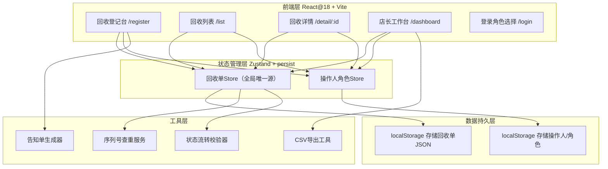
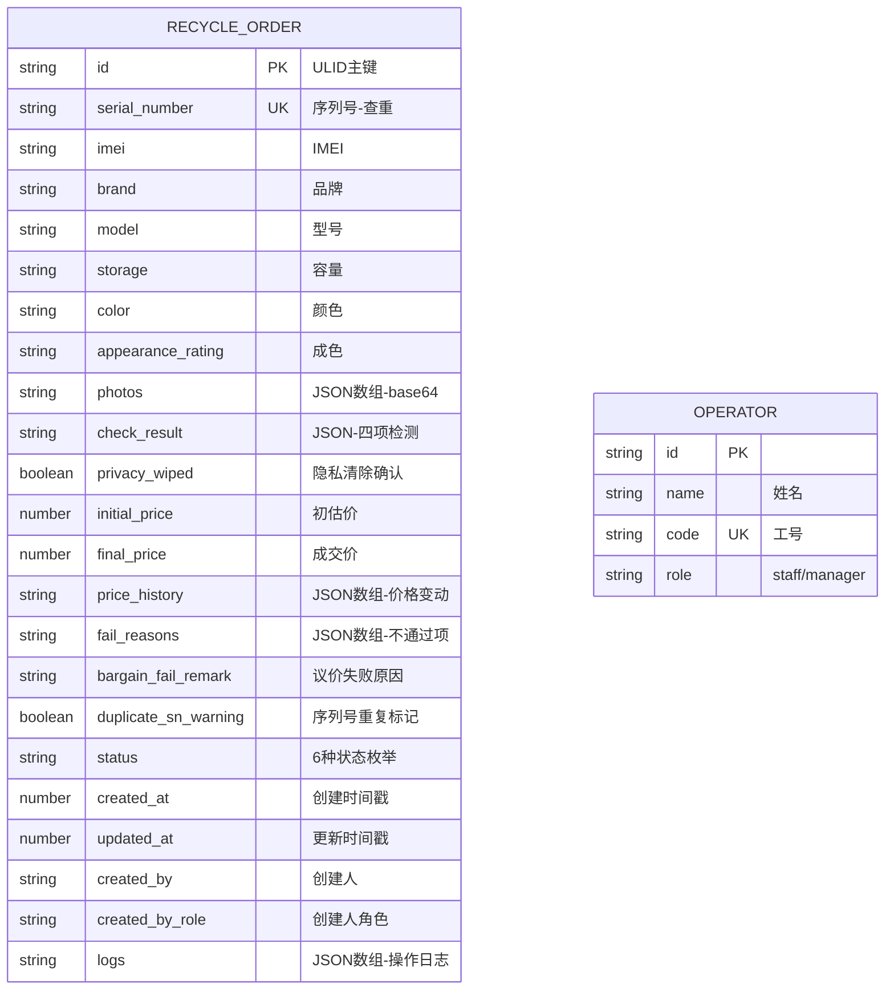

## 1. 架构设计



---

## 2. 技术描述

- **前端**：React@18 + TypeScript@5 + React Router@6 + Zustand@4（含 persist 中间件）+ TailwindCSS@3 + lucide-react 图标
- **初始化工具**：Vite@5 `npm create vite@latest`（React + TypeScript 模板）
- **后端**：无（纯前端 Demo，数据通过 Zustand + localStorage 持久化，页面刷新后列表与详情 100% 一致）
- **数据库**：localStorage 存储，初始化时注入 10+ 条模拟数据覆盖所有状态类型
- **额外依赖**：dayjs（日期处理）、papaparse（CSV 导出）、qrcode（告知单二维码）

---

## 3. 路由定义

| Route | 页面 | 说明 |
|-------|------|------|
| `/login` | 角色登录页 | 选择店员/店长 + 工号，店长需额外输入密码（演示密码 888888） |
| `/register` | 回收登记台 | 新建回收单的核心操作页（默认页，登录后直达） |
| `/register/:id` | 回收登记台（编辑模式） | 点击列表编辑时复用同一页，URL 带 id 区分 |
| `/list` | 回收列表 | 全量记录表格 + 筛选 + 搜索 + 详情抽屉 |
| `/detail/:id` | 回收详情 | 完整信息 + 价格时间线 + 状态流转 + 操作日志 |
| `/dashboard` | 店长工作台 | 数据看板 + 导出区 + 上架审核（仅店长可见导航） |

---

## 4. 核心数据类型定义（TypeScript）

```typescript
// ========== 基础枚举 ==========
export type RecycleStatus =
  | 'pending_in'     // 待入库
  | 'in_stock'       // 已入库（待上架）
  | 'on_shelf'       // 已上架
  | 'returned'       // 已退回
  | 'bargain_fail';  // 议价失败（未成交）

export type CheckResult = 'pass' | 'fail' | 'pending';

// ========== 检测项 ==========
export interface ScreenCheck {
  scratch: CheckResult;    // 划痕
  crack: CheckResult;      // 碎裂
  display: CheckResult;    // 显示异常
  remark?: string;
}
export interface BatteryCheck {
  health: number;          // 电池健康度 0-100
  bulge: CheckResult;      // 鼓包
  remark?: string;
}
export interface WaterCheck {
  indicator: CheckResult;  // 进水试纸
  remark?: string;
}
export interface AccountCheck {
  idLoggedOut: CheckResult; // 账号ID已退出
  remark?: string;
}
export interface FullCheck {
  screen: ScreenCheck;
  battery: BatteryCheck;
  water: WaterCheck;
  account: AccountCheck;
}

// ========== 价格变动记录（完整历史） ==========
export interface PriceChange {
  id: string;
  oldPrice: number;
  newPrice: number;
  reason: string;
  operator: string;
  operatorRole: 'staff' | 'manager';
  timestamp: number; // ms
}

// ========== 操作日志 ==========
export interface OpLog {
  id: string;
  action: string;     // 创建/检测完成/入库/上架/退回/议价失败
  operator: string;
  operatorRole: 'staff' | 'manager';
  timestamp: number;
  detail?: string;
}

// ========== 回收单（主模型） ==========
export interface RecycleOrder {
  id: string;                   // 主键 ULID
  serialNumber: string;         // 序列号（唯一查重）
  imei?: string;
  brand: string;                // Apple/华为/小米/OPPO/vivo/其他
  model: string;                // 具体型号
  storage: string;              // 128GB/256GB/512GB/1TB
  color: string;
  appearanceRating: 'A+' | 'A' | 'B' | 'C' | 'D';  // 成色评级
  photos: string[];             // base64 图片数组，最多6张
  checkResult: FullCheck;
  privacyWiped: boolean;        // 隐私清除确认
  initialPrice: number;         // 初估价
  finalPrice: number | null;    // 最终成交价
  priceHistory: PriceChange[];  // 每次价格变动（含初估价→第一次议价）
  failReasons?: string[];       // 检测不通过的项目，用于告知单
  bargainFailRemark?: string;   // 议价失败原因
  duplicateSnWarning?: boolean; // 是否被标记重复序列号
  status: RecycleStatus;
  createdAt: number;
  updatedAt: number;
  createdBy: string;
  createdByRole: 'staff' | 'manager';
  logs: OpLog[];
}

// ========== 操作人 ==========
export interface Operator {
  id: string;
  name: string;
  code: string;       // 工号
  role: 'staff' | 'manager';
}
```

---

## 5. 状态流转校验器逻辑

```typescript
// 校验：能否从 fromStatus → toStatus
export function canTransition(
  from: RecycleStatus,
  to: RecycleStatus,
  order: RecycleOrder
): { ok: boolean; reason?: string } {
  // 1. 待入库 → 已入库：必须账号ID已退出 + 隐私已清除
  if (from === 'pending_in' && to === 'in_stock') {
    if (order.checkResult.account.idLoggedOut !== 'pass')
      return { ok: false, reason: '❌ 请先让顾客退出Apple ID/账号锁' };
    if (!order.privacyWiped)
      return { ok: false, reason: '⚠️ 请确认已完成隐私数据清除' };
    return { ok: true };
  }
  // 2. 已入库 → 已上架：仅店长操作 + 隐私已清除
  if (from === 'in_stock' && to === 'on_shelf') {
    if (!order.privacyWiped)
      return { ok: false, reason: '⚠️ 隐私清除未确认，不能上架' };
    return { ok: true };
  }
  // 3. 任意 → 议价失败：仅 pending_in 状态允许
  if (to === 'bargain_fail' && from !== 'pending_in')
    return { ok: false, reason: '已入库/上架订单无法标记议价失败' };
  // 4. 退回：仅 in_stock / on_shelf → returned
  if (to === 'returned' && !['in_stock', 'on_shelf'].includes(from))
    return { ok: false, reason: '当前状态不可退回' };
  return { ok: false, reason: `不允许的状态变更：${from} → ${to}` };
}
```

---

## 6. 数据模型（ER 图）



---

## 7. 目录结构

```
src/
├── main.tsx
├── App.tsx                 # 路由 + 角色守卫
├── router/
│   └── index.tsx
├── store/
│   ├── useRecycleStore.ts  # Zustand + persist，核心数据源
│   └── useAuthStore.ts
├── types/
│   └── index.ts            # 全部 TS 类型
├── utils/
│   ├── transition.ts       # 状态流转校验
│   ├── snChecker.ts        # 序列号查重（防抖）
│   ├── csvExport.ts        # 三种报表导出
│   ├── noticeSheet.tsx     # 检测告知单生成
│   └── mockData.ts         # 初始mock数据
├── components/
│   ├── layout/
│   │   ├── Sidebar.tsx     # 左侧导航（角色感知）
│   │   └── AppLayout.tsx   # 外层布局
│   ├── common/
│   │   ├── StatusBadge.tsx
│   │   ├── PriceTag.tsx
│   │   └── ConfirmDialog.tsx
│   ├── register/
│   │   ├── BasicInfoForm.tsx    # 机型/序列号/查重
│   │   ├── CheckPanel.tsx       # 四项检测大卡片
│   │   ├── PhotoUploader.tsx    # 照片上传（本地预览）
│   │   ├── PriceBargain.tsx     # 初估价+议价时间线
│   │   ├── ConfirmBar.tsx       # 底部入库/失败按钮
│   │   └── NoticeSheetModal.tsx # 告知单弹窗
│   ├── list/
│   │   ├── FilterBar.tsx        # 筛选+搜索
│   │   ├── RecycleTable.tsx     # 数据表格
│   │   └── DetailDrawer.tsx     # 侧边详情抽屉
│   ├── detail/
│   │   ├── InfoCard.tsx         # 基本信息卡
│   │   ├── PriceTimeline.tsx    # 价格变动时间线
│   │   ├── CheckResultCard.tsx  # 检测详情
│   │   └── StatusFlowCard.tsx   # 状态流转
│   └── dashboard/
│       ├── StatsCards.tsx       # 今日看板5卡片
│       ├── ExportZone.tsx       # 三按钮导出区
│       └── ShelfReviewList.tsx  # 上架审核列表
├── pages/
│   ├── LoginPage.tsx
│   ├── RegisterPage.tsx
│   ├── ListPage.tsx
│   ├── DetailPage.tsx
│   └── DashboardPage.tsx
└── index.css               # Tailwind + 自定义主题色
```

---

## 8. 一致性与刷新保证机制

1. **单一数据源**：全部组件读取 `useRecycleStore` 同一实例，任何增删改都通过 store 的 action 完成，禁止组件内局部缓存
2. **持久化**：Zustand `persist` 中间件自动同步 localStorage，键名 `recycle-order-store-v1`，白名单只持久化 `orders` 数组
3. **URL → Store 双向同步**：详情页加载时 `useEffect` 从 store 按 id 查找，找不到则重定向回列表，避免 URL 伪造脏数据
4. **列表页订阅**：列表表格直接 `useStore(s => s.orders)` 加上筛选派生，store 一变更 React 自动重渲染，无需手动刷新
5. **详情操作后同步**：详情页触发状态流转时，调用 store 的 `updateOrder` action → 同时更新 order + 追加 log → 列表页订阅自动反映
6. **登录态持久化**：角色与工号同样 persist，刷新后保持登录
