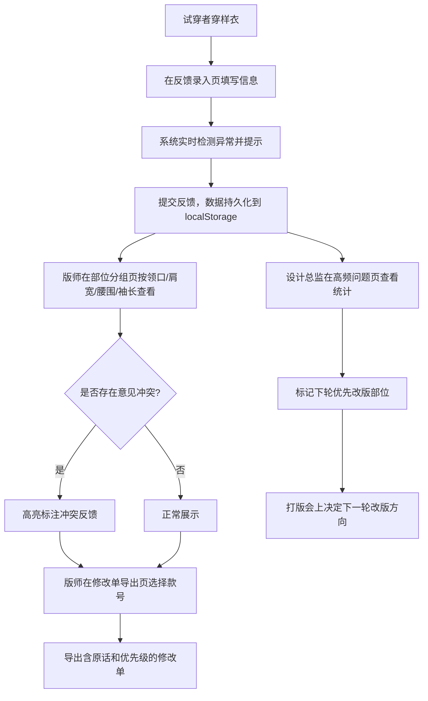

## 1. 产品概述

服装样衣试穿反馈管理工具——解决打样后设计师、试穿同事、版师之间反馈信息碎片化的问题。试穿者在群里发"腰紧、袖长"等零散意见，版师难以判断具体改哪一片。本产品将反馈结构化录入，按身体部位分组呈现，自动检测异常，支持导出修改单，让版师一目了然、设计总监快速定位高频问题。

- 目标用户：服装公司设计师、试穿同事、版师、设计总监
- 核心价值：将碎片化试穿反馈结构化，减少沟通损耗，提高改版效率

## 2. 核心功能

### 2.1 用户角色

| 角色 | 使用方式 | 核心权限 |
|------|----------|----------|
| 试穿者 | 录入反馈 | 填写试穿反馈、上传照片 |
| 版师 | 查看/导出 | 按部位查看反馈、导出修改单 |
| 设计总监 | 统览/决策 | 查看高频问题、标记优先级、决定下轮改版方向 |

### 2.2 功能模块

1. **反馈录入页**：录入样衣款号、试穿人信息、尺码、照片、活动动作、不适位置
2. **部位分组查看页**：按领口、肩宽、腰围、袖长等部位分组展示反馈
3. **修改单导出页**：版师导出含原话和优先级的修改清单
4. **高频问题统计页**：设计总监查看高频问题分布，决定下轮优先改版部位

### 2.3 页面详情

| 页面名称 | 模块名称 | 功能描述 |
|----------|----------|----------|
| 反馈录入页 | 样衣信息区 | 输入样衣款号、选择/新建版本号 |
| 反馈录入页 | 试穿人信息区 | 输入身高、体重、选择尺码 |
| 反馈录入页 | 照片上传区 | 粘贴照片链接，标注正/反面 |
| 反馈录入页 | 活动动作区 | 选择试穿动作（抬手/弯腰/坐/走等） |
| 反馈录入页 | 不适位置标注区 | 选择部位（领口/肩宽/胸围/腰围/臀围/袖长/裤长等），描述不适感，设置严重程度 |
| 反馈录入页 | 智能提示区 | 实时提示尺码缺项、多版本冲突、照片未标正反面、意见冲突 |
| 部位分组页 | 部位筛选栏 | 按领口/肩宽/腰围/袖长等部位分组Tab |
| 部位分组页 | 反馈卡片列表 | 每条反馈显示试穿人、尺码、不适描述、严重程度、原话 |
| 部位分组页 | 照片预览 | 点击卡片展开查看照片 |
| 部位分组页 | 冲突提示 | 同款号不同试穿人意见冲突时高亮标注 |
| 修改单导出页 | 款号选择 | 选择要导出的样衣款号和版本 |
| 修改单导出页 | 修改项列表 | 按优先级排列的修改项，含原话、部位、严重程度 |
| 修改单导出页 | 导出按钮 | 导出为可打印的修改单文档 |
| 高频问题页 | 部位热力图 | 各部位问题频次可视化 |
| 高频问题页 | 高频问题列表 | 按频次排序的问题列表，支持标记"下轮优先改" |
| 高频问题页 | 趋势对比 | 同款号不同版本间问题变化趋势 |

## 3. 核心流程

## 4. 用户界面设计

### 4.1 设计风格

- **主色调**：深炭灰 (#1a1a2e) + 暖米白 (#f5f0eb)，专业沉稳
- **强调色**：陶土红 (#c44536) 标注紧急/冲突，靛蓝 (#3d5a80) 标注信息
- **按钮风格**：圆角矩形 (8px)，填充式主按钮 + 描边式次按钮
- **字体**：标题用 Noto Serif SC（衬线，东方韵味），正文用 Noto Sans SC（无衬线，清晰易读）
- **布局风格**：左侧导航 + 右侧内容区，卡片式布局
- **图标**：lucide-react 图标库，线性风格

### 4.2 页面设计概览

| 页面名称 | 模块名称 | UI 元素 |
|----------|----------|---------|
| 反馈录入页 | 样衣信息区 | 输入框、下拉选择器、版本号标签 |
| 反馈录入页 | 试穿人信息区 | 身高体重数字输入、尺码下拉 |
| 反馈录入页 | 照片上传区 | 链接输入框、正反面切换按钮、缩略图预览 |
| 反馈录入页 | 不适位置标注区 | 部位选择胶囊按钮、严重程度滑块、文本域 |
| 反馈录入页 | 智能提示区 | 黄色/红色提示条，图标+文字 |
| 部位分组页 | 部位筛选栏 | 水平Tab切换 |
| 部位分组页 | 反馈卡片 | 卡片式，含头像缩略、部位标签、严重度色条 |
| 修改单导出页 | 修改项列表 | 表格式，优先级色标+原话引用块 |
| 高频问题页 | 部位热力图 | CSS实现的人体轮廓图+频次热力色 |
| 高频问题页 | 问题列表 | 条形图+列表结合 |

### 4.3 响应式设计

- 桌面端优先（版师主要在电脑上查看导出）
- 平板适配（试穿者可能用平板录入）
- 移动端基本可用（群内快速查看）

### 4.4 交互细节

- 反馈提交后自动滚动到部位分组页对应区域
- 冲突提示使用脉冲动画引起注意
- 导出修改单时自动按严重程度排序
- 高频问题页支持拖拽调整优先级
