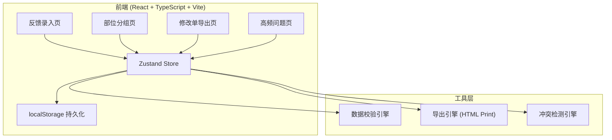
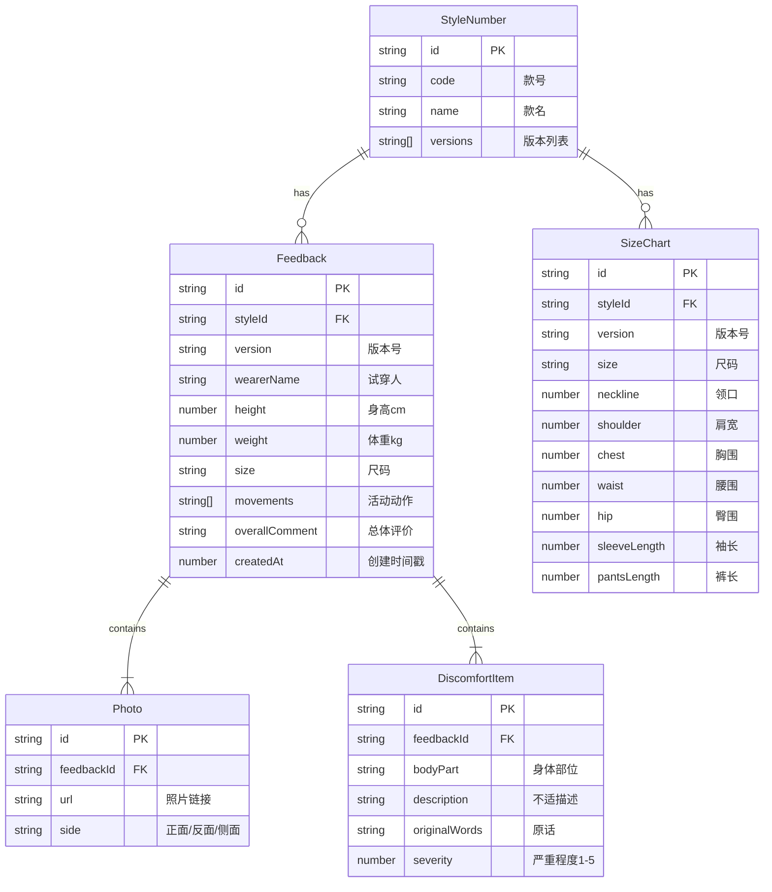

## 1. 架构设计



纯前端架构，无后端服务。数据持久化使用 localStorage，确保刷新后数据不丢失。

## 2. 技术说明

- **前端**：React@18 + TypeScript + Tailwind CSS@3 + Vite
- **初始化工具**：vite-init (react-ts 模板)
- **状态管理**：Zustand（含 persist 中间件实现 localStorage 持久化）
- **路由**：react-router-dom@6
- **后端**：无（纯前端，数据存储在 localStorage）
- **导出**：使用浏览器原生 window.print() + 自定义打印样式表
- **图标**：lucide-react

## 3. 路由定义

| 路由 | 用途 |
|------|------|
| / | 反馈录入页，默认首页 |
| /grouped | 部位分组查看页，按领口/肩宽/腰围/袖长分组 |
| /export | 修改单导出页，版师导出修改清单 |
| /analytics | 高频问题统计页，设计总监查看高频问题 |

## 4. 数据模型

### 4.1 数据模型定义



### 4.2 数据定义（TypeScript 类型）

```typescript
type BodyPart = 'neckline' | 'shoulder' | 'chest' | 'waist' | 'hip' | 'sleeveLength' | 'pantsLength' | 'armhole' | 'backWidth'

type PhotoSide = 'front' | 'back' | 'side'

type Movement = 'raiseArms' | 'bendOver' | 'sit' | 'walk' | 'crossLegs' | 'squat' | 'reachForward' | 'turnAround'

interface StyleNumber {
  id: string
  code: string
  name: string
  versions: string[]
}

interface SizeChart {
  id: string
  styleId: string
  version: string
  size: string
  neckline: number | null
  shoulder: number | null
  chest: number | null
  waist: number | null
  hip: number | null
  sleeveLength: number | null
  pantsLength: number | null
}

interface Feedback {
  id: string
  styleId: string
  version: string
  wearerName: string
  height: number
  weight: number
  size: string
  movements: Movement[]
  overallComment: string
  createdAt: number
}

interface Photo {
  id: string
  feedbackId: string
  url: string
  side: PhotoSide
}

interface DiscomfortItem {
  id: string
  feedbackId: string
  bodyPart: BodyPart
  description: string
  originalWords: string
  severity: number
}

interface Alert {
  id: string
  type: 'missingSize' | 'multipleVersions' | 'photoNoSide' | 'conflict'
  message: string
  relatedIds: string[]
}
```

## 5. 智能提示逻辑

| 提示类型 | 触发条件 | 提示级别 |
|----------|----------|----------|
| 尺码表缺项 | 该款号+版本+尺码的尺寸数据有空值 | ⚠️ 警告（黄色） |
| 同款多版本 | 同一款号存在多个版本未选择 | ℹ️ 提示（蓝色） |
| 照片未标正反面 | 照片链接存在但 side 字段为空 | ⚠️ 警告（黄色） |
| 意见冲突 | 同款号同部位出现相反描述（如"腰紧"vs"腰松"） | 🔴 严重（红色） |

## 6. 导出修改单格式

修改单按严重程度降序排列，每项包含：
- 部位名称
- 严重程度（1-5，用色条表示）
- 试穿人原话引用
- 不适描述摘要
- 关联照片缩略图

## 7. 高频问题统计逻辑

- 统计各部位反馈频次，按降序排列
- 同款号同部位出现 ≥3 次标记为"高频"
- 支持按版本对比同一部位的问题变化
- 设计总监可标记"下轮优先改"，标记后该部位显示旗帜图标
