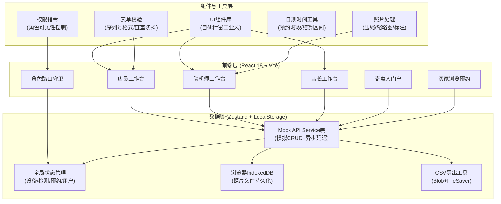

## 1. 架构设计



## 2. 技术描述

- **前端框架**：React 18 + TypeScript（严格模式）
- **构建工具**：Vite 5.x
- **状态管理**：Zustand（轻量，替代Redux，适合中等复杂度）
- **样式方案**：TailwindCSS 3.x + CSS Variables（主题色/铜金渐变/深色模式原生支持）
- **路由**：React Router v6（嵌套路由+角色守卫）
- **图标**：Lucide React（线性图标，自定义1.5px描边）
- **表单**：React Hook Form + Zod（运行时类型校验）
- **数据持久化**：LocalStorage（结构化数据）+ IndexedDB（照片文件Base64存储）
- **UI交互**：Framer Motion（微动画/过渡效果）
- **导出**：自定义CSV生成器（不依赖第三方库，保证数据隐私）
- **日期处理**：date-fns（轻量，相比moment体积小）
- **照片处理**：Canvas API（压缩生成缩略图、霉斑位置标注圆圈）

## 3. 路由定义

| 路由路径 | 页面/组件 | 访问角色 | 说明 |
|----------|-----------|----------|------|
| `/login` | LoginPage | 全部 | 登录入口，支持账号密码+手机号验证码 |
| `/` | 根重定向 | - | 根据角色重定向到对应工作台 |
| `/clerk/dashboard` | ClerkDashboard | 店员 | 店员工作台：设备列表+入库入口+预约管理 |
| `/clerk/equipment/new` | EquipmentNewPage | 店员 | 新增设备入库表单页 |
| `/clerk/equipment/:id` | EquipmentDetailPage | 店员/验机师/店长 | 设备详情：检测报告+价格历史+预约记录 |
| `/clerk/appointments` | AppointmentManagePage | 店员 | 看机预约列表管理 |
| `/inspector/workbench` | InspectorWorkbench | 验机师 | 验机核心工作台（左设备列表+右检测面板同屏） |
| `/inspector/equipment/:id/detect` | InspectorDetectPage | 验机师 | 检测录入页（快门数+霉斑同屏） |
| `/manager/price-audit` | PriceAuditPage | 店长 | 调价审批队列 |
| `/manager/audit-log` | AuditLogPage | 店长 | 价格变更审计日志（可筛选导出） |
| `/manager/settlement` | SettlementPage | 店长 | 成交结算导出中心 |
| `/consignor/portal` | ConsignorPortal | 寄卖人 | 我的设备列表（仅自己的） |
| `/consignor/fees` | ConsignorFeesPage | 寄卖人 | 扣费明细与到账金额 |
| `/showroom` | BuyerShowroomPage | 公开/买家 | 买家设备展厅浏览 |
| `/showroom/:id/appointment` | BuyerAppointmentPage | 公开/买家 | 单台设备看机预约表单 |
| `/403` | ForbiddenPage | - | 无权限提示页 |

## 4. 数据模型与类型定义

```typescript
// ========== 用户与角色 ==========
type Role = 'clerk' | 'inspector' | 'manager' | 'consignor' | 'buyer';

interface User {
  id: string;
  username?: string;
  password?: string;
  phone: string;
  name: string;
  role: Role;
  avatar?: string;
  createdAt: string;
}

// ========== 设备核心 ==========
type EquipmentType = 'body' | 'lens' | 'kit';
type EquipmentStatus = 'pending_inspect' | 'available' | 'reserved' | 'sold' | 'returned';
type DefectGrade = 'S' | 'A' | 'B' | 'C' | 'D';

interface Equipment {
  id: string;
  type: EquipmentType;
  serialNumber: string;           // 机身序列号/镜头编号
  brand: string;
  model: string;
  consignorId: string;            // 寄卖人ID
  consignorName: string;
  consignorPhone: string;
  basePrice: number;              // 寄卖底价
  currentPrice: number;           // 当前展示价（可调整）
  accessories: string[];          // 配件清单
  status: EquipmentStatus;
  defectGrade?: DefectGrade;      // 验机后评定
  coverImage?: string;            // 封面缩略图
  inspectionId?: string;          // 关联检测报告
  createdAt: string;
  createdBy: string;              // 入库操作人ID
  createdByName: string;
  soldAt?: string;
  soldPrice?: number;
}

// ========== 检测报告 ==========
interface MoldSpot {
  id: string;
  imageId: string;                // 关联照片ID
  x: number;                      // 霉斑位置X(百分比)
  y: number;                      // 霉斑位置Y(百分比)
  size: 'small' | 'medium' | 'large';
  note?: string;
}

interface InspectionPhoto {
  id: string;
  equipmentId: string;
  category: 'shutter' | 'mold' | 'focus' | 'appearance' | 'accessory';
  url: string;                    // Base64缩略图
  originalUrl?: string;           // 原图Base64
  name: string;
  uploadAt: string;
  moldSpots?: MoldSpot[];         // 霉斑标注
}

interface Inspection {
  id: string;
  equipmentId: string;
  equipmentSerialNumber: string;
  shutterCount: number;           // 快门数
  shutterImageId?: string;        // 快门数显示照片
  moldSpotsCount: number;         // 霉斑总数
  moldPhotos: InspectionPhoto[];  // 霉斑照片（与快门数同页展示）
  focusTest: {
    passed: boolean;
    centerSharp: boolean;
    edgeSharp: boolean;
    infinityFocus: boolean;
    note?: string;
  };
  accessoryCheck: {
    item: string;
    present: boolean;
    condition?: string;
  }[];
  appearanceNote?: string;
  defectGrade: DefectGrade;
  conclusion: string;             // 检测结论
  inspectorId: string;
  inspectorName: string;
  createdAt: string;
}

// ========== 价格变更 ==========
interface PriceChangeRequest {
  id: string;
  equipmentId: string;
  oldPrice: number;
  newPrice: number;
  reason: string;
  requesterId: string;
  requesterName: string;
  status: 'pending' | 'approved' | 'rejected';
  approverId?: string;
  approverName?: string;
  approvedAt?: string;
  rejectReason?: string;
  createdAt: string;
}

interface PriceChangeLog {
  id: string;
  equipmentId: string;
  oldPrice: number;
  newPrice: number;
  operatorId: string;
  operatorName: string;
  changeType: 'create' | 'adjust' | 'sale';
  remark?: string;
  createdAt: string;
}

// ========== 看机预约 ==========
interface Appointment {
  id: string;
  equipmentId: string;
  buyerName: string;
  buyerPhone: string;
  appointmentDate: string;
  appointmentTimeSlot: string;
  note?: string;
  status: 'pending' | 'confirmed' | 'completed' | 'cancelled' | 'no_show';
  createdBy?: string;             // 店员代预约
  createdAt: string;
  confirmedAt?: string;
}

// ========== 成交结算 ==========
interface Settlement {
  id: string;
  equipmentId: string;
  equipmentSerialNumber: string;
  soldPrice: number;
  platformFee: number;            // 平台服务费（百分比/固定）
  inspectionFee: number;          // 检测费
  otherFees: { name: string; amount: number }[];
  totalDeduction: number;
  payoutAmount: number;           // 实际到账
  consignorId: string;
  consignorName: string;
  consignorPhone: string;
  managerId: string;
  managerName: string;
  soldAt: string;
  settledAt: string;
}
```

## 5. 核心数据结构与索引设计

### 5.1 ER关系图

```mermaid
erDiagram
    USER ||--o{ EQUIPMENT : "creates"
    USER ||--o{ INSPECTION : "inspects"
    USER ||--o{ PRICE_CHANGE_REQUEST : "requests/approves"
    USER ||--o{ APPOINTMENT : "confirms"
    USER ||--o{ SETTLEMENT : "settles"
    USER {
        string id PK
        string phone
        string name
        enum role
    }
    EQUIPMENT ||--|| INSPECTION : "has"
    EQUIPMENT ||--o{ PRICE_CHANGE_LOG : "changes"
    EQUIPMENT ||--o{ PRICE_CHANGE_REQUEST : "requests"
    EQUIPMENT ||--o{ APPOINTMENT : "books"
    EQUIPMENT ||--|| SETTLEMENT : "settled_in"
    EQUIPMENT {
        string id PK
        enum type
        string serial_number UK
        string brand
        string model
        string consignor_id FK
        number base_price
        number current_price
        enum status
        enum defect_grade
        string created_by FK
    }
    INSPECTION {
        string id PK
        string equipment_id FK UK
        number shutter_count
        number mold_spots_count
        json focus_test
        json accessory_check
        enum defect_grade
        text conclusion
        string inspector_id FK
    }
    INSPECTION_PHOTO {
        string id PK
        string inspection_id FK
        string equipment_id FK
        enum category
        text url_base64
        json mold_spots
    }
    PRICE_CHANGE_REQUEST {
        string id PK
        string equipment_id FK
        number old_price
        number new_price
        enum status
        string requester_id FK
        string approver_id FK
    }
    PRICE_CHANGE_LOG {
        string id PK
        string equipment_id FK
        number old_price
        number new_price
        string operator_id FK
        datetime created_at
    }
    APPOINTMENT {
        string id PK
        string equipment_id FK
        string buyer_phone
        date appointment_date
        enum status
    }
    SETTLEMENT {
        string id PK
        string equipment_id FK UK
        number sold_price
        number total_deduction
        number payout_amount
        string consignor_id FK
    }
```

### 5.2 关键字段索引（LocalStorage/Zustand层模拟）

```typescript
// 序列号唯一索引（查重用）
const serialNumberIndex = new Map<string, Equipment>();

// 按状态索引（快速查询可用设备）
const statusIndex = new Map<EquipmentStatus, Set<string>>();

// 按寄卖人索引（寄卖人门户数据隔离）
const consignorIndex = new Map<string, Set<string>>();

// 按日期索引（结算筛选）
const dateIndex = new Map<string, Set<string>>();
```

## 6. 初始化数据（Mock）

```typescript
// 默认演示账号
const seedUsers: User[] = [
  { id: 'u_clerk_001', username: 'clerk', password: '123456', phone: '13800000001', name: '李小员', role: 'clerk', createdAt: '2024-01-01' },
  { id: 'u_inspector_001', username: 'inspector', password: '123456', phone: '13800000002', name: '王验机', role: 'inspector', createdAt: '2024-01-01' },
  { id: 'u_manager_001', username: 'manager', password: '123456', phone: '13800000003', name: '张店长', role: 'manager', createdAt: '2024-01-01' },
  { id: 'u_consignor_001', username: 'consignor', password: '123456', phone: '13900000001', name: '陈先生', role: 'consignor', createdAt: '2024-02-01' },
];

// 演示设备数据（覆盖各状态）
const seedEquipments: Equipment[] = [
  { id: 'eq_001', type: 'body', serialNumber: 'SONY-A7M4-2024001', brand: 'Sony', model: 'A7 IV', consignorId: 'u_consignor_001', consignorName: '陈先生', consignorPhone: '13900000001', basePrice: 14500, currentPrice: 14800, accessories: ['原装电池', '充电器', '肩带', '说明书'], status: 'available', defectGrade: 'A', createdAt: '2025-06-01', createdBy: 'u_clerk_001', createdByName: '李小员' },
  { id: 'eq_002', type: 'lens', serialNumber: 'CANON-RF2470-2023008', brand: 'Canon', model: 'RF 24-70mm F2.8 L', consignorId: 'u_consignor_001', consignorName: '陈先生', consignorPhone: '13900000001', basePrice: 13000, currentPrice: 13500, accessories: ['镜头盖', '遮光罩', '镜头袋'], status: 'pending_inspect', createdAt: '2025-06-10', createdBy: 'u_clerk_001', createdByName: '李小员' },
  { id: 'eq_003', type: 'body', serialNumber: 'NIKON-Z6II-2022055', brand: 'Nikon', model: 'Z6 II', consignorId: 'u_consignor_002', consignorName: '刘女士', consignorPhone: '13900000002', basePrice: 9800, currentPrice: 10200, accessories: ['原装电池', '充电器'], status: 'sold', defectGrade: 'B', soldAt: '2025-06-08', soldPrice: 10000, createdAt: '2025-05-20', createdBy: 'u_clerk_001', createdByName: '李小员' },
];
```
