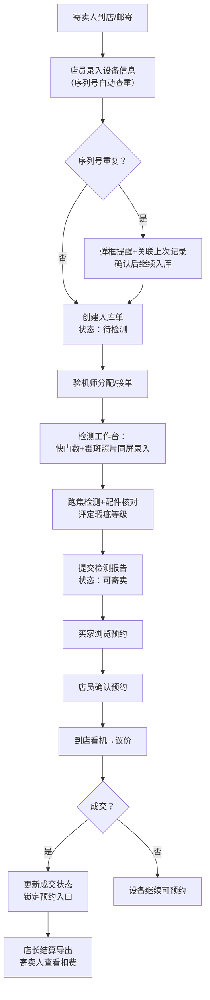
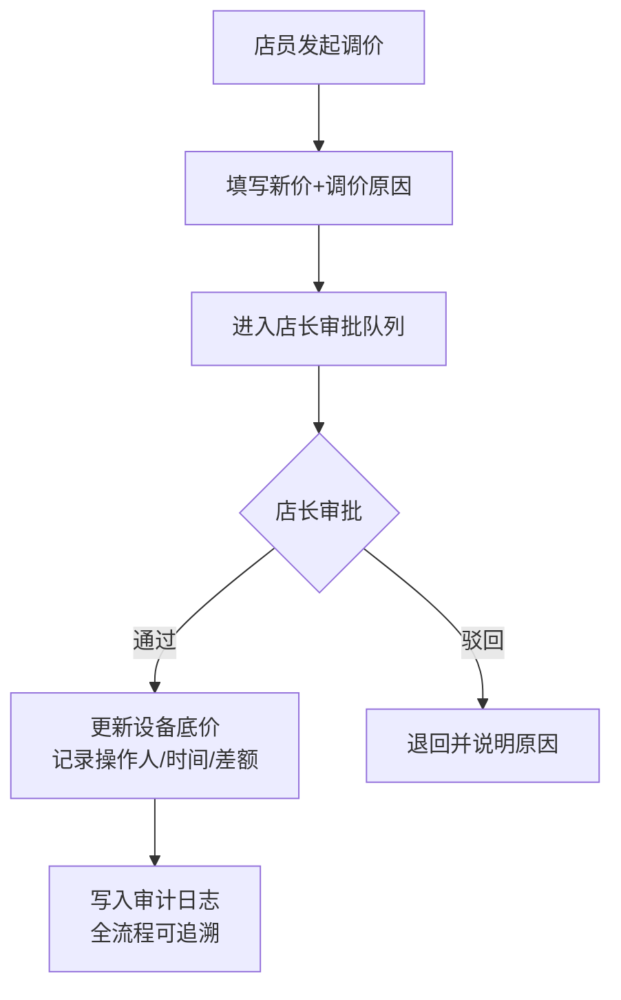

## 1. 产品概述
面向相机实体店的二手设备寄卖管理系统，解决纸单登记容易漏项、多角色信息不对称、调价无追溯、结算对账繁琐等痛点。通过统一的数字化平台，覆盖店员登记、验机师检测、买家预约、寄卖人查看、店长结算全流程。

- **核心问题**：纸单管理易遗漏、检测信息分散、价格变更无审计、结算导出繁琐、寄卖人信息不对称
- **目标用户**：相机店店员、验机师、店长、寄卖人（设备所有者）、二手相机买家

## 2. 核心功能

### 2.1 用户角色

| 角色 | 登录方式 | 核心权限 |
|------|----------|----------|
| 店员 | 账号密码登录 | 登记设备入库、管理看机预约、发起调价申请、查看设备状态 |
| 验机师 | 账号密码登录 | 填写检测报告（快门数/霉斑/跑焦/配件）、上传检测照片、给出瑕疵等级 |
| 店长 | 账号密码登录 | 审批调价、查看调价审计日志、导出成交结算报表、管理全部设备 |
| 寄卖人 | 手机号+验证码登录 | 查看自己名下寄卖设备、查看扣费明细、查看成交状态 |
| 买家 | 无需登录/手机号预约 | 浏览可预约设备、提交看机预约、查看预约状态 |

### 2.2 功能模块

1. **登录与权限中心**：角色鉴权、路由守卫、会话管理
2. **设备入库登记（店员）**：机身序列号/镜头编号录入、寄卖人信息、寄卖底价、配件清单、序列号查重提醒
3. **检测工作台（验机师）**：快门数录入、霉斑照片上传（与快门数同页）、跑焦检测结果、配件核对、瑕疵等级评定、检测结论
4. **看机预约管理**：买家浏览预约、店员确认预约、已售设备自动禁用预约按钮
5. **价格变更与审计**：发起调价、审批调价、记录操作人及时间、完整变更历史
6. **成交结算导出（店长）**：按时间筛选、导出Excel/CSV、结算明细含扣费项
7. **寄卖人自助查看**：仅可见自己设备、成交金额、平台扣费、实际到账
8. **序列号防重机制**：入库时自动校验重复序列号，弹框提醒并关联上次入库记录

### 2.3 页面详情

| 页面名称 | 模块名称 | 功能描述 |
|-----------|-------------|---------------------|
| 登录页 | 角色选择登录 | 账号密码/手机号验证码、角色切换入口 |
| 店员工作台 | 设备入库表单 | 机身序列号/镜头编号、品牌型号、寄卖人、底价、配件复选框、序列号实时查重 |
| 店员工作台 | 设备列表 | 搜索/筛选/状态标签、快捷操作（编辑/调价/查看检测） |
| 店员工作台 | 预约管理 | 待确认/已确认/已完成预约列表、联系买家信息 |
| 验机师工作台 | 检测中心（核心页） | 左侧设备列表→右侧检测面板：快门数+霉斑照片同屏、跑焦检测、配件核对表、瑕疵等级选择器、检测结论富文本 |
| 验机师工作台 | 照片上传区 | 支持拖拽上传、缩略图预览、局部特写标注（霉斑位置） |
| 店长工作台 | 调价审批 | 待审批调价列表、原始价/申请价/差额对比、通过/驳回操作 |
| 店长工作台 | 审计日志 | 全部价格变更历史（操作人/时间/原价/新价）、筛选导出 |
| 店长工作台 | 成交结算 | 时间范围筛选、成交设备列表、一键导出CSV、扣费明细预览 |
| 寄卖人门户 | 我的设备 | 设备卡片列表（状态标签）、当前底价、成交金额/进度条 |
| 寄卖人门户 | 扣费明细 | 平台服务费/检测费/其他扣费、实际到账金额 |
| 买家浏览页 | 设备展厅 | 可预约设备卡片（瑕疵等级/底价/缩略图）、已售灰显不可点击 |
| 买家浏览页 | 预约表单 | 看机日期时间段、联系手机号、备注 |

## 3. 核心流程

### 3.1 设备入库与寄卖全流程

### 3.2 调价审批流程

## 4. 用户界面设计

### 4.1 设计风格
- **整体风格**：专业精密质感，致敬高端相机工业设计语言，深色系为主搭配铜金/银色点缀
- **主色**：深空灰 `#1a1d23`（背景）、石墨黑 `#2a2e37`（卡片）、铜金 `#c9a96e`（强调/品牌色）
- **辅助色**：信号绿 `#4ade80`（正常/通过）、警示橙 `#fb923c`（待处理）、警示红 `#f87171`（异常/驳回）
- **字体**：展示字体用 `JetBrains Mono`（等宽精密感，适合序列号/编号），正文字体用 `Noto Sans SC`
- **按钮风格**：微圆角4px、轻微内阴影、按下时3D下沉效果
- **布局风格**：双栏/三栏工作台布局，信息密度高但层次分明，卡片式模块分区
- **图标风格**：线性细图标（1.5px描边），关键状态用实心图标强调
- **视觉细节**：铜金色渐变描边、轻微噪点纹理背景、表格行悬停铜金高光

### 4.2 页面设计概览

| 页面名称 | 模块名称 | UI元素 |
|-----------|-------------|-------------|
| 登录页 | 品牌展示区 | 左侧铜金渐变相机剪影、右侧登录表单、JetBrains Mono字体展示品牌名「镜头銘」 |
| 验机师工作台 | 检测中心（核心页） | 左栏设备列表（铜金高亮当前选中）、右栏上半区快门数数字面板+霉斑照片画廊同屏、下半区跑焦/配件/瑕疵等级表单、右下固定提交按钮 |
| 验机师工作台 | 照片上传区 | 拖拽虚线框（铜金渐变边框+hover发光）、上传后铜金色勾选标记、霉斑标注用圆圈叠加 |
| 店员工作台 | 设备入库表单 | 序列号输入框右侧实时查重状态灯（绿/红）、输入完成自动弹出品牌型号联想 |
| 店长工作台 | 审计日志 | 时间轴样式日志、每次变更连接铜金色竖线、操作人头像+名字标签 |
| 买家浏览页 | 设备展厅 | Masonry瀑布流卡片、瑕疵等级用彩色标签（S/A/B/C级）、已售卡片半透明灰化+已售角标 |
| 寄卖人门户 | 扣费明细 | 阶梯式扣费进度条、每项扣费左侧铜金圆点标记、汇总区大号到账金额 |

### 4.3 响应式
- **桌面优先**：核心工作台（验机师/店员/店长）仅优化1280px+桌面端，保证信息密度
- **移动自适应**：寄卖人门户、买家浏览页提供移动端适配，触控区域≥44px
- **断点**：≥1280px（工作台三栏）、≥768px（双栏）、<768px（单栏堆叠）

### 4.4 微交互与动画
- 页面切换：左侧铜金色渐变滑块作为导航激活指示器，300ms ease滑动
- 检测照片上传：缩放淡入+铜金色进度条
- 价格变更数字：滚动数字动画（从旧价滚动到新价）
- 表格行：悬停时左侧出现3px铜金竖条高亮
- 提交检测报告：按钮loading态用铜金色旋转圆环
- 序列号查重：输入后300ms防抖→右侧状态灯呼吸闪烁→变绿/变红
