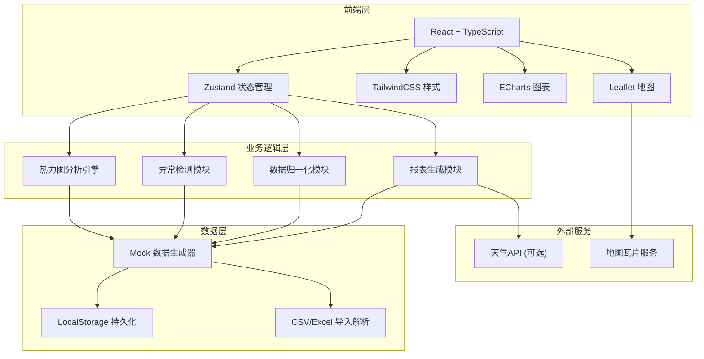
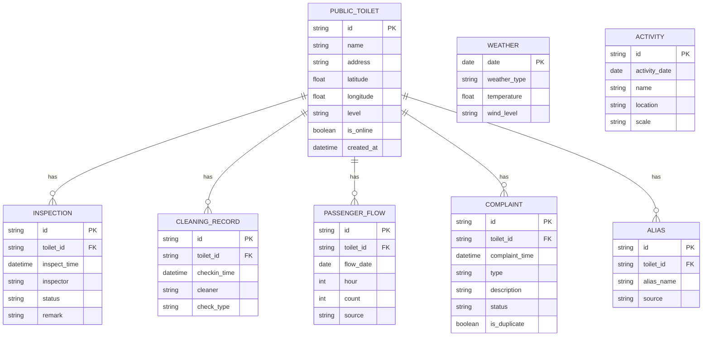

## 1. 架构设计



## 2. 技术描述

- **前端框架**：React@18 + TypeScript
- **构建工具**：Vite@5
- **样式方案**：TailwindCSS@3
- **状态管理**：Zustand
- **路由方案**：React Router DOM@6
- **图表库**：ECharts@5
- **地图库**：Leaflet@1.9
- **UI 图标**：Lucide React
- **数据导入**：PapaParse (CSV) + SheetJS (Excel)
- **后端**：无，纯前端应用，使用Mock数据 + LocalStorage
- **数据持久化**：LocalStorage + IndexedDB

## 3. 路由定义

| 路由 | 页面 | 说明 |
|------|------|------|
| /dashboard | 热力图总览 | 默认首页，地图+统计+时间轴 |
| /data | 数据管理 | 四类数据的导入、浏览、别名管理 |
| /anomaly | 异常分析 | 三类异常点位分析与详情 |
| /reports | 报告导出 | 周报生成、预览、导出 |
| /history | 历史回看 | 天气/活动筛选、时段对比、加巡建议 |

## 4. 数据模型

### 4.1 核心数据实体



### 4.2 热力图数据结构

```typescript
interface HeatmapPoint {
  toiletId: string;
  toiletName: string;
  latitude: number;
  longitude: number;
  timeSlot: string;
  heatLevel: 1 | 2 | 3 | 4 | 5;
  passengerCount: number;
  cleaningCount: number;
  complaintCount: number;
  inspectionCount: number;
  anomalies: AnomalyType[];
}

type AnomalyType = 
  | 'high_flow_low_clean'
  | 'high_complaint_normal_inspection'
  | 'missing_checkin'
  | 'device_offline';

interface DailyStats {
  date: string;
  totalPassengers: number;
  totalCleanings: number;
  totalComplaints: number;
  totalInspections: number;
  offlineDevices: number;
  anomalyCount: number;
}
```

## 5. 核心模块说明

### 5.1 数据归一化模块
- 点位别名映射：维护标准名称与别名的映射关系
- 时间标准化：处理跨天数据，统一为24小时制时段
- 数据去重：投诉去重、打卡重复记录识别
- 设备状态：根据最后上报时间判断离线/在线

### 5.2 热力分析引擎
- 按时段聚合：按小时/天/周聚合四类数据
- 热力值计算：综合客流、保洁频次、投诉数计算热力等级
- 阈值配置：可配置各指标的预警阈值
- 异常识别：三类异常自动检测算法

### 5.3 报表生成模块
- 周报模板：固定格式的周度保洁报告
- 图表生成：客流趋势、保洁频次、投诉分布等图表
- 导出功能：PDF/Excel格式导出
- 考核指标：自动计算考核达标率

### 5.4 历史回看模块
- 时间筛选：日期范围选择
- 天气关联：按天气类型筛选对比
- 活动日标记：标记重大活动日期
- 加巡建议：基于历史模式推荐加巡点位

## 6. 目录结构

```
src/
├── components/
│   ├── layout/          # 布局组件
│   ├── map/             # 地图相关组件
│   ├── charts/          # 图表组件
│   ├── common/          # 通用组件
│   └── features/        # 业务功能组件
├── pages/               # 页面组件
├── hooks/               # 自定义Hooks
├── store/               # Zustand状态
├── utils/               # 工具函数
│   ├── heatmap.ts       # 热力计算
│   ├── anomaly.ts       # 异常检测
│   ├── normalize.ts     # 数据归一化
│   └── export.ts        # 导出工具
├── types/               # TypeScript类型定义
├── data/                # Mock数据
└── styles/              # 全局样式
```
