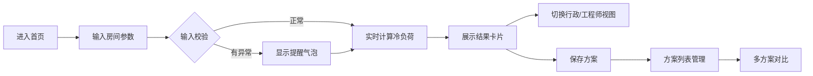

## 1. 产品概述

空调冷负荷粗算器是一款面向行政人员和工程师的轻量级工具，用于快速估算办公室空调冷负荷并推荐合适的空调容量范围。用户输入房间面积、层高、朝向、窗墙比、人数、电脑数量和使用时段等参数，系统自动计算冷负荷并给出空调匹数推荐。

- **核心目标**：替代销售的粗略建议，提供更科学、可解释的冷负荷估算
- **目标用户**：行政人员（主）、设施工程师（辅）
- **产品价值**：降低空调选型决策成本，避免选型过大造成浪费或选型过小效果不佳

## 2. 核心功能

### 2.1 用户角色

| 角色 | 使用场景 | 核心需求 |
|------|----------|----------|
| 行政人员 | 办公室装修前采购空调 | 看懂推荐结果和原因，保存多套方案对比 |
| 设施工程师 | 审核空调选型方案 | 查看计算参数、保守系数，验证结果合理性 |

### 2.2 功能模块

1. **冷负荷计算器**：参数输入、实时计算、结果展示
2. **双视图报告**：行政版（通俗解释）、工程师版（参数明细）
3. **方案管理**：保存方案、方案列表、方案对比
4. **输入校验提醒**：单位混用、缺失参数、密度异常、设备漏填

### 2.3 页面详情

| 页面名称 | 模块名称 | 功能描述 |
|----------|----------|----------|
| 首页（计算器） | 参数输入区 | 面积、层高、朝向、窗墙比、人数、电脑数、使用时段输入 |
| 首页（计算器） | 实时结果卡 | 冷负荷估算值、空调容量推荐范围、匹数建议 |
| 首页（计算器） | 视图切换 | 行政版/工程师版报告切换 |
| 首页（计算器） | 提醒气泡 | 输入异常时的友好提示 |
| 方案管理 | 保存方案 | 命名保存当前参数方案 |
| 方案管理 | 方案列表 | 展示已保存方案，支持删除 |
| 方案对比 | 对比视图 | 多方案参数与结果横向对比 |

## 3. 核心流程

### 3.1 主流程描述

用户进入首页 → 填写房间参数 → 系统实时计算冷负荷 → 显示推荐结果 → 切换行政/工程师视图 → 可保存方案 → 进入方案对比页面查看差异

### 3.2 流程图

## 4. 用户界面设计

### 4.1 设计风格

- **设计方向**：专业工程风 × 清爽现代感。冷色调为主，呼应"制冷"主题，同时保持数据工具的严谨感。
- **主色调**：深蓝青色（#0EA5E9）作为主色，代表专业与冷静；冰蓝（#E0F2FE）作为辅助色。
- **中性色**： slate 灰阶，保证数据可读性。
- **按钮风格**：圆润胶囊形按钮，主色填充配白色文字，hover 有轻微上浮效果。
- **字体**：标题使用现代无衬线字体，正文使用清晰易读的字体，数值使用等宽字体。
- **布局风格**：左侧参数输入区 + 右侧结果展示区的双栏布局，卡片式设计。
- **图标风格**：线性图标，统一 24px 尺寸，与主色呼应。

### 4.2 页面设计概览

| 页面名称 | 模块名称 | UI 元素 |
|----------|----------|---------|
| 首页 | 参数输入区 | 分组折叠卡片、数值输入框带单位切换、下拉选择、滑块 |
| 首页 | 结果展示区 | 大号冷负荷数值、空调匹数范围条、推荐理由文字块 |
| 首页 | 视图切换 | 分段切换控件（行政版 / 工程师版）|
| 方案管理 | 方案列表 | 卡片式列表，每项显示名称、面积、冷负荷、操作按钮 |
| 方案对比 | 对比表格 | 横向对比表，高亮差异项 |

### 4.3 响应式

- 桌面端：左右双栏布局（参数区 40% + 结果区 60%）
- 平板端：上下堆叠布局
- 移动端：单列流式布局，输入分组可折叠
- 触控优化：点击区域 ≥ 44px，重要操作按钮加大

### 4.4 动效与微交互

- 参数输入后结果数值有平滑数字跳动动画
- 提醒气泡从顶部滑入，带有轻微抖动效果
- 卡片 hover 时有微妙的阴影加深和上移动效
- 视图切换时内容有淡入淡出过渡
- 方案保存成功有确认动效
