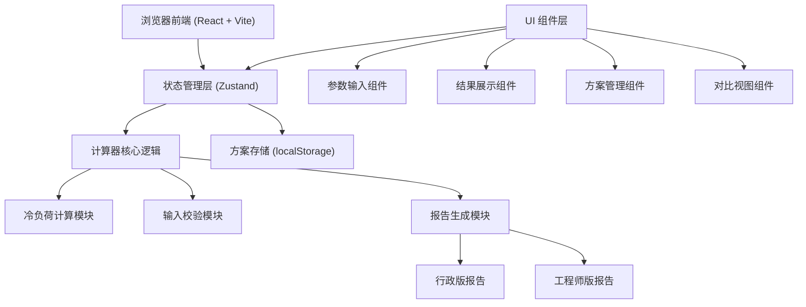

## 1. 架构设计



## 2. 技术选型

- **前端框架**：React 18 + TypeScript
- **构建工具**：Vite 5
- **样式方案**：TailwindCSS 3
- **状态管理**：Zustand
- **路由**：React Router DOM 6
- **图标**：Lucide React
- **数据持久化**：localStorage（无后端）
- **动画**：CSS transitions + 自定义数字动画

## 3. 目录结构

```
src/
├── components/
│   ├── calculator/        # 计算器相关组件
│   │   ├── ParamsForm.tsx      # 参数输入表单
│   │   ├── ResultCard.tsx      # 结果展示卡片
│   │   ├── ReportView.tsx      # 报告视图切换
│   │   └── WarningBubble.tsx   # 提醒气泡
│   ├── plans/             # 方案管理相关组件
│   │   ├── SavePlanModal.tsx   # 保存方案弹窗
│   │   ├── PlanList.tsx        # 方案列表
│   │   └── PlanCompare.tsx     # 方案对比
│   └── common/            # 通用组件
│       ├── NumberInput.tsx     # 数值输入框
│       ├── Select.tsx          # 下拉选择
│       └── Slider.tsx          # 滑块组件
├── hooks/                 # 自定义 Hooks
│   ├── useCalculator.ts       # 计算器逻辑
│   └── useWarningCheck.ts     # 校验提醒逻辑
├── store/                 # 状态管理
│   └── usePlanStore.ts        # 方案存储 store
├── utils/                 # 工具函数
│   ├── coolingLoad.ts         # 冷负荷计算核心算法
│   ├── unitConverter.ts       # 单位转换
│   └── constants.ts           # 常量定义
├── types/                 # 类型定义
│   └── index.ts
├── pages/                 # 页面组件
│   ├── Home.tsx               # 首页（计算器）
│   └── Compare.tsx            # 对比页
├── App.tsx
├── main.tsx
└── index.css
```

## 4. 路由定义

| 路由 | 页面 | 用途 |
|------|------|------|
| / | 首页 | 冷负荷计算器主页面 |
| /compare | 对比页 | 多方案参数与结果横向对比 |

## 5. 数据模型

### 5.1 房间参数类型

```typescript
interface RoomParams {
  id?: string;
  name?: string;
  area: number;           // 面积
  areaUnit: 'sqm' | 'sqft'; // 面积单位
  floorHeight: number | null; // 层高 (米)
  orientation: 'north' | 'south' | 'east' | 'west' | 'northeast' | 'northwest' | 'southeast' | 'southwest';
  windowWallRatio: number;   // 窗墙比 0-1
  peopleCount: number;       // 人数
  computerCount: number;     // 电脑数量
  usageHours: number;        // 使用时段 (小时/天)
  usageType: 'office' | 'meeting' | 'server'; // 使用类型
  createdAt?: number;
}
```

### 5.2 冷负荷结果类型

```typescript
interface CoolingResult {
  totalCoolingLoad: number;      // 总冷负荷 (W)
  buildingLoad: number;          // 建筑围护负荷 (W)
  humanLoad: number;             // 人员散热负荷 (W)
  equipmentLoad: number;         // 设备散热负荷 (W)
  lightingLoad: number;          // 照明负荷 (W)
  recommendedACMin: number;      // 推荐空调最小容量 (W)
  recommendedACMax: number;      // 推荐空调最大容量 (W)
  recommendedHP: string;         // 推荐匹数范围
  safetyFactor: number;          // 保守系数
  breakdown: {
    orientationFactor: number;   // 朝向系数
    windowFactor: number;        // 窗户负荷
    wallFactor: number;          // 墙体负荷
    roofFactor: number;          // 屋顶负荷
  };
}
```

### 5.3 方案存储结构

```typescript
interface Plan {
  id: string;
  name: string;
  params: RoomParams;
  result: CoolingResult;
  createdAt: number;
}
```

## 6. 核心算法说明

### 6.1 冷负荷计算方法

采用谐波反应法简化模型，适用于初步估算：

1. **建筑围护结构负荷**：
   - 墙体负荷 = 面积 × 墙体传热系数 × 温差修正
   - 窗户负荷 = 窗户面积 × 窗传热系数 + 太阳辐射得热
   - 屋顶负荷 = 面积 × 屋顶传热系数（顶层时计入）

2. **人员散热负荷**：
   - 静坐办公：100W/人（显热）+ 50W/人（潜热）
   - 轻度活动：130W/人（显热）+ 70W/人（潜热）

3. **设备散热负荷**：
   - 电脑：200W/台（含显示器）
   - 服务器：根据类型估算

4. **照明负荷**：
   - 办公室：10-15 W/㎡

5. **总冷负荷** = (建筑 + 人员 + 设备 + 照明) × 使用时段系数 × 保守系数

### 6.2 空调匹数换算

- 1匹 ≈ 2500W 制冷量
- 小1匹 ≈ 2200W
- 大1匹 ≈ 2600W
- 1.5匹 ≈ 3500W
- 2匹 ≈ 5000W
- 3匹 ≈ 7200W
- 5匹 ≈ 12000W

### 6.3 输入校验规则

| 校验项 | 触发条件 | 提醒级别 |
|--------|----------|----------|
| 单位混用 | 面积输入异常值或频繁切换单位 | 警告 |
| 层高缺失 | 层高为空或为 0 | 警告 |
| 人数密度过高 | 人均面积 < 3㎡ | 错误 |
| 设备发热漏填 | 人数 > 0 但电脑数 = 0 | 提示 |
| 面积异常 | 面积 > 500㎡ 或 < 5㎡ | 提示 |
| 窗墙比异常 | 窗墙比 < 0.1 或 > 0.8 | 提示 |

## 7. 常量配置

### 7.1 朝向系数

| 朝向 | 太阳辐射得热系数 |
|------|------------------|
| 北 | 0.3 |
| 南 | 0.8 |
| 东 | 0.6 |
| 西 | 0.7 |
| 东北 | 0.45 |
| 西北 | 0.5 |
| 东南 | 0.7 |
| 西南 | 0.75 |

### 7.2 使用类型系数

| 使用类型 | 人员密度参考 | 设备密度参考 | 使用时段系数 |
|----------|-------------|-------------|-------------|
| 办公室 | 6-10 ㎡/人 | 0.8 台/人 | 1.0 |
| 会议室 | 2-4 ㎡/人 | 0.3 台/人 | 0.8 |
| 机房 | 20+ ㎡/人 | 高密度 | 1.2 |
