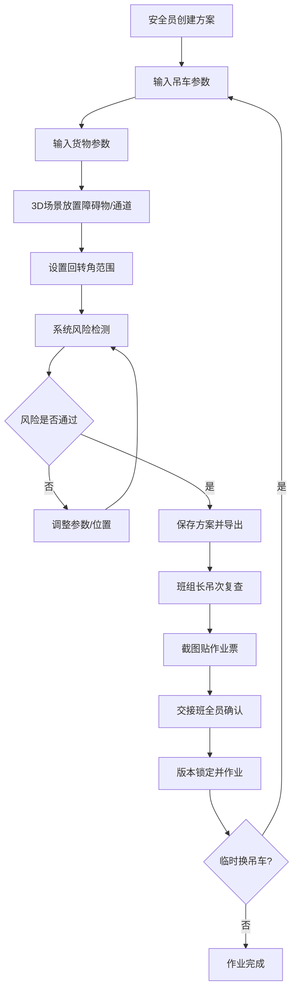

## 1. 产品概述

散货码头临时大件吊装作业的3D可视化安全预演系统，解决传统纸图交底不直观、现场风险难预判的问题。安全员可在3D场景中放置吊车、货物、船边、仓库门及禁入区，输入臂长、重量和回转角后实时检测超半径、碰撞和人员通道占用风险。支持方案保存导出、吊次复查、风险截图和交接班确认。

- **核心用户**：码头安全员、班组长、吊装作业班组
- **目标价值**：提升大件吊装作业安全性，降低交底沟通成本，确保所有作业人员基于同一版方案施工

---

## 2. 核心功能

### 2.1 用户角色

| 角色 | 注册方式 | 核心权限 |
|------|----------|----------|
| 安全员 | 默认登录 | 创建方案、输入参数、风险判定、保存导出、风险截图 |
| 班组长 | 默认登录 | 查看方案、吊次复查、作业票贴截图、交接班确认 |
| 作业人员 | 默认登录 | 查看方案、确认已阅读、交接班签字 |

### 2.2 功能模块

1. **3D场景主页面**：泊位全景展示、吊车/货物/障碍物可视化、实时半径预警圈
2. **参数输入面板**：吊车参数、货物参数、回转角设置、单位切换
3. **风险检测面板**：超半径预警、碰撞检测、通道占用、特殊工况说明
4. **方案管理页面**：方案列表、保存/加载、导出交底文档
5. **吊次复查页面**：按吊次编号复查参数、确认作业条件
6. **交接班确认页面**：人员签字、已阅读确认、版本锁定

### 2.3 页面详情

| 页面名称 | 模块名称 | 功能描述 |
|----------|----------|----------|
| 3D场景主页 | 场景视口 | 可旋转/缩放/平移的3D泊位场景，包含码头地面、船边、仓库、道路 |
| 3D场景主页 | 吊车模型 | 根据参数实时更新吊臂长度、角度、底座位置，显示安全半径扇区 |
| 3D场景主页 | 货物模型 | 显示尺寸、重量、吊点位置（含偏心标记） |
| 3D场景主页 | 禁入区/通道 | 半透明红色禁入区域、绿色人员通道，检测是否被半径覆盖 |
| 参数输入面板 | 吊车参数 | 型号、最大臂长、额定吨位、作业半径表 |
| 参数输入面板 | 货物参数 | 长宽高、重量（吨/公斤切换）、吊点X/Y偏心距 |
| 参数输入面板 | 作业设置 | 回转起始角/终止角、步长、吊车停靠坐标 |
| 风险检测面板 | 超半径检测 | 红色警告，标注超出范围的角度区间 |
| 风险检测面板 | 碰撞检测 | 与船舷、仓库门、障碍物的距离警告 |
| 风险检测面板 | 通道占用 | 人员通道被半径覆盖时警告 |
| 风险检测面板 | 特殊说明 | 货物高度缺失提示、吊点偏心影响说明、单位换算说明 |
| 方案管理 | 方案列表 | 时间、编号、货物名称、吊车型号、创建人 |
| 方案管理 | 保存方案 | 自动保存参数快照、3D场景截图、风险报告 |
| 方案管理 | 导出交底 | 导出PDF/HTML包含参数、截图、风险点，供班组打印 |
| 吊次复查 | 吊次列表 | 每吊次的参数、起吊点、落吊点、状态标记 |
| 吊次复查 | 复查确认 | 开工前核对当日工况（风速、地面承重），确认无变更 |
| 交接班确认 | 人员清单 | 本班所有作业人员 |
| 交接班确认 | 阅读确认 | 每人点击确认，记录时间和用户标识 |
| 交接班确认 | 版本锁定 | 确认后方案版本锁定，修改需重新交底 |

---

## 3. 核心流程

安全员创建吊装方案 → 选择吊车并输入参数 → 放置货物与障碍物 → 设置回转角范围 → 系统检测风险并标记 → 调整参数直至通过 → 保存方案并导出 → 开工前班组长按吊次复查工况 → 风险截图贴入作业票 → 交接班全员确认已阅读 → 作业执行 → 临时换吊车时重新核算更新方案

---

## 4. 用户界面设计

### 4.1 设计风格

- **主色调**：深海蓝 `#0F2744`（工业专业感）+ 安全橙 `#FF8A3D`（警示高亮）+ 警戒红 `#FF4757`（危险预警）
- **辅助色**：通过绿 `#2ED573`、注意黄 `#FFA502`、信息蓝 `#5352ED`
- **背景**：深色金属质感渐变 `#0A1628 → #142844`，带细微网格纹理
- **按钮风格**：直角微圆角（4px），悬浮有辉光效果，危险按钮红底白字
- **字体**：主字体 `Noto Sans SC`，数字/参数使用 `JetBrains Mono` 等宽字体
- **布局风格**：左侧参数面板 + 中央3D视口 + 右侧风险/方案面板的三栏工业控制台布局
- **图标风格**：线性工业图标（lucide-react），危险状态切换为填充红色

### 4.2 页面设计概述

| 页面名称 | 模块名称 | UI元素 |
|----------|----------|--------|
| 3D场景主页 | 顶栏 | 方案编号、当前版本、风速指示器、保存/导出/截图按钮 |
| 3D场景主页 | 左侧面板 | 分组折叠的参数表单：吊车/货物/作业设置，每参数带单位切换 |
| 3D场景主页 | 中央视口 | 3D场景占70%宽度，底部工具栏：视图重置/顶视/侧视/剖切 |
| 3D场景主页 | 右侧面板 | 风险列表（按严重度分级卡片）+ 实时半径数据仪表 |
| 3D场景主页 | 底部状态栏 | 当前鼠标坐标、回转角、半径、最小净距读数 |
| 方案管理页 | 列表 | 卡片式方案列表，每张带缩略截图、参数摘要、风险标记 |
| 吊次复查页 | 时间线 | 横向吊次时间轴，每吊次点击展开参数详情和复查项清单 |
| 交接班页 | 签名卡 | 每人一行：头像+姓名+确认按钮+时间戳，全员确认后显示版本锁定印章动画 |

### 4.3 响应式

- **设计原则**：桌面优先（安全员/班组长均使用现场办公本或三防平板）
- **断点适配**：1280px 以上三栏完整布局；768-1280px 折叠为左右两栏（参数与风险面板Tab切换）；768px以下单列滚动
- **触屏优化**：3D场景支持双指捏合缩放、单指旋转；参数面板增大输入框和按钮至48px最小触控区

### 4.4 3D场景指引

- **环境氛围**：工业港口黄昏氛围，HDRI带云层和水面反射，码头灯柱点光源
- **光照设置**：半球光模拟天光+方向光模拟落日+区域光模拟吊车大灯，阴影软阴影
- **相机设置**：默认45°俯视角，OrbitControls限制最小距离5m、最大100m，禁止钻入地下
- **焦点构成**：吊车为视觉中心，货物和半径圈高亮，背景船/仓库适度降饱和
- **交互动画**：参数改变时吊臂平滑伸缩/旋转，风险出现时对应区域红色脉冲闪烁
- **后期效果**：轻微Bloom突出警示灯和半径圈边缘，Vignette聚焦中央场景
- **性能预算**：单场景面数<10万，使用InstancedMesh处理重复构件，LOD远景简化
