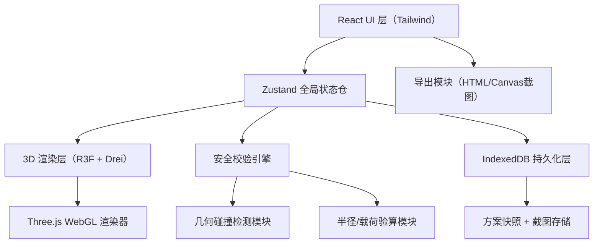

## 1. 架构设计

纯前端React应用，状态管理使用Zustand，3D渲染基于Three.js生态。方案数据使用IndexedDB持久化（localStorage存元数据），无需后端服务，适合码头现场断网环境使用。



## 2. 技术描述

- **前端框架**：React@18 + TypeScript@5
- **构建工具**：Vite@5
- **样式方案**：TailwindCSS@3
- **状态管理**：Zustand@4（含 persist 中间件）
- **路由**：React Router@6
- **3D渲染**：three@0.160 + @react-three/fiber@8 + @react-three/drei@9 + @react-three/postprocessing@2
- **图标**：lucide-react@0.294
- **数据持久化**：IndexedDB（通过 idb@7 轻封装）+ localStorage（方案索引）
- **截图导出**：html2canvas@1 + dom-to-image-more（3D场景直接用canvas.toDataURL）
- **导出文档**：原生JS生成可打印HTML模板 + 浏览器打印/PDF导出
- **后端**：无，纯前端本地运行，支持导出文件分享

## 3. 路由定义

| 路由 | 页面组件 | 用途 |
|------|----------|------|
| `/` | `SceneHome` | 3D场景主页，含参数面板与风险面板 |
| `/plans` | `PlanList` | 方案管理列表，保存/加载/删除 |
| `/lifts/:planId` | `LiftReview` | 吊次复查页面，按吊次编号核对 |
| `/handover/:planId` | `HandoverPage` | 交接班确认，全员签字页面 |
| `/preview/:planId` | `PlanPreview` | 方案只读预览页，供作业人员查看 |

## 4. 数据模型

### 4.1 核心类型定义

```typescript
// 重量单位
type WeightUnit = 'ton' | 'kg';

// 吊车参数
interface CraneSpec {
  model: string;
  maxArmLength: number;       // 最大臂长（米）
  ratedCapacity: number;      // 额定吨位（吨）
  radiusTable: RadiusEntry[]; // 作业半径表
  basePosition: [number, number, number]; // 停靠坐标 XYZ
}

// 半径表条目：臂长 + 半径 = 额定载荷
interface RadiusEntry {
  armLength: number;          // 臂长（米）
  radius: number;             // 作业半径（米）
  capacity: number;           // 额定载荷（吨）
}

// 货物参数
interface CargoSpec {
  name: string;
  length: number;             // 长（米）
  width: number;              // 宽（米）
  height?: number;            // 高（米），可选缺失
  weight: number;             // 重量值
  weightUnit: WeightUnit;
  liftPointOffsetX: number;   // 吊点偏心X（米）
  liftPointOffsetY: number;   // 吊点偏心Y（米）
  position: [number, number, number]; // 放置位置
}

// 障碍物/区域
interface Zone {
  id: string;
  type: 'ship_edge' | 'warehouse_door' | 'forbidden' | 'walkway' | 'obstacle';
  name: string;
  polygon: [number, number][]; // 地面多边形顶点（XY坐标）
  height: number;             // 高度（米）
}

// 作业设置
interface LiftOperation {
  id: string;
  liftNo: string;             // 吊次编号
  armLength: number;          // 使用臂长
  startAngle: number;         // 起始回转角（度，0=船方向）
  endAngle: number;           // 终止回转角
  stepAngle: number;          // 步长
  liftPoint: [number, number, number];  // 起吊点
  dropPoint: [number, number, number];  // 落吊点
  reviewed: boolean;          // 是否复查通过
  reviewTime?: string;
}

// 方案
interface LiftPlan {
  id: string;
  planNo: string;             // 方案编号
  name: string;
  createTime: string;
  createUser: string;
  version: number;
  crane: CraneSpec;
  cargo: CargoSpec;
  zones: Zone[];
  operations: LiftOperation[];
  windSpeed: number;          // 当前风速（m/s）
  remarks: string;
  locked: boolean;            // 版本锁定
  screenshot?: string;        // 缩略图base64
  risks: RiskItem[];          // 风险快照
}

// 风险项
interface RiskItem {
  id: string;
  level: 'danger' | 'warning' | 'info' | 'notice';
  category: 'radius' | 'collision' | 'walkway' | 'capacity' | 'special';
  title: string;
  description: string;
  affectedAngle?: [number, number]; // 受影响角度区间
}

// 交接班记录
interface HandoverRecord {
  planId: string;
  version: number;
  confirmations: {
    userId: string;
    userName: string;
    role: string;
    time: string;
  }[];
  locked: boolean;
}
```

### 4.2 安全校验引擎逻辑

```
校验流程：
1. 单位换算：将货物重量统一转换为吨
   - kg → ton：÷ 1000
2. 高度缺失检查：cargo.height 为空 → 生成 notice 级风险
3. 吊点偏心检查：offsetX/Y 不为 0 → 生成 warning，说明偏心对净距的影响
4. 载荷验算：
   - 遍历 startAngle → endAngle 的每一步
   - 计算当前角度下的实际作业半径
   - 查 radiusTable 插值得到额定载荷
   - 若货物重量 > 额定载荷 → danger 级超半径/超载
5. 碰撞检测（AABB+圆）：
   - 以吊车底座为圆心，当前半径画圆
   - 与 zones 中的多边形做圆-多边形相交检测
   - 若相交 forbidden/obstacle → danger 碰撞
   - 若相交 walkway → warning 通道占用
6. 输出按 level 排序的风险列表
```

## 5. 项目结构

```
src/
├── components/
│   ├── scene/              # 3D场景组件
│   │   ├── SceneCanvas.tsx    # R3F Canvas容器
│   │   ├── Crane.tsx          # 吊车模型（底座+可伸缩吊臂）
│   │   ├── Cargo.tsx          # 货物模型+吊点标记
│   │   ├── Zone.tsx           # 区域/障碍物渲染
│   │   ├── RadiusCircle.tsx   # 回转半径扇区
│   │   ├── Dock.tsx           # 码头地面/船边/仓库
│   │   └── Lights.tsx         # 光照+环境
│   ├── panels/             # UI面板
│   │   ├── TopBar.tsx         # 顶栏导航+操作按钮
│   │   ├── CraneParams.tsx    # 吊车参数输入
│   │   ├── CargoParams.tsx    # 货物参数输入
│   │   ├── OperationPanel.tsx # 作业/回转角设置
│   │   ├── RiskPanel.tsx      # 风险检测结果
│   │   ├── ZoneEditor.tsx     # 区域绘制工具
│   │   └── StatusBar.tsx      # 底部状态栏
│   ├── common/             # 通用组件
│   │   ├── NumberInput.tsx    # 数值输入+单位切换
│   │   ├── RiskCard.tsx       # 风险卡片
│   │   ├── ViewButton.tsx     # 视角切换按钮
│   │   └── Modal.tsx          # 通用弹窗
│   └── pages/              # 页面组件
│       ├── SceneHome.tsx
│       ├── PlanList.tsx
│       ├── LiftReview.tsx
│       ├── HandoverPage.tsx
│       └── PlanPreview.tsx
├── hooks/
│   ├── useRiskEngine.ts       # 安全校验引擎hook
│   ├── useIndexedDB.ts        # IndexedDB封装
│   ├── usePlanStore.ts        # Zustand方案状态
│   └── useScreenshot.ts       # 截图hook
├── utils/
│   ├── geometry.ts            # 几何计算（圆-多边形相交等）
│   ├── unitConvert.ts         # 单位换算
│   ├── interpolation.ts       # 半径表插值
│   ├── exportHTML.ts          # 导出HTML交底文档
│   └── mockData.ts            # 示例方案/吊车型号数据
├── types/
│   └── index.ts               # 所有类型定义
├── App.tsx
├── main.tsx
└── index.css
```

## 6. 初始化与Mock数据

首次加载时注入以下Mock数据：
- 3种常见吊车型号（徐工QY50K、中联QY80V、三一STC1000）含半径表
- 2个示例泊位方案
- 5个默认作业人员（交接班确认用）
- 1个完整示例方案（含风险项、吊次）供用户立即体验
