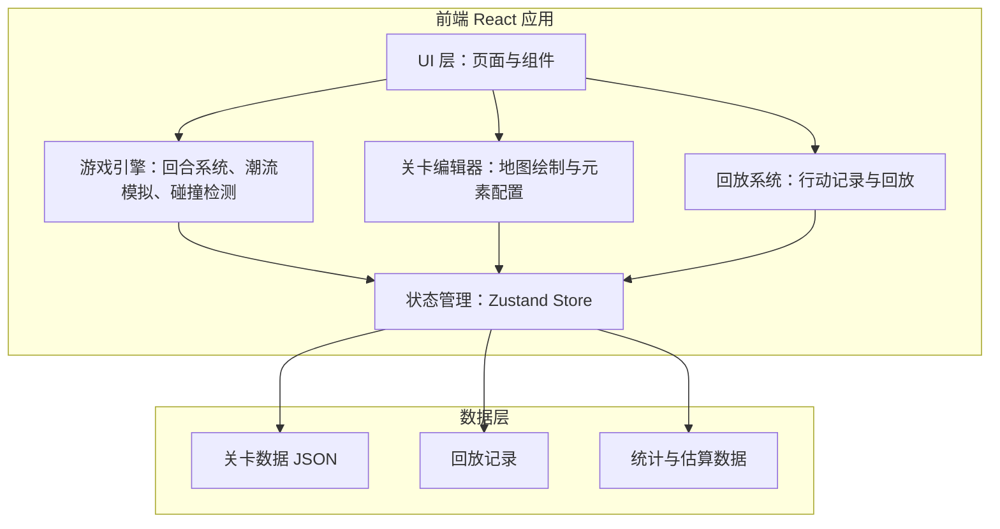
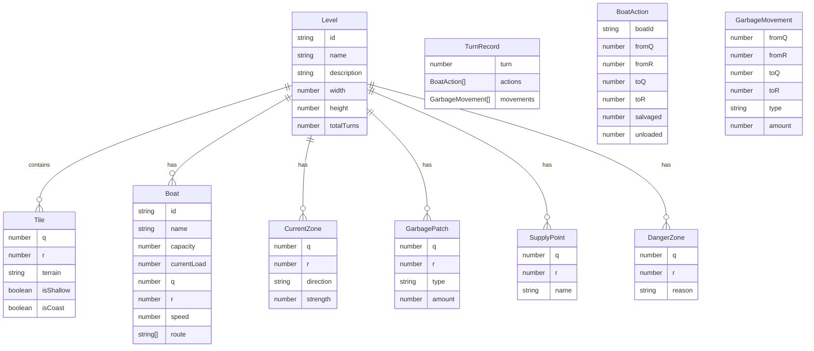

## 1. 架构设计



## 2. 技术说明

- **前端**：React@18 + TypeScript + Tailwind CSS@3 + Vite
- **初始化工具**：vite-init（react-ts 模板）
- **状态管理**：Zustand（游戏状态、编辑器状态、回放状态）
- **后端**：无（纯前端应用，关卡数据存储在 localStorage）
- **数据库**：无（使用 localStorage + JSON 文件持久化）

## 3. 路由定义

| 路由 | 用途 |
|------|------|
| `/` | 首页，关卡选择列表 |
| `/game/:levelId` | 游戏主界面，加载指定关卡 |
| `/result/:levelId` | 结算页面，回放与统计 |
| `/editor` | 关卡编辑器 |
| `/editor/:levelId` | 编辑指定关卡 |

## 4. 核心数据模型

### 4.1 数据模型定义



### 4.2 核心游戏逻辑

**六角格坐标系**：使用 axial 坐标系 (q, r)，支持六个方向的邻居计算。

**潮流系统**：每个潮流区有方向（6个六角格方向之一）和强度（1-3）。每回合潮流阶段，垃圾带按潮流方向移动 strength 格。若多个潮流区作用于同一垃圾，取合成方向。

**船只系统**：
- 基础速度：2格/回合
- 超载减速：装载量 > 容量80%时，速度降为1格/回合；>100%无法移动
- 每格自动打捞：经过有垃圾的格子时自动打捞（受剩余容量限制）
- 补给点卸载：到达补给点格子时，自动卸载全部垃圾

**垃圾类型**：
- `floating_plastic`：漂浮塑料，受潮流推移
- `shoreline_foam`：靠岸泡沫，不被潮流推移（固定在岸边）
- `large_debris`：大件垃圾，占3倍容量，不被推移

**危险区**：安全员标记的区域，船只不可进入，路径规划时自动避让。

**浅滩**：船只进入浅滩格速度降为1格/回合。

### 4.3 回合流程

1. **规划阶段**：玩家为每艘船设定本回合路线（最多 speed 个格子）
2. **行动阶段**：船只依次沿路线移动，经过垃圾格打捞，到达补给点卸载
3. **潮流阶段**：漂浮塑料类垃圾按潮流推移
4. **检查阶段**：判断是否达到回合上限或清理目标

### 4.4 袋子估算算法

```
总袋子数 = Σ(每艘船实际装载量) / 每袋容量
建议袋子 = 总袋子数 × 1.2（预留20%余量）
```

## 5. 项目结构

```
src/
  pages/
    HomePage.tsx          # 首页-关卡选择
    GamePage.tsx          # 游戏主界面
    ResultPage.tsx        # 结算页面
    EditorPage.tsx        # 关卡编辑器
  components/
    game/
      HexMap.tsx          # 六角格地图渲染
      BoatPanel.tsx       # 船只状态面板
      RoutePlanner.tsx    # 路线规划交互
      TurnControl.tsx     # 回合控制栏
      CurrentIndicator.tsx # 潮流方向指示器
    editor/
      MapCanvas.tsx       # 编辑器地图画布
      ToolBar.tsx         # 编辑工具栏
      PropertyPanel.tsx   # 属性配置面板
    result/
      ReplayPlayer.tsx    # 回放播放器
      StatsChart.tsx      # 统计图表
      BagEstimator.tsx    # 袋子估算卡片
    common/
      HexGrid.tsx         # 通用六角格组件
      Toolbar.tsx         # 通用工具栏
  hooks/
    useGameEngine.ts      # 游戏引擎逻辑
    useHexGrid.ts         # 六角格坐标计算
    useReplay.ts          # 回放控制
  store/
    gameStore.ts          # 游戏状态
    editorStore.ts        # 编辑器状态
    levelStore.ts         # 关卡数据持久化
  utils/
    hex.ts                # 六角格数学工具
    current.ts            # 潮流计算
    pathfinding.ts        # 路径规划（含避障）
    estimation.ts         # 袋子估算
  types/
    game.ts               # 游戏类型定义
    level.ts              # 关卡类型定义
  data/
    presets.ts            # 预设关卡数据
```
