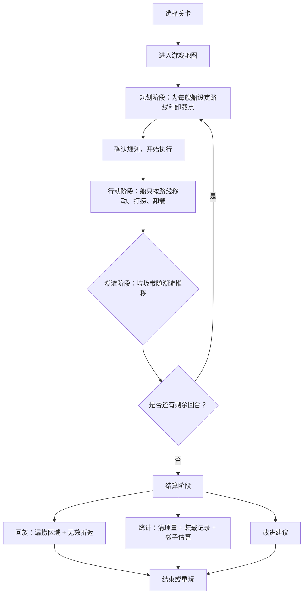
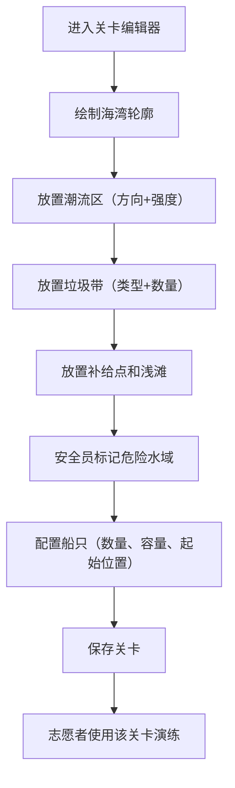

## 1. 产品概述

"海洋垃圾打捞策略"是一款面向海湾公益清理志愿者的策略模拟小游戏。玩家在模拟海湾地图上安排打捞船的路线和卸载顺序，在潮流推移垃圾、船只超载减速、危险水域禁入等约束下，争取高效完成清理任务。

- 核心目的：让志愿者在活动前通过游戏演练理解潮流影响、装载限制和安全边界，减少实战中的无效折返和遗漏
- 目标用户：海湾公益清理活动的志愿者队长、安全员和队员

## 2. 核心功能

### 2.1 用户角色

| 角色 | 进入方式 | 核心权限 |
|------|----------|----------|
| 志愿者（玩家） | 选择关卡直接进入 | 规划路线、操控船只、查看回放与统计 |
| 队长 | 关卡编辑器入口 | 配置海湾地图、设置潮流/垃圾/补给点、保存/加载关卡 |
| 安全员 | 关卡编辑器中标记 | 标记危险水域（不可进入区域）、设置浅滩 |

### 2.2 功能模块

1. **游戏主界面**：海湾地图渲染、船只状态面板、操作控制、回合进度
2. **关卡编辑器**：队长和安全员配置海湾地形、潮流、垃圾分布和危险区
3. **回放与统计**：回合结束回放漏捞区域、无效折返、装载记录和袋子估算

### 2.3 页面详情

| 页面名称 | 模块名称 | 功能描述 |
|----------|----------|----------|
| 首页 | 关卡选择 | 展示可用关卡列表（预设+自定义），进入游戏或编辑器 |
| 游戏主界面 | 海湾地图 | 六角格地图渲染，显示潮流方向、垃圾带、浅滩、补给点、危险区、船只位置 |
| 游戏主界面 | 船只状态面板 | 每艘船的容量、当前装载、速度、位置信息 |
| 游戏主界面 | 路线规划面板 | 为每艘船规划路线（点击格子设路径点），设定卸载顺序 |
| 游戏主界面 | 回合控制 | 执行回合、暂停、加速、查看潮流预报 |
| 游戏主界面 | 迷你地图/概览 | 缩小版地图展示全局态势 |
| 结算页面 | 回放模块 | 逐步回放每回合行动，高亮漏捞区域和无效折返路径 |
| 结算页面 | 统计面板 | 总清理量、每船装载记录、袋子需求估算、效率评分 |
| 结算页面 | 改进建议 | 基于回放数据给出路线优化建议 |
| 关卡编辑器 | 地图绘制 | 在空白网格上绘制海湾轮廓（海岸线、水域形状） |
| 关卡编辑器 | 元素放置 | 放置潮流区（方向+强度）、垃圾带（类型+数量）、补给点、浅滩、危险区 |
| 关卡编辑器 | 船只配置 | 设置可用船只数量、每艘船的容量和初始位置 |
| 关卡编辑器 | 保存/加载 | 保存关卡配置到本地，加载已有关卡编辑 |

## 3. 核心流程

玩家选择关卡后进入海湾地图，首先在规划阶段为每艘船设定路线和卸载点。确认后进入执行阶段，船只按规划路线移动，经过垃圾带自动打捞（受容量限制），到达补给点可卸载。每个回合结束后潮流阶段推移垃圾带位置。玩家可实时调整路线。所有回合结束后进入结算，回放漏捞和低效路径，统计清理数据并估算下次物资需求。

队长/安全员流程：

## 4. 用户界面设计

### 4.1 设计风格

- **主色调**：深海蓝 (#0A2540) + 海洋青 (#00D4AA) + 珊瑚橙 (#FF6B35) 作为警示色
- **辅助色**：浅滩沙色 (#E8D5B7)、泡沫白 (#F0F4F8)
- **按钮风格**：圆角微3D按钮，hover有海浪微动效果
- **字体**：标题用 "ZCOOL QingKe HuangYou"（站酷庆科黄油体），正文用 "Noto Sans SC"
- **布局风格**：地图占据主区域，右侧信息面板，底部操作栏
- **图标风格**：线性图标（lucide），海洋主题

### 4.2 页面设计概览

| 页面名称 | 模块名称 | UI元素 |
|----------|----------|--------|
| 首页 | 关卡选择 | 卡片式关卡列表，每张卡片含海湾缩略图、难度标签、进入按钮 |
| 游戏主界面 | 海湾地图 | 六角格网格，潮流用动态箭头粒子表示，垃圾带用色块+图标，补给点用锚图标，危险区用红色斜线填充 |
| 游戏主界面 | 船只状态面板 | 右侧固定面板，每艘船一个卡片显示船名、容量条、速度指示、当前位置 |
| 游戏主界面 | 路线规划 | 点击格子添加路径点，路径用虚线连接，悬停格子显示预估信息 |
| 游戏主界面 | 回合控制 | 底部工具栏：执行/暂停/加速按钮、回合计数器、潮流预报 |
| 结算页面 | 回放模块 | 时间轴滑块，播放/暂停，步骤前进/后退，地图高亮 |
| 结算页面 | 统计面板 | 柱状图（每船清理量）、饼图（垃圾类型分布）、袋子估算卡片 |
| 关卡编辑器 | 地图绘制 | 左侧工具栏（画笔/橡皮/填充），中间网格画布，右侧属性面板 |

### 4.3 响应式设计

- 桌面优先设计，地图区域自适应缩放
- 平板端：信息面板折叠为可展开侧栏
- 移动端：地图全屏，面板改为底部抽屉

### 4.4 游戏视觉指引

- **海洋氛围**：深蓝渐变背景，水面微波纹动画，浅色网格线
- **潮流效果**：半透明箭头粒子沿方向流动，强度越大粒子越密
- **垃圾类型视觉**：漂浮塑料=绿色点阵，靠岸泡沫=白色团状，大件垃圾=橙色方块
- **船只**：简洁船形图标，装载量用颜色深浅表示
- **危险区**：红色半透明覆盖+脉冲动画警示
