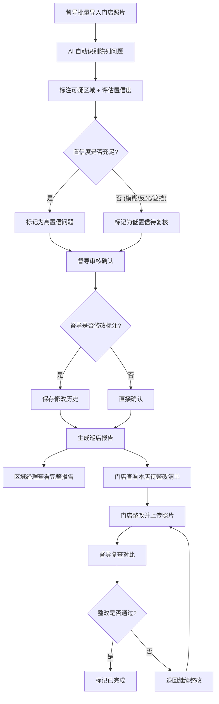

## 1. 产品概述

巡店陈列照片识别系统 —— 帮助零售督导批量导入门店货架照片，通过 AI 初筛缺价签、错价签、排面不足、竞品混放和堆头遮挡等陈列问题，并将可疑区域圈出标注。系统支持督导确认与修改历史追溯，生成面向区域经理的完整巡店报告和面向门店的待整改清单，并提供复查时对比上次确认照片的功能。

- 目标用户：零售督导、区域经理、店长
- 核心价值：将人工巡店从逐张肉眼审查升级为 AI 辅助批量筛查，显著提升巡店效率和问题发现率

## 2. 核心功能

### 2.1 用户角色

| 角色 | 使用方式 | 核心权限 |
|------|----------|----------|
| 零售督导 | 账号登录 | 批量导入照片、查看识别结果、确认/修改标注、导出报告、生成整改清单、复查对比 |
| 区域经理 | 账号登录 | 查看巡店报告、查看区域汇总数据、按门店查看整改进度 |
| 店长 | 账号登录 | 仅查看本门店待整改项、上传整改后照片 |

### 2.2 功能模块

1. **照片导入页**：批量拖拽/选择上传照片，按门店分组，显示上传进度
2. **识别结果页**：照片网格展示，筛选问题类型，查看 AI 标注的可疑区域边框
3. **确认审核页**：放大单张照片，查看/调整标注框，确认或驳回问题，记录修改历史
4. **巡店报告页**：按巡店批次生成报告，区域经理查看完整版，导出 PDF
5. **整改清单页**：按门店生成待整改项列表，跟踪整改进度
6. **复查对比页**：左右对比上次确认照片与当前照片，查看历史标注

### 2.3 页面详情

| 页面名称 | 模块名称 | 功能描述 |
|----------|----------|----------|
| 照片导入页 | 拖拽上传区 | 支持拖拽或点击选择多张图片，自动读取 EXIF 时间，按门店分配 |
| 照片导入页 | 上传队列 | 显示每张照片的上传进度、缩略图预览、门店标签选择 |
| 照片导入页 | 门店选择器 | 下拉选择或搜索门店名称 |
| 识别结果页 | 照片网格 | 缩略图网格展示所有照片，问题照片显示红色角标 |
| 识别结果页 | 问题筛选器 | 按问题类型（缺价签/错价签/排面不足/竞品混放/堆头遮挡）筛选 |
| 识别结果页 | 置信度标识 | 照片上标注 AI 识别置信度，模糊/反光/遮挡情况降低置信度 |
| 确认审核页 | 照片大图 | 放大查看单张照片，支持缩放和平移 |
| 确认审核页 | 标注框列表 | 侧边栏列出所有 AI 标注区域，点击跳转到对应位置 |
| 确认审核页 | 标注编辑 | 调整框位置/大小、修改问题类型、添加备注、确认或驳回 |
| 确认审核页 | 修改历史 | 底部时间线显示每次确认/修改的操作记录 |
| 巡店报告页 | 报告列表 | 按巡店日期列出所有报告，显示门店数、问题数 |
| 巡店报告页 | 报告详情 | 查看单次巡店的完整报告：问题汇总、照片列表、统计图表 |
| 巡店报告页 | 导出按钮 | 导出 PDF 报告，区域经理版本包含所有门店，门店版本仅含本店 |
| 整改清单页 | 门店筛选 | 按门店筛选查看整改清单 |
| 整改清单页 | 整改项列表 | 显示每项问题描述、对应照片、截止日期、当前状态 |
| 整改清单页 | 进度追踪 | 显示整改进度条，区分待整改/整改中/已完成 |
| 复查对比页 | 左右对比 | 左侧上次确认照片+标注，右侧当前照片 |
| 复查对比页 | 历史记录 | 下方时间线显示历次巡店的确认照片 |

## 3. 核心流程

**主流程**：督导批量导入照片 → AI 自动识别并标注问题区域 → 督导逐张确认或修改标注 → 生成巡店报告和整改清单 → 门店按清单整改 → 督导复查对比

## 4. 用户界面设计

### 4.1 设计风格

- 主色调：深蓝灰 (#1a2332) + 警示橙 (#ff6b35)，辅以冷灰 (#6b7280) 和通过绿 (#10b981)
- 按钮：圆角微立体风格，主要操作用警示橙，确认操作用通过绿
- 字体：标题用思源黑体 / Noto Sans SC，数据用 JetBrains Mono
- 布局：左侧导航栏 + 右侧内容区，卡片式布局
- 图标：线性图标风格，使用 Lucide React

### 4.2 页面设计概览

| 页面名称 | 模块名称 | UI 元素 |
|----------|----------|---------|
| 照片导入页 | 拖拽上传区 | 虚线边框大区域，拖入时边框变色动画，中央上传图标+文字 |
| 照片导入页 | 上传队列 | 卡片列表，每张缩略图+进度条+门店标签 |
| 照片导入页 | 门店选择器 | 下拉搜索框，选中门店显示标签 |
| 识别结果页 | 照片网格 | 3-4列网格，每张带问题类型角标和置信度标签 |
| 识别结果页 | 问题筛选器 | 顶部水平标签组，选中态用橙色底色 |
| 识别结果页 | 置信度标识 | 红色低置信/黄色中置信/绿色高置信小圆点 |
| 确认审核页 | 照片大图 | 居中大图，可缩放平移，标注框用不同颜色区分问题类型 |
| 确认审核页 | 标注框列表 | 右侧抽屉，列表项点击高亮对应框 |
| 确认审核页 | 标注编辑 | 框上显示问题类型标签，hover 出现编辑按钮 |
| 确认审核页 | 修改历史 | 底部可展开时间线，每项显示操作人+时间+变更内容 |
| 巡店报告页 | 报告列表 | 表格布局，每行可展开查看详情 |
| 巡店报告页 | 报告详情 | 顶部统计卡片 + 中部问题分布图 + 底部照片列表 |
| 巡店报告页 | 导出按钮 | 右上角图标按钮，点击弹出格式选择 |
| 整改清单页 | 门店筛选 | 左侧门店列表，右侧整改项 |
| 整改清单页 | 整改项列表 | 卡片列表，每项显示问题缩略图+描述+状态标签 |
| 整改清单页 | 进度追踪 | 顶部汇总进度条，下方按状态分组 |
| 复查对比页 | 左右对比 | 两列等宽布局，同步滚动，标注框叠加在照片上 |
| 复查对比页 | 历史记录 | 底部横向时间线，节点可点击切换 |

### 4.3 响应式

- 桌面优先设计，最小宽度 1280px
- 平板适配：导航栏收缩为图标模式，照片网格 2 列
- 确认审核页和复查对比页仅支持桌面端使用
