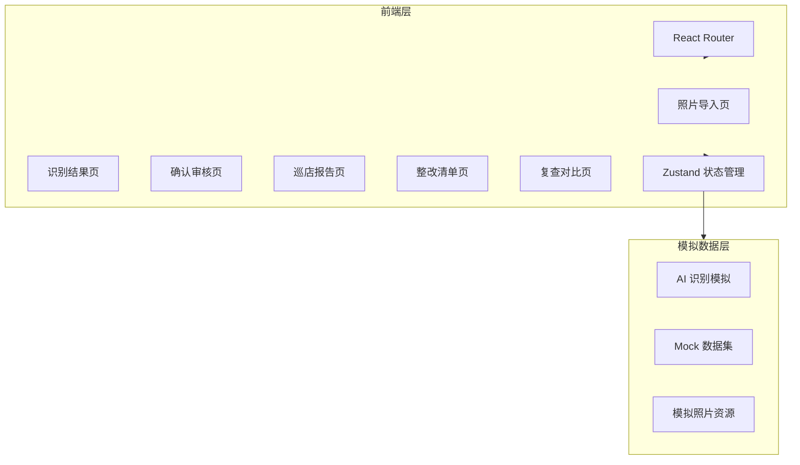
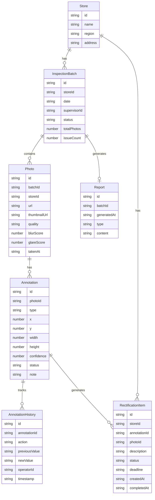

## 1. 架构设计

## 2. 技术说明

- 前端：React@18 + TypeScript + Tailwind CSS@3 + Vite
- 初始化工具：vite-init (react-ts 模板)
- 后端：无（纯前端项目，使用 Mock 数据模拟 AI 识别结果）
- 数据库：无（使用 Zustand + localStorage 持久化）
- 状态管理：Zustand
- 图表：Recharts
- 图标：Lucide React
- 路由：React Router DOM v6

## 3. 路由定义

| 路由 | 用途 |
|------|------|
| `/` | 重定向到 `/import` |
| `/import` | 照片导入页 |
| `/results` | 识别结果页 |
| `/review/:photoId` | 确认审核页 |
| `/reports` | 巡店报告页 |
| `/reports/:reportId` | 报告详情页 |
| `/rectification` | 整改清单页 |
| `/recheck/:storeId` | 复查对比页 |

## 4. 数据模型

### 4.1 数据模型定义

### 4.2 数据定义

**Mock 数据策略**：
- 预设 3 个门店（北京朝阳店、上海静安店、广州天河店）
- 每个门店预设 8-12 张货架照片（使用 picsum 占位图）
- 每张照片预设 2-5 个标注框，覆盖全部 5 种问题类型
- 部分照片标记为低置信度（模拟模糊/反光/遮挡情况）
- 预设 2 个巡店批次、若干整改项

**问题类型枚举**：
- `MISSING_PRICE` - 缺价签
- `WRONG_PRICE` - 错价签
- `INSUFFICIENT_SHELF` - 排面不足
- `COMPETITOR_MIX` - 竞品混放
- `DISPLAY_BLOCKED` - 堆头遮挡

**置信度等级**：
- `HIGH` (≥0.8) - 高置信度
- `MEDIUM` (0.5-0.8) - 中置信度
- `LOW` (<0.5) - 低置信度，需人工复核

**照片质量降级条件**：
- 模糊检测分数 > 阈值 → 降低置信度
- 灯光反光分数 > 阈值 → 降低置信度
- 同一货架多角度时取最高置信度的照片作为主照片
- 促销物料被部分遮挡 → 降低置信度并标记
