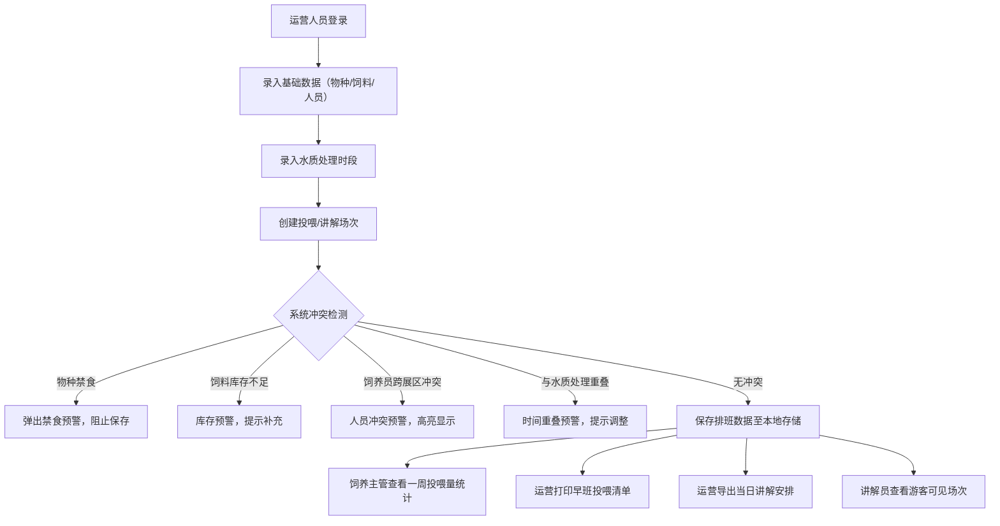

## 1. 产品概述

水族馆喂食讲解排班系统，用于统一管理鲨鱼、企鹅、水母等物种的投喂与讲解场次，协调饲养员、讲解员、展区时段和水质处理时间，实现排班冲突智能预警、数据持久化存储及多角色报表输出。

- 解决问题：人工排班易出现饲养员跨展区冲突、讲解活动挤占后台护理时间、饲料库存不足未预警等问题
- 目标用户：饲养员、讲解员、运营人员、饲养主管
- 产品价值：提升排班效率，减少运营事故，保障动物福利与游客体验

## 2. 核心功能

### 2.1 用户角色

| 角色 | 核心权限 |
|------|----------|
| 饲养员 | 查看个人投喂清单、标记完成状态 |
| 讲解员 | 查看个人讲解场次、游客可见时段 |
| 运营人员 | 排班录入与调整、导出当天讲解安排、打印早班投喂清单、海报场次引用 |
| 饲养主管 | 查看一周投喂量统计、后台护理时间监控、禁食管理 |

### 2.2 功能模块

1. **排班看板页**：展区时段日历视图、场次列表、冲突提示区
2. **数据录入页**：物种、饲料、饲养员、讲解员、场次、水质备注录入
3. **报表输出页**：投喂清单打印、讲解安排导出、一周投喂量统计
4. **库存与预警页**：饲料库存管理、物种禁食设置、冲突预警中心

### 2.3 页面详情

| 页面名称 | 模块名称 | 功能描述 |
|-----------|-------------|---------------------|
| 排班看板 | 展区时段日历 | 按展区和时段展示所有投喂/讲解场次，支持周视图/日视图切换 |
| 排班看板 | 场次卡片 | 展示物种、时间、饲养员、讲解员、饲料信息，支持编辑与删除 |
| 排班看板 | 冲突预警条 | 实时高亮显示禁食、库存不足、饲养员冲突、时间重叠等问题 |
| 数据录入 | 基础信息表单 | 录入/编辑物种、饲料、饲养员、讲解员基础档案 |
| 数据录入 | 场次排期表单 | 选择展区、物种、时段，分配人员，关联饲料和水质备注 |
| 数据录入 | 水质备注 | 记录每日各展区水质处理时段，排班时自动避开 |
| 报表输出 | 早班投喂清单 | 按日期/展区生成可打印的投喂清单（含物种、饲料、用量、饲养员） |
| 报表输出 | 讲解安排导出 | 导出当日所有讲解场次为 CSV/Excel，含游客可见窗口 |
| 报表输出 | 一周投喂量 | 按物种维度统计近7天投喂次数与饲料用量，趋势图表展示 |
| 库存预警 | 饲料库存管理 | 录入当前库存量与安全阈值，低于阈值自动预警 |
| 库存预警 | 物种禁食设置 | 设置某物种某时间段禁食状态，排班时自动拦截 |
| 库存预警 | 冲突检测中心 | 汇总所有排班冲突，支持一键跳转到问题场次 |

## 3. 核心流程

核心用户流程：运营人员录入基础档案 → 设置各展区水质处理时段 → 创建投喂与讲解场次 → 系统实时检测五类冲突 → 通过后持久化存储 → 多角色按权限查看与导出排班结果。

## 4. 用户界面设计

### 4.1 设计风格

- 主色：深海蓝 `#0A2540`（稳重专业），辅助色：珊瑚橙 `#FF6B4A`（预警强调）、水绿 `#2DD4BF`（正常状态）
- 按钮风格：圆角 6px，主按钮填充深海蓝带悬停光效，预警按钮珊瑚橙描边
- 字体：标题使用 DM Serif Display（海洋馆气质衬线体），正文使用 Inter（清晰易读）
- 布局：左侧深色导航栏 + 右侧浅色内容区，卡片式模块，玻璃拟态点缀
- 图标风格：线性图标配合海洋主题（鱼、波浪、水滴滴度）

### 4.2 页面设计概览

| 页面名称 | 模块名称 | UI 元素 |
|-----------|-------------|-------------|
| 排班看板 | 展区时段日历 | 时间轴网格布局，场次色块区分状态，悬停浮层显示详情，入场淡入动画 |
| 排班看板 | 冲突预警条 | 顶部常驻珊瑚橙警示条，带跳动感叹号图标，可展开查看全部冲突 |
| 数据录入 | 表单区域 | 卡片式分组，输入框带深海蓝聚焦边框，下拉选择带预览图标，渐入动画 |
| 报表输出 | 一周投喂量 | 堆叠柱状图，水绿色渐变柱体，hover 显示精确数值，图表入场动画 |
| 库存预警 | 预警列表 | 卡片红色边框闪烁动画，紧急预警带脉冲标记，一键跳转定位 |

### 4.3 响应式

桌面端优先设计，1440px 基准宽度。平板端左侧导航收起为图标菜单，日历网格自适应列数。移动端采用纵向堆叠布局，周视图切换为日视图列表。所有表单控件支持触摸操作。
