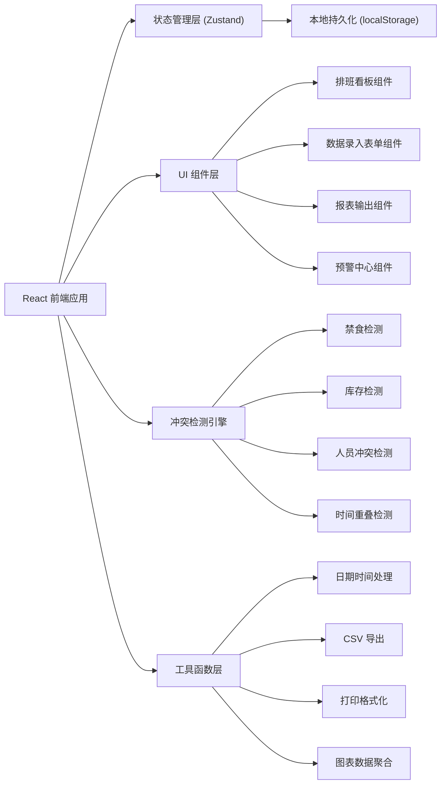
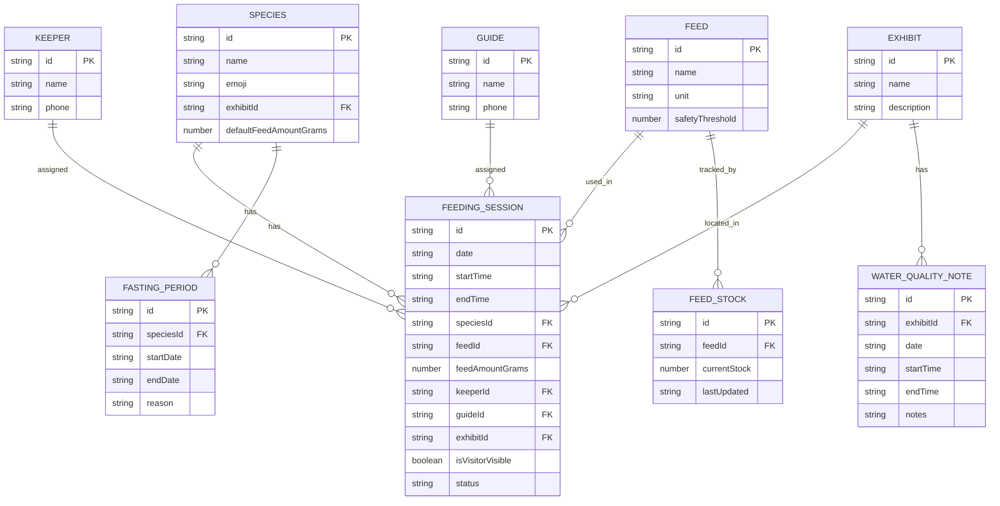

## 1. 架构设计



## 2. 技术描述

- 前端框架：React@18 + TypeScript
- 构建工具：Vite@5
- 样式方案：Tailwind CSS@3
- 状态管理：Zustand（轻量，支持中间件持久化）
- 路由：React Router@6
- 图表库：Recharts（React 原生，体积小）
- 图标：Lucide React
- 后端：无（纯前端应用，数据本地持久化）
- 数据存储：localStorage（通过 Zustand persist 中间件自动同步）

## 3. 路由定义

| 路由 | 页面名称 | 用途 |
|------|----------|------|
| / | 排班看板 | 默认首页，展示展区时段日历与场次列表 |
| /data | 数据录入 | 物种、饲料、人员、场次、水质备注录入 |
| /reports | 报表输出 | 投喂清单打印、讲解安排导出、一周投喂量统计 |
| /alerts | 预警中心 | 饲料库存管理、物种禁食设置、冲突检测汇总 |

## 4. 数据模型

### 4.1 数据模型定义（ER 图）



### 4.2 数据实体 TypeScript 类型定义

```typescript
// 物种
interface Species {
  id: string;
  name: string;
  emoji: string;
  exhibitId: string;
  defaultFeedAmountGrams: number;
}

// 饲料
interface Feed {
  id: string;
  name: string;
  unit: string;
  safetyThreshold: number;
}

// 饲料库存
interface FeedStock {
  id: string;
  feedId: string;
  currentStock: number;
  lastUpdated: string;
}

// 饲养员
interface Keeper {
  id: string;
  name: string;
  phone: string;
}

// 讲解员
interface Guide {
  id: string;
  name: string;
  phone: string;
}

// 展区
interface Exhibit {
  id: string;
  name: string;
  description: string;
}

// 水质备注
interface WaterQualityNote {
  id: string;
  exhibitId: string;
  date: string;
  startTime: string;
  endTime: string;
  notes: string;
}

// 禁食期
interface FastingPeriod {
  id: string;
  speciesId: string;
  startDate: string;
  endDate: string;
  reason: string;
}

// 投喂场次
interface FeedingSession {
  id: string;
  date: string;
  startTime: string;
  endTime: string;
  speciesId: string;
  feedId: string;
  feedAmountGrams: number;
  keeperId: string;
  guideId: string | null;
  exhibitId: string;
  isVisitorVisible: boolean;
  status: 'scheduled' | 'completed' | 'cancelled';
}

// 冲突预警
interface ConflictAlert {
  id: string;
  sessionId: string | null;
  type: 'fasting' | 'low_stock' | 'keeper_conflict' | 'time_overlap' | 'guide_conflict';
  severity: 'warning' | 'error';
  message: string;
}
```

## 5. 状态管理设计

使用 Zustand 单一 store 管理所有业务状态，通过 persist 中间件自动同步 localStorage。

```typescript
interface AppState {
  // 基础数据
  species: Species[];
  feeds: Feed[];
  feedStocks: FeedStock[];
  keepers: Keeper[];
  guides: Guide[];
  exhibits: Exhibit[];
  waterQualityNotes: WaterQualityNote[];
  fastingPeriods: FastingPeriod[];
  feedingSessions: FeedingSession[];
  
  // UI 状态
  selectedDate: string;
  viewMode: 'day' | 'week';
  
  // Actions
  addSpecies: (s: Omit<Species, 'id'>) => void;
  updateSpecies: (id: string, s: Partial<Species>) => void;
  deleteSpecies: (id: string) => void;
  
  addFeed: (f: Omit<Feed, 'id'>) => void;
  updateFeedStock: (feedId: string, stock: number) => void;
  
  addFeedingSession: (s: Omit<FeedingSession, 'id'>) => { success: boolean; conflicts: ConflictAlert[] };
  updateFeedingSession: (id: string, s: Partial<FeedingSession>) => { success: boolean; conflicts: ConflictAlert[] };
  deleteFeedingSession: (id: string) => void;
  
  detectConflicts: (session: FeedingSession, excludeId?: string) => ConflictAlert[];
}
```

## 6. 冲突检测引擎规则

| 检测项 | 规则逻辑 | 严重级别 |
|--------|----------|----------|
| 物种禁食 | 场次日期落在该物种任一禁食期 [startDate, endDate] 区间内 | error（阻止保存） |
| 饲料库存不足 | 场次饲料用量 > 该饲料当前库存 | warning（可保存但预警） |
| 饲养员跨展区冲突 | 同一饲养员在同日存在时间段重叠且展区不同的场次 | error（阻止保存） |
| 讲解员冲突 | 同一讲解员在同日存在时间段重叠的场次 | warning |
| 与水质处理重叠 | 场次时间段与所在展区同日水质处理时间段相交 | error（阻止保存） |
| 游客可见与后台操作重叠 | 标记游客可见的场次时间与后台护理时段（默认 12:00-14:00）重叠 | warning |
