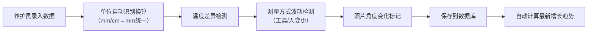
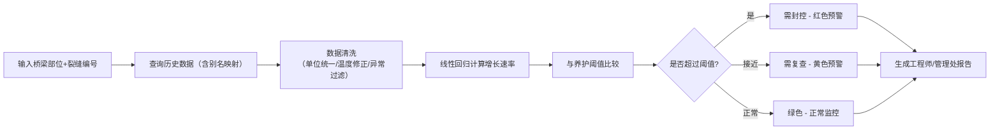

## 1. 产品概述

桥梁裂缝增长复核系统，用于桥梁养护部门高效管理裂缝监测数据，自动计算裂缝增长趋势并预警，解决人工翻查历史数据效率低、单位混用、温度影响等问题。

- 主要解决：桥梁裂缝历史数据人工复核慢、毫米厘米混写、温度差异影响判断、测量方式波动干扰等痛点
- 目标用户：桥梁养护员、工程师、管理处人员
- 核心价值：提升病害识别效率，辅助科学决策，保障桥梁安全

## 2. 核心功能

### 2.1 用户角色

| 角色 | 核心权限 |
|------|----------|
| 养护员 | 录入测量数据、查看个人记录 |
| 工程师 | 查看完整数据、增长曲线、趋势分析 |
| 管理处 | 查看需复查/需封控清单、导出报告 |

### 2.2 功能模块

1. **数据录入页**：养护记录录入，支持毫米/厘米自动换算
2. **裂缝查询页**：按桥梁部位、裂缝编号查询历史数据
3. **工程师报告页**：详细数据表格、增长曲线图、趋势分析
4. **管理处报告页**：需复查点、需封控点清单，一键导出
5. **裂缝映射管理**：同一裂缝不同编号的别名映射配置

### 2.3 页面详情

| 页面名称 | 模块名称 | 功能描述 |
|---------|----------|----------|
| 数据录入页 | 表单模块 | 桥梁部位、裂缝编号、宽度（自动单位换算）、温度、照片编号、测量人、复测人、测量工具 |
| 数据录入页 | 实时校验 | 毫米/厘米自动识别转换、温度异常提示、照片角度变化标记 |
| 裂缝查询页 | 搜索筛选 | 按桥梁、部位、裂缝编号、时间范围筛选 |
| 裂缝查询页 | 历史列表 | 展示该裂缝所有测量记录，标注异常点 |
| 工程师报告页 | 数据表格 | 完整历史数据，含原始值、换算值、温度修正值 |
| 工程师报告页 | 增长曲线 | 时间-宽度散点图+趋势线，标注阈值线 |
| 工程师报告页 | 异常标注 | 标记温度差异大、测量工具变更、照片角度变化等说明 |
| 管理处报告页 | 风险清单 | 需复查（增长接近阈值）、需封控（超过阈值）两类列表 |
| 管理处报告页 | 统计概览 | 各桥梁风险数量统计、导出报告按钮 |
| 裂缝映射页 | 别名管理 | 同一裂缝的曾用名/新编号映射关系配置 |

## 3. 核心流程

### 3.1 数据录入流程

### 3.2 裂缝复核流程

## 4. 用户界面设计

### 4.1 设计风格
- 主色调：工业蓝 (#1E40AF) + 安全绿 (#16A34A) + 警告橙 (#F59E0B) + 危险红 (#DC2626)
- 辅助色：冷灰色系，体现专业、严谨的工程风格
- 按钮风格：直角微圆角 (4px)，边框清晰，点击反馈明确
- 字体：标题使用 Noto Sans SC Bold，正文使用 Noto Sans SC Regular，数字使用等宽字体 JetBrains Mono
- 布局风格：卡片式分区，顶部导航栏 + 侧边菜单 + 主内容区
- 图标：使用线条型工程类图标，避免卡通风格

### 4.2 页面设计概览

| 页面名称 | 模块名称 | UI 元素 |
|---------|----------|---------|
| 数据录入页 | 表单区 | 分组表单卡片，左侧标签右对齐，输入框带单位选择下拉 |
| 数据录入页 | 实时反馈 | 输入宽度后实时显示换算结果，温度异常时输入框边框变黄 |
| 工程师报告页 | 曲线区 | 大面积折线图，带阈值参考线，鼠标悬停显示详情 |
| 工程师报告页 | 数据区 | 斑马纹表格，异常行背景高亮，备注列显示解释说明 |
| 管理处报告页 | 风险卡片 | 红/黄/绿三色状态卡片，数量大字显示，底部列表 |
| 管理处报告页 | 清单区 | 可展开的风险点列表，带快捷导出按钮 |

### 4.3 响应式
- Desktop-first 设计，主内容区最小宽度 1280px
- 平板端侧边菜单可折叠，表格支持横向滚动
- 移动端简化为垂直流式布局，重点数据优先展示

## 5. 核心算法说明

### 5.1 单位换算
- 自动识别输入值单位：含"mm"或数值<10 视为毫米；含"cm"或数值≥10 视为厘米
- 统一换算为毫米存储：厘米 ×10 = 毫米
- 保留原始录入值和单位，报告中同时显示

### 5.2 温度修正
- 记录每次测量时的环境温度
- 计算相邻两次测量的温度差 ΔT
- |ΔT| > 15℃ 时标记为"温度差异大"，增长速率计算时需注明
- 可选线性温度修正模型：宽度修正值 = 测量值 × (1 + α×ΔT)，α为混凝土线膨胀系数

### 5.3 增长趋势计算
- 使用最小二乘法做线性回归，计算斜率（mm/季度）
- 计算相关系数 R²，判断趋势可信度
- 预测下季度宽度：当前值 + 斜率 × 时间间隔

### 5.4 阈值判断
- 注意值（黄色）：增长速率 > 0.1mm/季度 或 宽度 > 1.5mm
- 封控值（红色）：增长速率 > 0.3mm/季度 或 宽度 > 3.0mm
- 阈值可配置

### 5.5 测量波动判断
- 同一裂缝相邻两次测量，若测量人或工具变更，标记为"测量方式变更"
- 宽度变化 > 0.2mm 但测量方式变更时，提示"可能由测量方式造成，需结合照片复核"
