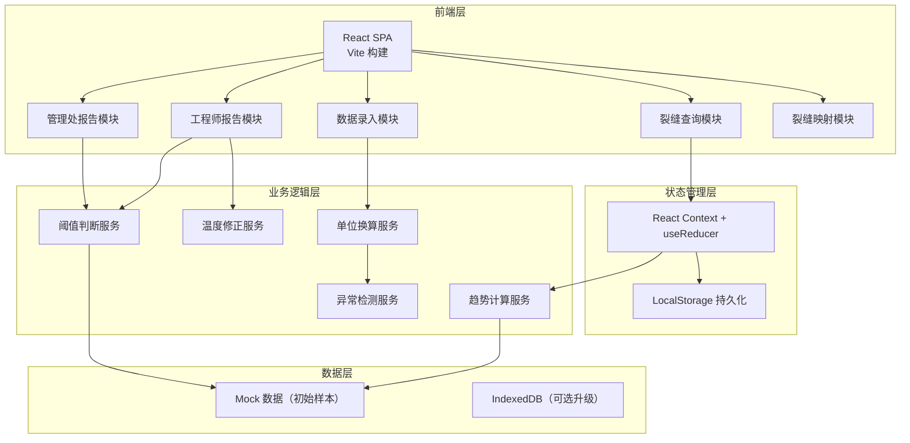
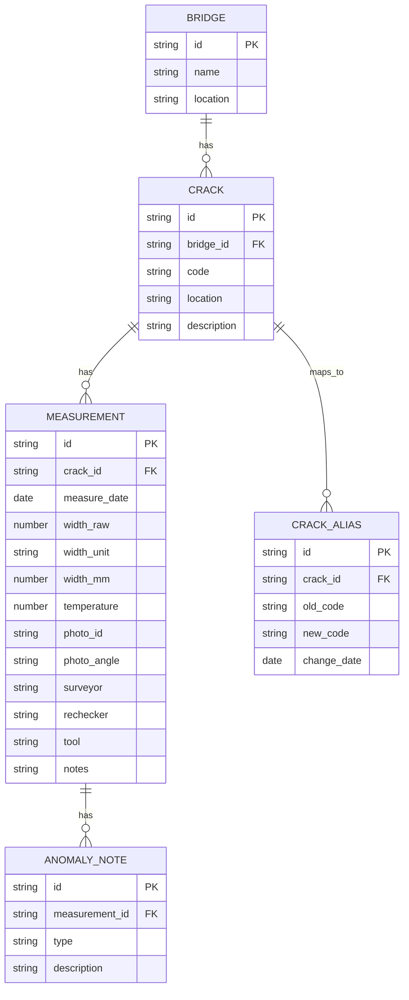

## 1. 架构设计



## 2. 技术描述

- 前端：React@18 + TypeScript + tailwindcss@3 + vite@5
- 路由：react-router-dom@6
- 图表：recharts@2（折线图、散点图）
- 图标：lucide-react
- 状态管理：React Context + useReducer
- 数据持久化：LocalStorage（演示用），可升级为 IndexedDB
- 后端：None（纯前端单页应用，使用 Mock 数据）
- 构建工具：Vite@5
- 包管理：npm

## 3. 目录结构

```
src/
├── components/          # 通用组件
│   ├── Layout/         # 布局组件
│   ├── Form/           # 表单组件
│   ├── Chart/          # 图表组件
│   └── Table/          # 表格组件
├── pages/              # 页面组件
│   ├── DataEntry.tsx   # 数据录入页
│   ├── CrackQuery.tsx  # 裂缝查询页
│   ├── EngineerReport.tsx # 工程师报告
│   ├── ManagementReport.tsx # 管理处报告
│   └── CrackMapping.tsx # 裂缝映射管理
├── services/           # 业务逻辑服务
│   ├── unitConverter.ts # 单位换算
│   ├── tempCorrection.ts # 温度修正
│   ├── trendAnalysis.ts # 趋势分析
│   ├── thresholdCheck.ts # 阈值判断
│   └── anomalyDetector.ts # 异常检测
├── store/              # 状态管理
│   ├── AppContext.tsx
│   └── types.ts
├── data/               # Mock 数据
│   └── mockData.ts
├── types/              # TypeScript 类型定义
│   └── index.ts
├── utils/              # 工具函数
│   ├── date.ts
│   └── format.ts
├── App.tsx
├── main.tsx
└── index.css
```

## 4. 路由定义

| 路由 | 页面 | 说明 |
|------|------|------|
| / | 数据录入页 | 默认首页，养护员录入测量数据 |
| /query | 裂缝查询页 | 查询裂缝历史记录 |
| /engineer | 工程师报告页 | 详细数据和增长曲线 |
| /management | 管理处报告页 | 风险清单和统计概览 |
| /mapping | 裂缝映射页 | 裂缝编号别名管理 |

## 5. 数据模型

### 5.1 ER 图



### 5.2 TypeScript 类型定义

```typescript
// 桥梁
interface Bridge {
  id: string;
  name: string;
  location: string;
}

// 裂缝
interface Crack {
  id: string;
  bridgeId: string;
  code: string;
  location: string;
  description: string;
}

// 裂缝别名映射
interface CrackAlias {
  id: string;
  crackId: string;
  oldCode: string;
  newCode: string;
  changeDate: string;
}

// 测量记录
interface Measurement {
  id: string;
  crackId: string;
  measureDate: string;
  widthRaw: number;
  widthUnit: 'mm' | 'cm';
  widthMm: number;
  temperature: number;
  photoId: string;
  photoAngle: string;
  surveyor: string;
  rechecker: string;
  tool: string;
  notes: string;
  anomalies: AnomalyNote[];
}

// 异常说明
interface AnomalyNote {
  id: string;
  type: 'unit_conversion' | 'temp_diff' | 'tool_change' | 'surveyor_change' | 'angle_change';
  description: string;
}

// 分析结果
interface AnalysisResult {
  crackId: string;
  crackCode: string;
  bridgeName: string;
  growthRate: number; // mm/季度
  rSquared: number;
  currentWidth: number;
  predictedWidth: number;
  riskLevel: 'normal' | 'warning' | 'danger';
  warnings: string[];
}

// 阈值配置
interface ThresholdConfig {
  warningRate: number; // 0.1 mm/季度
  dangerRate: number; // 0.3 mm/季度
  warningWidth: number; // 1.5 mm
  dangerWidth: number; // 3.0 mm
  tempDiffThreshold: number; // 15 ℃
  widthFluctuation: number; // 0.2 mm
}
```

### 5.3 Mock 初始数据

```typescript
// 示例桥梁数据
const bridges: Bridge[] = [
  { id: 'b1', name: '长江大桥', location: '南京市' },
  { id: 'b2', name: '黄河大桥', location: '济南市' },
];

// 示例裂缝数据
const cracks: Crack[] = [
  { id: 'c1', bridgeId: 'b1', code: 'L-001', location: '主梁跨中', description: '纵向裂缝' },
  { id: 'c2', bridgeId: 'b1', code: 'L-002', location: '桥墩顶部', description: '横向裂缝' },
];

// 示例测量记录（含多季度历史数据）
const measurements: Measurement[] = [
  {
    id: 'm1',
    crackId: 'c1',
    measureDate: '2024-01-15',
    widthRaw: 0.8,
    widthUnit: 'mm',
    widthMm: 0.8,
    temperature: 5,
    photoId: 'IMG_0001',
    photoAngle: '正面',
    surveyor: '张三',
    rechecker: '李四',
    tool: '游标卡尺-A型',
    notes: '',
    anomalies: [],
  },
  // ... 更多季度数据
];
```

## 6. 核心算法实现

### 6.1 单位换算函数

```typescript
function convertToMm(value: number, unit: 'mm' | 'cm'): number {
  return unit === 'cm' ? value * 10 : value;
}

function autoDetectUnit(input: string): { value: number; unit: 'mm' | 'cm' } {
  // 自动识别 mm/cm 单位
}
```

### 6.2 线性回归趋势计算

```typescript
function linearRegression(data: { x: number; y: number }[]): {
  slope: number;
  intercept: number;
  rSquared: number;
} {
  // 最小二乘法计算斜率、截距、R²
}
```

### 6.3 异常检测逻辑

```typescript
function detectAnomalies(
  current: Measurement,
  previous: Measurement | null
): AnomalyNote[] {
  const anomalies: AnomalyNote[] = [];
  
  // 温度差异检测
  if (previous && Math.abs(current.temperature - previous.temperature) > 15) {
    anomalies.push({
      id: generateId(),
      type: 'temp_diff',
      description: `与上次测量温度差异${Math.abs(current.temperature - previous.temperature)}℃，可能影响数据对比`,
    });
  }
  
  // 测量工具变更检测
  if (previous && current.tool !== previous.tool) {
    anomalies.push({
      id: generateId(),
      type: 'tool_change',
      description: `测量工具由${previous.tool}变更为${current.tool}，数据波动可能由工具差异造成`,
    });
  }
  
  // 测量人变更检测
  if (previous && current.surveyor !== previous.surveyor) {
    anomalies.push({
      id: generateId(),
      type: 'surveyor_change',
      description: `测量人由${previous.surveyor}变更为${current.surveyor}`,
    });
  }
  
  // 照片角度变更检测
  if (previous && current.photoAngle !== previous.photoAngle) {
    anomalies.push({
      id: generateId(),
      type: 'angle_change',
      description: `照片角度由${previous.photoAngle}变更为${current.photoAngle}`,
    });
  }
  
  return anomalies;
}
```

### 6.4 风险等级判断

```typescript
function determineRiskLevel(
  growthRate: number,
  currentWidth: number,
  config: ThresholdConfig
): 'normal' | 'warning' | 'danger' {
  if (growthRate > config.dangerRate || currentWidth > config.dangerWidth) {
    return 'danger';
  }
  if (growthRate > config.warningRate || currentWidth > config.warningWidth) {
    return 'warning';
  }
  return 'normal';
}
```
