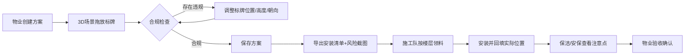

## 1. 产品概述
面向办公楼物业与施工团队的3D室内导视牌安装预览与管理系统。在3D楼层模型中可视化放置电梯厅、走廊门牌、立式导视牌，自动检查视距、高度、遮挡、朝向、消防栓距离等合规性问题，输出可执行的安装清单、风险截图与领料计划。

- 目标用户：物业管理人员、导视系统施工队、保洁/安保巡查人员
- 核心价值：降低施工返工率，确保无障碍合规，统一多方信息口径

## 2. 核心功能

### 2.1 用户角色
| 角色 | 注册方式 | 核心权限 |
|------|----------|----------|
| 物业管理员 | 本地登录 | 创建楼层方案、放置/调整标牌、导出安装清单、分配施工任务 |
| 施工人员 | 工号登录 | 查看领料清单、回填实际安装位置、上传完工照片 |
| 保洁/安保 | 工号登录 | 查看标牌位置、安装注意点、巡检标记 |

### 2.2 功能模块
1. **3D楼层预览页**：楼层3D模型、电梯厅/走廊/柱子/消防栓渲染、标牌拖拽放置、视角控制
2. **合规检查面板**：视距检查、高度检查、遮挡检查、朝向检查、消防栓距离检查、转角视线检查
3. **方案管理页**：方案列表、创建/编辑/删除方案、楼层切换、区域管理
4. **安装清单导出页**：按楼层/区域分组的标牌清单、风险截图预览、PDF/Excel导出
5. **施工回填页**：领料确认、实际位置回填、完工状态标记、照片上传
6. **巡检注意点页**：保洁擦拭注意事项、安保巡查要点、无障碍通道标识

### 2.3 页面详情
| 页面名称 | 模块名称 | 功能描述 |
|---------|---------|---------|
| 3D楼层预览 | 3D场景渲染 | Three.js渲染楼层结构（墙体、地板、电梯门、柱子、消防栓），支持OrbitControls旋转缩放 |
| 3D楼层预览 | 标牌库面板 | 门牌、立式牌、电梯厅牌、无障碍标识牌的分类选择与拖入场景 |
| 3D楼层预览 | 标牌拖拽交互 | 点击选中标牌，沿地面拖动、旋转朝向、调整高度，实时显示参数 |
| 3D楼层预览 | 无障碍路径 | 轮椅通道高亮显示，标牌检测是否侵入无障碍空间 |
| 合规检查面板 | 实时警告 | 标牌拖拽时实时弹出警告气泡，红（违规）/黄（警告）/绿（合规）三级状态 |
| 合规检查面板 | 视距分析 | 从走廊入口模拟人眼视角，射线检测标牌可见距离（建议≥8m） |
| 合规检查面板 | 高度检查 | 门牌底边≥1.2m、立式牌≥1.4m、无障碍通道旁标牌底部≥0.9m |
| 合规检查面板 | 遮挡分析 | 射线检测标牌与观察点之间是否被柱子/墙体遮挡，转角处特殊检测 |
| 合规检查面板 | 朝向检查 | 标牌法线方向与走廊主方向夹角≤30° |
| 合规检查面板 | 消防栓距离 | 标牌与消防栓距离≥0.5m，且不得遮挡消防栓正面 |
| 方案管理 | 方案CRUD | LocalStorage持久化方案数据，支持多方案切换 |
| 方案管理 | 楼层切换 | 支持1F-5F楼层切换，每层独立数据 |
| 安装清单导出 | 清单表格 | 按楼层→区域→标牌类型分组，含编号、类型、设计位置、设计高度、风险项 |
| 安装清单导出 | 风险截图 | 一键截取所有违规标牌的3D视角图，嵌入清单PDF |
| 施工回填 | 领料确认 | 施工队按楼层/区域勾选已领材料，自动统计数量 |
| 施工回填 | 位置回填 | 输入实际安装坐标/高度，与设计值对比，偏差>10cm高亮提示 |
| 巡检注意点 | 保洁注意 | 易积灰标牌提醒、亚克力材质护理提示、高处作业安全 |
| 巡检注意点 | 安保注意 | 安防监控盲区标识、夜间反光条检查、应急逃生方向牌 |

## 3. 核心流程
物业管理员创建楼层方案 → 在3D场景中拖放各类标牌 → 系统实时检查合规性并提示 → 管理员调整直至无严重违规 → 保存方案并导出安装清单与风险截图 → 施工队领料并按清单安装 → 回填实际安装位置 → 保洁/安保查看巡检注意点 → 物业确认验收。

## 4. 用户界面设计
### 4.1 设计风格
- **主色调**：工业蓝 #1E3A5F + 安全橙 #F26B3A（警告色）+ 合规绿 #22C55E
- **辅助色**：浅灰 #F1F5F9（背景）、深灰 #334155（文字）、警示红 #EF4444
- **按钮风格**：圆角6px、微悬浮、2px边框强调色；危险操作按钮配红色描边
- **字体**：中文用 "PingFang SC" + "Noto Sans SC"，数字用 "JetBrains Mono"，标题20px/600，正文14px/400
- **布局风格**：左侧工具面板（标牌库+合规警告）、中间3D主视图、右侧属性面板（选中标牌参数）、底部状态栏（当前楼层/方案名称/合规统计）
- **图标风格**：Material Symbols Rounded，配蓝色填充底，尺寸统一18px

### 4.2 页面设计概览
| 页面名称 | 模块名称 | UI元素 |
|---------|---------|--------|
| 3D楼层预览 | 顶部导航栏 | 方案名称下拉、楼层切换Tab、导出按钮、用户头像、深色/浅色切换 |
| 3D楼层预览 | 左侧标牌库 | 可折叠分类卡片、拖拽时显示虚影、搜索框、类型筛选 |
| 3D楼层预览 | 中心3D视图 | 全屏Canvas、右上角视角切换（顶视/透视/正视）、指南针、缩放条 |
| 3D楼层预览 | 底部警告条 | 横向滚动的警告卡片，点击跳转到对应标牌视角，红黄灰配色 |
| 3D楼层预览 | 右侧属性面板 | 选中标牌缩略图、坐标输入框（X/Y/Z带步进）、旋转滑块、材质预览 |
| 合规检查 | 警告气泡 | 3D场景中贴在标牌上方，图标+简短文字，点击展开详情 |
| 安装清单 | 导出卡片 | 预览缩略图、下载按钮、格式选择（PDF/Excel/JSON） |
| 施工回填 | 列表行 | 左侧勾选框、中间标牌编号+实际坐标输入、右侧状态徽章（未领/已领/已装/验收） |

### 4.3 响应式
- 桌面端（≥1280px）：三栏布局（左260px + 中自适应 + 右320px）
- 平板端（768-1279px）：左右面板改为可抽屉式呼出，3D视图占满
- 移动端（<768px）：仅保留3D视图+底部Tab导航，标牌库与警告全屏弹窗

### 4.4 3D场景指导
- **环境与氛围**：明亮办公环境，HDRI用柔和室内光，地面为浅米色地砖纹理，墙体白色带踢脚线
- **灯光设置**：AmbientLight 0.6 + 两盏DirectionalLight模拟顶灯 + 标牌自发光材质提升可读性
- **相机设置**：初始PerspectiveCamera fov=50，位置(25, 18, 30)看向场景中心；支持俯视顶视角切换（OrthographicCamera）
- **构图与焦点**：场景中心点为电梯厅，标牌放置时自动平滑相机聚焦；无障碍通道用半透明蓝色光带高亮
- **交互与动画**：标牌选中时发光边框+轻微浮动动画；拖拽时地面投影跟随；警告出现时脉冲缩放
- **后处理效果**：FXAA抗锯齿 + 轻微Bloom提升标牌发光质感 + SSAO增加空间层次
- **性能预算**：3D面数≤20万，标牌为低面数Box+Plane贴图，Draw Call≤120
