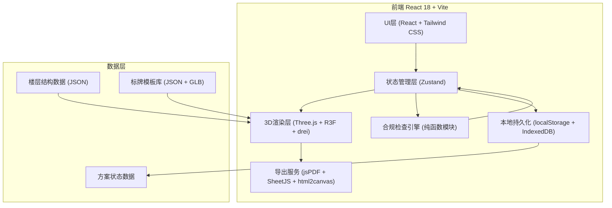

## 1. 架构设计


## 2. 技术描述
- **前端框架**：React@18.2 + TypeScript@5 + Vite@5
- **样式方案**：Tailwind CSS@3.4 + CSS Variables 主题系统
- **3D引擎**：three@0.160 + @react-three/fiber@8.15 + @react-three/drei@9.92 + @react-three/postprocessing@2.15
- **状态管理**：Zustand@4.4（轻量、支持订阅切片、与R3F兼容好）
- **拖拽交互**：@react-three/drei 的 DragControls + 自定义射线平面吸附
- **合规引擎**：纯函数模块，输入3D场景快照（标牌数组+障碍物数组），输出警告列表
- **导出能力**：jspdf@2.5 + jspdf-autotable（PDF清单）、xlsx@0.18（Excel）、html2canvas@1.4（截图）、three.js CanvasRenderer截图（3D视角图）
- **持久化**：LocalStorage存方案元数据，IndexedDB存方案大图截图
- **图标库**：@material-symbols/react（rounded风格）
- **无后端**：全部数据本地存储，施工回填模拟多用户场景（用localStorage区分角色）

## 3. 路由定义
| 路由 | 页面组件 | 用途 |
|------|---------|------|
| / | 方案列表页 | 查看所有方案、创建新方案、进入方案编辑 |
| /editor/:schemeId | 3D楼层编辑器 | 核心工作区，3D预览+标牌拖放+合规检查 |
| /export/:schemeId | 安装清单导出页 | 预览清单、选择格式、下载安装包 |
| /construction/:schemeId | 施工回填页 | 领料确认、实际位置回填、完工标记 |
| /inspection/:schemeId | 巡检注意点页 | 保洁/安保查看注意事项与巡检要点 |

## 4. 核心数据结构（TypeScript类型）
```typescript
// 楼层与场景
interface FloorPlan {
  id: string;
  floorNumber: number;
  name: string;
  walls: Wall[];
  columns: Column[];
  elevators: Elevator[];
  fireHydrants: FireHydrant[];
  accessiblePaths: AccessiblePath[];
  rooms: Room[];
}

// 标牌
type SignType = 'room_door' | 'floor_standing' | 'elevator_hall' | 'accessible' | 'directional';
interface Sign {
  id: string;
  type: SignType;
  name: string;
  position: { x: number; y: number; z: number };
  rotationY: number; // 朝向角度(弧度)
  width: number;
  height: number;
  roomId?: string; // 门牌关联的房间
  zone: string; // 区域：A区/B区
  material: 'acrylic' | 'metal' | 'pvc';
  createdAt: number;
}

// 合规检查结果
type WarningLevel = 'error' | 'warning' | 'info';
interface ComplianceWarning {
  id: string;
  signId: string;
  level: WarningLevel;
  category: 'height' | 'distance' | 'occlusion' | 'orientation' | 'fire_hydrant' | 'corner_view' | 'accessible_path';
  message: string;
  suggestion: string;
  value?: number; // 当前值
  threshold?: number; // 阈值
}

// 施工记录
interface ConstructionRecord {
  signId: string;
  pickedAt?: number; // 领料时间
  installedPosition?: { x: number; y: number; z: number };
  installedAt?: number;
  photoUrls?: string[];
  status: 'pending' | 'picked' | 'installed' | 'verified';
  workerId?: string;
}

// 方案
interface Scheme {
  id: string;
  name: string;
  createdAt: number;
  updatedAt: number;
  currentFloor: number;
  floors: Record<number, FloorPlan>;
  signs: Record<number, Sign[]>; // 按楼层索引
  constructionRecords: Record<string, ConstructionRecord>;
}
```

## 5. 合规检查引擎算法
```
函数名: runComplianceCheck(signs[], floorPlan[], observerPoints[]) -> ComplianceWarning[]

规则1 高度检查 (checkHeight):
  门牌: 底边高度 < 1.2m → error
  立式牌: 底边高度 < 1.4m → warning
  无障碍通道旁: 底边 < 0.9m 或 顶边 > 2.5m → error

规则2 朝向检查 (checkOrientation):
  标牌法线与走廊主方向夹角 > 30° → warning

规则3 消防栓距离 (checkFireHydrant):
  距任一消防栓 < 0.5m → error
  标牌在消防栓正前方且遮挡正面 → error

规则4 转角视线 (checkCornerView):
  对每个转角观察点做射线投射，命中标牌则通过
  射线被柱子/墙体遮挡 → error，并记录遮挡物ID
  视距(射线路径长度) < 8m → warning

规则5 无障碍空间 (checkAccessiblePath):
  标牌包围盒与无障碍路径光带(宽度0.9m)相交 → error
  标牌底部在轮椅乘坐者视线范围1.0m~1.6m外 → warning

规则6 遮挡分析 (checkOcclusion):
  从走廊两端5个观察点射线检测标牌
  通过率 < 60% → error
  通过率 60%~80% → warning
```

## 6. 性能优化点
- **3D场景**：标牌使用InstancedMesh批量渲染同类型；LOD根据距离切换标牌细节
- **合规检查**：仅在拖拽结束（pointerup）与标牌参数修改后触发，使用requestIdleCallback调度；空间八叉树加速邻近查询
- **状态更新**：Zustand选择器订阅，避免R3F全场景重渲染；3D组件useMemo缓存几何体
- **截图导出**：缩略图用OffscreenCanvas，大图分块渲染，IndexedDB存Blob
