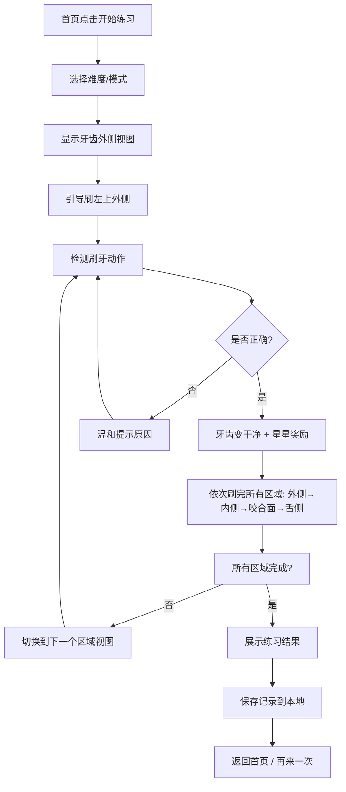
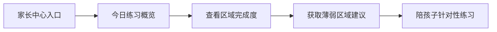
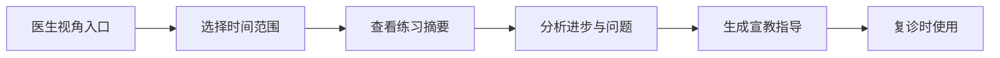

## 1. 产品概述

"刷牙姿势训练局"是一款面向儿童的口腔健康教育互动小游戏，帮助孩子在游戏中学习正确的刷牙方法，确保刷到牙齿的每一个面（外侧、内侧、咬合面、舌侧）。家长可以查看孩子的练习记录，医生可以获取练习摘要用于复诊指导。

- 核心价值：解决儿童只刷门牙、漏刷后牙的问题，通过游戏化方式培养正确刷牙习惯
- 目标用户：3-12岁儿童（主要使用者）、家长（监督者）、口腔科医生（指导者）
- 产品定位：寓教于乐的口腔健康教育工具

## 2. 核心功能

### 2.1 用户角色

| 角色 | 进入方式 | 核心权限 |
|------|----------|----------|
| 孩子 | 首页点击"开始练习" | 进行刷牙游戏、查看自己的成就 |
| 家长 | 首页点击"家长中心" | 查看今日练习时长、遗漏区域、历史记录、获取练习建议 |
| 医生 | 首页点击"医生视角" | 查看练习摘要、生成复诊宣教材料、查看进步趋势 |

### 2.2 功能模块

1. **首页/角色选择页**：角色切换入口、今日练习概览、开始练习按钮
2. **刷牙游戏页**：牙齿可视化、刷牙区域指示、计时器、力度指示器、实时反馈
3. **练习结果页**：本次练习评分、各区域完成情况、奖励动画
4. **家长中心页**：今日练习统计、区域完成度雷达图、历史记录、练习建议
5. **医生视角页**：复诊摘要、进步趋势图、宣教指导要点、可分享报告

### 2.3 页面详情

| 页面名称 | 模块名称 | 功能描述 |
|----------|----------|----------|
| 首页 | 角色选择区 | 三个角色卡片切换（孩子/家长/医生），带动画效果 |
| 首页 | 今日概览 | 显示今日练习次数、总时长，直观的进度条 |
| 首页 | 开始按钮 | 大尺寸"开始刷牙"按钮，吸引孩子点击 |
| 刷牙游戏页 | 牙齿模型 | 可视化展示上下颌牙齿，可切换视角（外侧/内侧/咬合面/舌侧） |
| 刷牙游戏页 | 区域指引 | 高亮当前需要刷的区域，箭头指示刷牙方向 |
| 刷牙游戏页 | 力度检测 | 模拟刷牙力度，通过触摸滑动速度检测，过大/过小都有提示 |
| 刷牙游戏页 | 计时器 | 每个区域建议刷30秒，总时长2分钟，倒计时显示 |
| 刷牙游戏页 | 实时反馈 | 温和语音/文字提示：跳过区域、力度过大、来回蹭同一处、提前结束 |
| 刷牙游戏页 | 完成动画 | 刷干净的牙齿变白/变闪亮，星星奖励特效 |
| 练习结果页 | 评分展示 | 本次刷牙得分（满分100）、星级评价 |
| 练习结果页 | 区域详情 | 四个区域各自的完成度、时间、问题点 |
| 练习结果页 | 鼓励语 | 根据表现生成个性化鼓励语 |
| 练习结果页 | 再来一次 | 按钮，鼓励继续练习 |
| 家长中心页 | 今日统计 | 练习次数、总时长、平均得分 |
| 家长中心页 | 区域雷达图 | 四个区域的掌握程度可视化 |
| 家长中心页 | 历史记录 | 最近7天/30天的练习趋势 |
| 家长中心页 | 薄弱区域 | 自动识别经常漏掉的区域，给出练习建议 |
| 家长中心页 | 陪练指南 | 家长如何配合孩子练习的小贴士 |
| 医生视角页 | 复诊摘要 | 一段时间内的练习数据汇总 |
| 医生视角页 | 进步趋势 | 折线图展示得分、时长、完整度的变化 |
| 医生视角页 | 问题分析 | 常见问题统计（漏刷区域、力度问题等） |
| 医生视角页 | 宣教要点 | 可打印/分享的宣教指导材料 |
| 医生视角页 | 夸奖素材 | 孩子进步的具体数据，供医生复诊时使用 |

## 3. 核心流程

孩子刷牙练习流程：

家长查看流程：

医生复诊流程：

## 4. 用户界面设计

### 4.1 设计风格

- **主色调**：清新薄荷绿 (#4ECDC4) + 温暖阳光黄 (#FFE66D)，营造健康、活泼的氛围
- **辅助色**：柔和珊瑚粉 (#FF6B6B) 用于提示，淡蓝色 (#A8E6CF) 用于背景
- **按钮风格**：圆润大按钮，带有微立体效果和弹跳动画，适合儿童点击
- **字体**：圆润可爱的中文字体（如站酷快乐体/圆体类），大号字，高对比度
- **布局风格**：卡片式布局，大量圆角，充足留白，视觉元素大而清晰
- **图标风格**：扁平化卡通风格，牙齿、牙刷、星星等元素拟人化，带笑脸
- **整体基调**：游戏化、鼓励式、无压力，所有反馈都以正面引导为主

### 4.2 页面设计概览

| 页面名称 | 模块名称 | UI元素 |
|----------|----------|--------|
| 首页 | Hero区 | 大标题"刷牙姿势训练局"，可爱牙齿吉祥物动画，渐变色背景 |
| 首页 | 角色选择 | 三张圆角卡片，悬停放大效果，图标+文字 |
| 首页 | 今日概览 | 圆形进度环，数字显示，彩色进度条 |
| 首页 | 开始按钮 | 超大渐变按钮，脉冲动画，牙刷图标 |
| 刷牙游戏页 | 牙齿展示区 | 中央大尺寸牙齿模型，SVG绘制，各区域可高亮 |
| 刷牙游戏页 | 顶部状态栏 | 计时器、当前区域名称、暂停按钮 |
| 刷牙游戏页 | 力度指示器 | 左侧垂直力度条，绿黄红三色，实时变化 |
| 刷牙游戏页 | 底部指引 | 文字提示 + 箭头动画，告诉孩子怎么刷 |
| 刷牙游戏页 | 反馈气泡 | 正确时绿色对勾气泡，错误时黄色提示气泡，温和语气 |
| 练习结果页 | 评分展示 | 大数字评分，星星动画，彩虹色背景 |
| 练习结果页 | 区域详情 | 四个区域卡片，各自的完成度圆环和小图标 |
| 练习结果页 | 鼓励语 | 卡通气泡框，里面是鼓励的话 |
| 家长中心页 | 顶部标题 | 返回按钮 + "家长中心"标题 |
| 家长中心页 | 统计卡片 | 三个数据卡片：次数、时长、得分 |
| 家长中心页 | 雷达图 | 四象限雷达图，展示各区域掌握度 |
| 家长中心页 | 历史折线图 | 最近7天练习趋势 |
| 家长中心页 | 建议卡片 | 黄色背景的小贴士卡片，带灯泡图标 |
| 医生视角页 | 摘要卡片 | 大尺寸汇总数据卡片 |
| 医生视角页 | 趋势图表 | 多条折线对比图 |
| 医生视角页 | 问题清单 | 带图标的问题列表 |
| 医生视角页 | 宣教材料 | 可展开的指导内容，打印按钮 |

### 4.3 响应式

- 采用 **移动端优先** 设计，因为孩子和家长主要在手机/平板上使用
- 支持触摸交互，按钮最小尺寸 48x48px
- 横屏适配：刷牙游戏页在横屏时牙齿区域更大，操作更舒适
- 适配 iPad 等平板设备，两列布局展示更多内容
- 桌面端作为辅助，居中展示，最大宽度限制

### 4.4 动画与交互

- 牙齿被刷干净时有"闪亮"特效和颜色渐变
- 正确动作有星星迸溅动画
- 页面切换使用淡入淡出 + 轻微缩放
- 按钮点击有弹跳反馈
- 错误提示使用轻微摇晃 + 温柔的黄色提示，不使用红色警告
- 奖励动画：完成练习后有彩纸飘落效果
