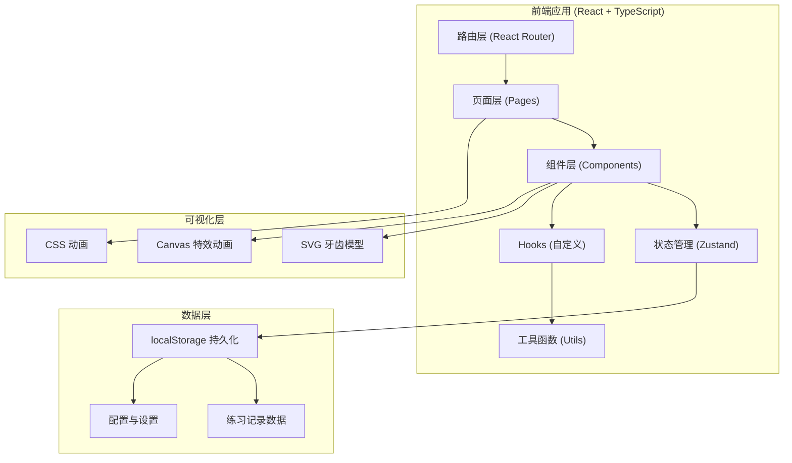
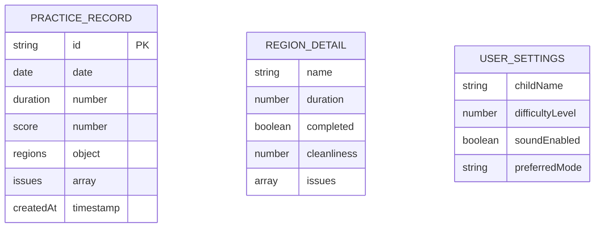

## 1. 架构设计



## 2. 技术描述

- **前端框架**: React 18 + TypeScript
- **构建工具**: Vite 5
- **样式方案**: Tailwind CSS 3
- **状态管理**: Zustand
- **路由**: React Router DOM 6
- **图表**: 原生 SVG + 简单 Canvas 实现（避免引入大型图表库，保持轻量）
- **数据持久化**: localStorage（纯前端，无需后端）
- **图标**: Lucide React
- **初始化工具**: vite-init

## 3. 路由定义

| 路由路径 | 页面组件 | 用途 |
|----------|----------|------|
| `/` | HomePage | 首页，角色选择与今日概览 |
| `/practice` | PracticePage | 刷牙游戏主页面 |
| `/result` | ResultPage | 练习结果展示页 |
| `/parent` | ParentPage | 家长中心 |
| `/doctor` | DoctorPage | 医生视角 |

## 4. 数据模型

### 4.1 数据模型定义



### 4.2 TypeScript 类型定义

```typescript
// 牙齿区域类型
type ToothRegion = 'outer' | 'inner' | 'occlusal' | 'lingual';

// 单个区域练习详情
interface RegionDetail {
  name: ToothRegion;
  duration: number;        // 实际刷的时间（秒）
  targetDuration: number;  // 目标时间（秒）
  completed: boolean;      // 是否完成
  cleanliness: number;     // 清洁度 0-100
  issues: string[];        // 问题列表
}

// 一次练习记录
interface PracticeRecord {
  id: string;
  date: string;            // YYYY-MM-DD
  startTime: number;       // timestamp
  totalDuration: number;   // 总时长（秒）
  score: number;           // 总分 0-100
  regions: Record<ToothRegion, RegionDetail>;
  overallIssues: string[]; // 整体问题
  stars: number;           // 获得星星数 0-3
}

// 用户设置
interface UserSettings {
  childName: string;
  difficulty: 'easy' | 'normal' | 'hard';
  soundEnabled: boolean;
  targetDuration: number;  // 总目标时长（秒）
}

// 游戏状态
interface GameState {
  isPlaying: boolean;
  isPaused: boolean;
  currentRegion: ToothRegion;
  currentRegionIndex: number;
  elapsedTime: number;
  regionStartTime: number;
  pressure: number;        // 当前力度 0-100
  brushPosition: { x: number; y: number } | null;
  cleanedAreas: Set<string>;
}
```

### 4.3 本地存储键名

- `tooth_trainer_records`: 所有练习记录数组
- `tooth_trainer_settings`: 用户设置
- `tooth_trainer_today`: 今日缓存数据

## 5. 项目目录结构

```
src/
├── components/           # 通用组件
│   ├── ToothModel/       # 牙齿模型组件（含4个视角）
│   ├── ToothRegionCard/  # 区域卡片
│   ├── PressureMeter/    # 力度指示器
│   ├── TimerDisplay/     # 计时器
│   ├── StarRating/       # 星星评分
│   ├── FeedbackBubble/   # 反馈气泡
│   └── ProgressRing/     # 进度环
├── pages/                # 页面组件
│   ├── HomePage/         # 首页
│   ├── PracticePage/     # 练习页
│   ├── ResultPage/       # 结果页
│   ├── ParentPage/       # 家长页
│   └── DoctorPage/       # 医生页
├── hooks/                # 自定义 Hooks
│   ├── useGameLogic.ts   # 游戏核心逻辑
│   ├── useTimer.ts       # 计时器
│   ├── useTouchBrush.ts  # 触摸刷牙检测
│   └── useLocalStorage.ts # 本地存储
├── store/                # Zustand 状态
│   ├── useGameStore.ts   # 游戏状态
│   ├── useRecordStore.ts # 记录状态
│   └── useSettingsStore.ts # 设置状态
├── utils/                # 工具函数
│   ├── scoring.ts        # 评分算法
│   ├── dateUtils.ts      # 日期工具
│   ├── feedback.ts       # 反馈文案生成
│   └── suggestions.ts    # 建议生成
├── types/                # 类型定义
│   └── index.ts
├── App.tsx
├── main.tsx
└── index.css
```

## 6. 核心算法说明

### 6.1 刷牙检测算法

通过监听触摸/鼠标移动事件来模拟刷牙动作：

1. **力度检测**: 基于滑动速度估算力度
   - 速度过快 → 力度过大
   - 速度过慢 → 力度不足
   - 速度适中 → 力度正常

2. **区域检测**: 将牙齿模型划分为多个小区块
   - 实时计算当前位置对应哪个区块
   - 记录每个区块被刷到的时长

3. **错误检测**:
   - 跳过区域：当前区域未完成就切换到下一个
   - 来回蹭同一处：在同一小区块停留时间过长且无方向变化
   - 提前结束：未完成所有区域就退出

### 6.2 评分算法

```
总分 = 区域完成度(40%) + 时间充足度(30%) + 动作规范性(30%)

- 区域完成度：四个区域是否都完成，每个区域清洁度
- 时间充足度：每个区域刷牙时间是否达标
- 动作规范性：是否有错误动作，错误次数扣分
```

### 6.3 反馈生成

根据检测到的问题生成温和的反馈文案，使用鼓励式语言：
- 不说"你错了"，而说"我们试试慢一点～"
- 不说"漏刷了"，而说"别忘了里面的牙齿哦～"

## 7. 性能优化

- 牙齿模型使用纯 SVG 绘制，避免 3D 库的性能开销
- 使用 `requestAnimationFrame` 处理动画循环
- 状态更新做节流处理，避免高频渲染
- 本地存储写入做防抖处理
- 图片资源使用 SVG，无外部图片依赖
