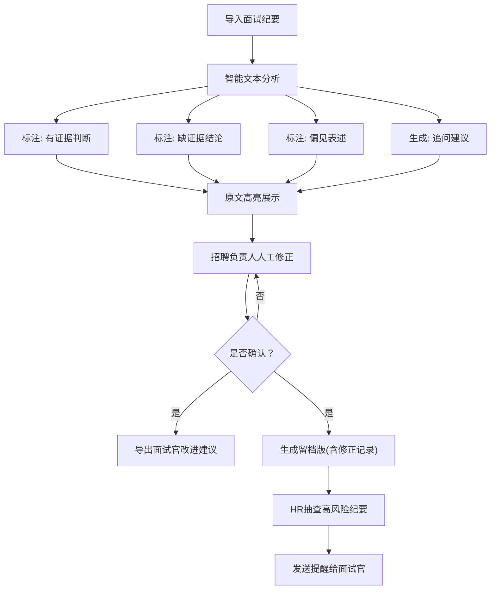

## 1. 产品概述

面试纪要偏差助手是一款面向招聘团队的智能辅助工具，帮助招聘负责人和HR复盘面试记录，识别纪要中缺少行为证据的主观判断、潜在偏见表述，并自动生成下一轮追问建议，提升面试评估的客观性与规范性。

- 解决问题：面试纪要主观化（"感觉不错""不太稳"）、缺少行为证据、夹杂个人评价、难以量化复盘
- 目标用户：招聘负责人、HR、面试官
- 核心价值：规范化面试记录、降低评估偏差、留存结构化证据、提升招聘质量

## 2. 核心功能

### 2.1 用户角色

| 角色 | 使用方式 | 核心权限 |
|------|----------|----------|
| 招聘负责人 | 导入纪要、审核标注、导出改进建议 | 完整标注编辑、导出面试官反馈 |
| HR | 抽查高风险纪要、数据统计 | 风险筛选、批量导出、统计看板 |
| 面试官 | 查看改进建议 | 仅查看本人纪要的反馈 |

### 2.2 功能模块

1. **纪要导入页**：文本粘贴/文件上传、候选人信息填写、岗位与轮次选择
2. **分析标注页**：智能标注四种类型（有证据判断/缺证据结论/偏见表述/追问建议）、人工修正、原句位置保留
3. **确认导出页**：招聘负责人审核确认、导出面试官改进建议、生成留档版（含修正记录）
4. **HR抽查页**：高风险纪要筛选、风险分布统计、批量提醒

### 2.3 页面详情

| 页面名称 | 模块名称 | 功能描述 |
|----------|----------|----------|
| 纪要导入页 | 顶部导航 | 角色切换、页面跳转 |
| 纪要导入页 | 导入表单 | 候选人姓名/岗位/轮次、面试官简称、纪要文本框、文件上传（.txt/.md） |
| 纪要导入页 | 示例数据 | 一键加载示例纪要、历史导入列表 |
| 分析标注页 | 原文视图 | 按段落展示原文、高亮标注类型、悬浮显示原句位置 |
| 分析标注页 | 标注侧边栏 | 四类标注的数量统计、分类筛选、单个标注详情与编辑 |
| 分析标注页 | 追问建议区 | 自动生成的追问问题、支持添加自定义追问 |
| 分析标注页 | 工具栏 | 撤销/重做、重置所有标注、保存草稿 |
| 确认导出页 | 审核视图 | 标注概览、修正记录时间线、确认按钮 |
| 确认导出页 | 导出面板 | 面试官改进建议（精简版）、留档版（含原句/修正/位置）、导出格式选择 |
| HR抽查页 | 风险看板 | 高风险纪要占比、偏见类型分布、证据缺失率趋势 |
| HR抽查页 | 纪要列表 | 按风险等级筛选、面试官维度筛选、批量选择与提醒 |

## 3. 核心流程

主要用户流程：
1. 招聘负责人导入面试纪要文本或上传文件
2. 系统自动分析并标注四类内容，在原文中高亮显示
3. 招聘负责人逐条审核标注结果，可删除/修改/新增标注
4. 确认无误后，导出给面试官的改进建议（精简版）和完整留档版
5. HR定期抽查高风险纪要，向相关面试官发送规范提醒

## 4. 用户界面设计

### 4.1 设计风格
- 主色调：深海蓝 #1e3a5f（专业、可信），辅助色：暖橙 #f59e0b（警告标注）、翠绿 #10b981（有证据）、玫红 #ef4444（偏见风险）、靛蓝 #6366f1（追问建议）
- 按钮风格：圆角中等、微阴影、悬停有细微上浮
- 字体：标题使用 Cormorant Garamond（衬线，优雅专业），正文使用 Plus Jakarta Sans（现代无衬线，易读）
- 布局：卡片式分区、顶部固定导航、分析页采用三栏布局（原文/标注栏/追问区）
- 视觉细节：柔和纹理背景、卡片微渐变边框、标注高亮使用半透明色块+下划线

### 4.2 页面设计概览

| 页面名称 | 模块名称 | UI元素 |
|----------|----------|--------|
| 纪要导入页 | Hero区域 | 大标题、副标题、核心功能图标、示例数据按钮 |
| 纪要导入页 | 导入卡片 | 表单分区、大文本框、拖拽上传区、步骤指示器 |
| 分析标注页 | 三栏布局 | 左：原文高亮视图，中：标注分类列表，右：追问建议 |
| 分析标注页 | 标注交互 | 悬浮弹出标注卡片、颜色图例、批量操作 |
| 确认导出页 | 时间线 | 修正记录时间轴、双栏导出预览 |
| HR抽查页 | 统计看板 | 数据卡片、风险环形图、趋势折线图 |

### 4.3 响应式
- 桌面端优先（≥1280px），三栏布局
- 平板端（768-1279px）：两栏布局，追问区折叠为抽屉
- 移动端（<768px）：单栏滚动，标签页切换不同视图
- 所有交互均支持触摸操作

### 4.4 动效设计
- 页面加载：分模块渐入，标题先现，内容随后
- 标注生成：逐条淡入，带颜色脉冲动画
- 导出确认：按钮点击有涟漪效果，成功显示打勾动画
- 悬浮交互：卡片轻微上浮、阴影加深
