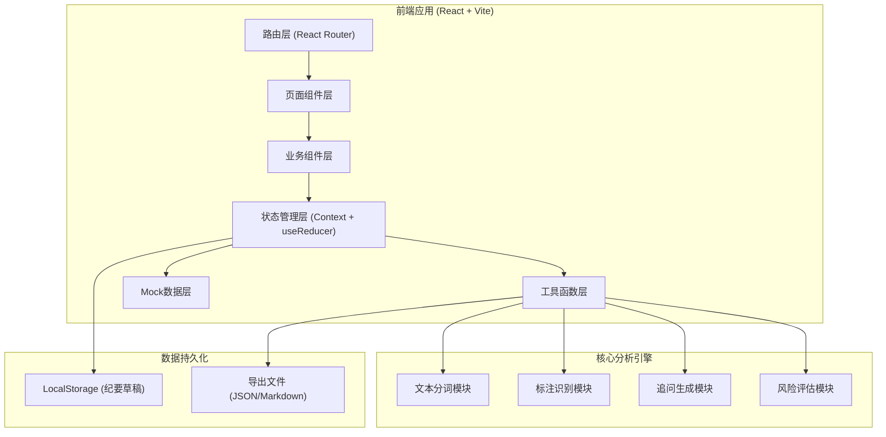
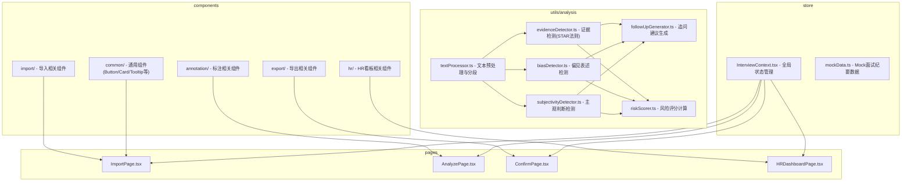

## 1. 架构设计



## 2. 技术说明

- 前端框架：React 18 + TypeScript
- 构建工具：Vite 5
- 样式方案：Tailwind CSS 3（配合 CSS 变量实现主题）
- 路由管理：React Router v6
- 状态管理：React Context + useReducer（轻量级，避免过度工程化）
- 图标：Lucide React
- 后端：无（纯前端应用，分析逻辑在前端实现，使用 Mock 数据）
- 数据存储：LocalStorage 存储草稿，文件导出（JSON/Markdown/TXT）

## 3. 路由定义

| 路由 | 页面 | 说明 |
|------|------|------|
| / | 首页/纪要导入页 | 项目介绍、纪要导入表单 |
| /analyze/:id | 分析标注页 | 智能标注、人工修正、追问建议 |
| /confirm/:id | 确认导出页 | 审核确认、导出改进建议和留档版 |
| /hr-dashboard | HR抽查页 | 风险看板、高风险纪要列表、批量提醒 |

## 4. 核心数据类型定义

```typescript
// 标注类型
type AnnotationType = 'evidence' | 'no_evidence' | 'bias' | 'follow_up';

// 单个标注
interface Annotation {
  id: string;
  type: AnnotationType;
  text: string;           // 被标注的原文
  start: number;          // 在原文中的起始位置
  end: number;            // 在原文中的结束位置
  paragraphIndex: number; // 段落索引
  reason?: string;        // 标注理由（系统生成或人工填写）
  suggestion?: string;    // 改进建议
  isManual: boolean;      // 是否为人工标注/修正
  createdAt: number;
}

// 追问建议
interface FollowUpQuestion {
  id: string;
  question: string;
  relatedAnnotationId?: string;
  isCustom: boolean;      // 是否为人工添加
  priority: 'high' | 'medium' | 'low';
}

// 修正记录
interface RevisionRecord {
  id: string;
  action: 'add' | 'modify' | 'delete';
  annotationId: string;
  oldValue?: Partial<Annotation>;
  newValue?: Partial<Annotation>;
  timestamp: number;
  operator: 'system' | 'user';
}

// 面试纪要
interface InterviewRecord {
  id: string;
  candidateName: string;
  position: string;
  round: number;
  interviewerAlias: string;
  interviewDate: string;
  content: string;
  paragraphs: string[];
  annotations: Annotation[];
  followUpQuestions: FollowUpQuestion[];
  revisions: RevisionRecord[];
  riskScore: number;      // 0-100 风险评分
  status: 'draft' | 'analyzed' | 'confirmed' | 'exported';
  createdAt: number;
  updatedAt: number;
}

// 分析结果
interface AnalysisResult {
  annotations: Annotation[];
  followUpQuestions: FollowUpQuestion[];
  riskScore: number;
  biasTypes: string[];
}
```

## 5. 模块架构



## 6. 标注识别规则（前端内置规则引擎）

### 6.1 有证据判断 (evidence)
- 包含具体行为动词：完成、设计、实现、优化、带领、解决
- 包含量化数据：数字、百分比、时间周期
- 符合STAR模式：情境(S)/任务(T)/行动(A)/结果(R)
- 引用候选人原话（引号内内容）

### 6.2 缺证据结论 (no_evidence)
- 主观感受词：感觉不错、挺好的、不太稳、一般、还行
- 模糊评价：能力强、技术好、沟通不错、有潜力
- 绝对化判断：肯定不行、绝对适合、完全不匹配
- 无具体事例支撑的结论性语句

### 6.3 偏见表述 (bias)
- 性别/年龄/外貌相关：女孩子、年纪大了、形象一般
- 地域/学校偏见：XX地方的人、XX学校出来的
- 刻板印象：90后不稳定、男生更适合、女生细心
- 个人好恶：我不喜欢这种风格、和我气场不合

### 6.4 保护项（不做标注）
- 候选人项目名/公司名：双引号或大写开头的特定名词
- 面试官简称：XX总、XX老师、英文名缩写
- 引用原话：明确的引号包裹内容
- 玩笑语气：哈哈、😄、表情符号等轻松语境
