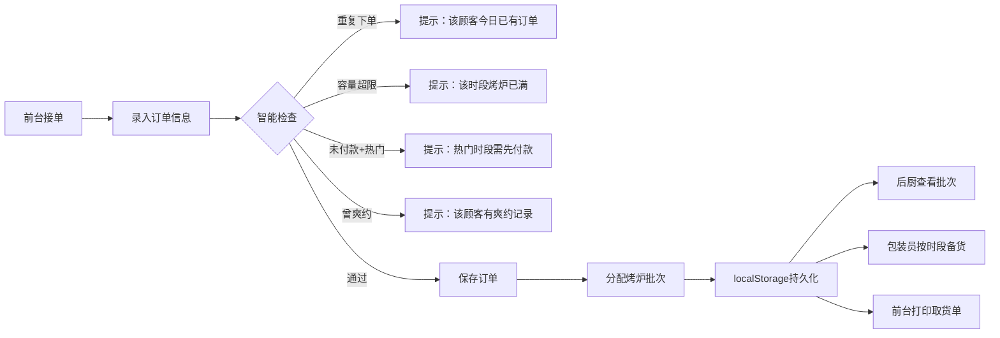
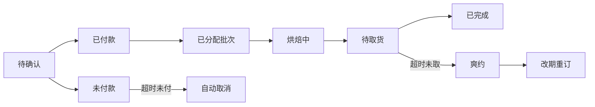

## 1. 产品概述

面包预订取货日历是一款面向面包店的订单管理系统，解决节日高峰期法棍、吐司、蛋糕等产品的预订冲突问题。通过烤炉批次规划、取货窗口调度、智能提示预警，帮助前台、后厨、包装员三方协同，避免烤炉过载和包装台拥堵。

### 核心价值
- 解决下午取货高峰时段烤炉批次冲突
- 实现订单数据持久化，刷新不丢失
- 多角色协同：前台录单、后厨烘焙、包装备货
- 智能预警重复下单、容量超限、未付款占坑、爽约改期

## 2. 核心 Features

### 2.1 用户角色

| 角色 | 使用场景 | 核心权限 |
|------|----------|----------|
| 前台 | 门店接单、打印取货单 | 录入/修改订单、打印取货清单、查看日历 |
| 后厨 | 烘焙生产调度 | 查看批次计划、分配烤炉批次、查看烘焙清单 |
| 包装员 | 备货打包 | 按时段查看订单、提前摆袋准备 |

### 2.2 功能模块

1. **日历主视图**：按日期/时段展示预订，支持日视图和批次视图切换
2. **订单录入**：顾客信息、品类（法棍/吐司/蛋糕）、数量、取货时间、付款状态、特殊口味
3. **烤炉批次管理**：批次容量配置、自动分配、超限预警
4. **取货窗口管理**：时段划分、热门时段标记、未付款预警
5. **智能提示系统**：重复下单、容量超限、未付款占坑、爽约改期
6. **打印功能**：前台取货清单、后厨烘焙清单
7. **数据持久化**：localStorage 本地存储
8. **爽约管理**：标记爽约、改期记录追踪

### 2.3 页面详情

| 页面名称 | 模块名称 | 功能描述 |
|---------|----------|----------|
| 日历主页面 | 日历视图 | 按日期格子展示订单数量，点击查看详情 |
| 日历主页面 | 时段视图 | 按取货时段（下午13-18点每小时一格）展示订单 |
| 日历主页面 | 批次视图 | 按烤炉批次展示待烘焙产品数量 |
| 订单录入弹窗 | 表单录入 | 顾客姓名、电话、品类、数量、取货时间、付款状态、特殊口味 |
| 订单详情面板 | 订单列表 | 展示时段内所有订单，支持编辑/删除/标记爽约 |
| 打印页面 | 取货清单 | 按顾客打印取货凭证，包含产品明细 |
| 打印页面 | 烘焙清单 | 按批次打印每炉需要烤的品类和数量 |
| 打印页面 | 包装清单 | 按时段打印需要提前摆袋的订单 |
| 设置面板 | 系统配置 | 烤炉容量、时段划分、热门时段设置 |

## 3. 核心流程

### 订单状态流转

## 4. 用户界面设计

### 4.1 设计风格
- **主色调**：温暖的面包烘焙色系 - 小麦金 (#D4A574)、深棕 (#5D4037)、奶油白 (#FFF8E1)
- **辅助色**：烘焙橙 (#FF8A65) 用于强调按钮、抹茶绿 (#81C784) 用于已完成、警示红 (#E57373) 用于预警
- **字体**：标题用 "Noto Serif SC" 衬线体体现面包店温馨感，正文用 "Noto Sans SC" 保证可读性
- **卡片风格**：圆角 12px，柔和阴影，模拟面包纸袋质感
- **图标**：使用面包相关 emoji 和线性图标组合（🥖🍞🎂）
- **背景纹理**：轻微的面粉颗粒质感叠加渐变背景

### 4.2 页面设计概览

| 页面名称 | 模块名称 | UI 元素 |
|---------|----------|---------|
| 日历主页面 | 顶部导航 | Logo、日期切换、视图切换（日历/时段/批次）、新增订单按钮 |
| 日历主页面 | 日历网格 | 7x6 日期格子，显示当日订单数量和状态指示条 |
| 日历主页面 | 时段时间轴 | 下午 13:00-18:00 垂直时间轴，每格 30 分钟 |
| 日历主页面 | 批次面板 | 烤炉批次卡片，显示批次号、容量、已用、产品明细 |
| 订单录入弹窗 | 表单 | 分步骤录入：顾客信息 → 产品选择 → 取货时间 → 确认 |
| 订单详情面板 | 订单卡片 | 顾客头像、产品标签、付款状态徽章、取货时间、操作按钮 |
| 打印页面 | 清单布局 | A4 打印优化，简洁黑白，大字体产品名称和数量 |
| 设置面板 | 配置表单 | 烤炉容量、时段长度、热门时段标记、提醒开关 |

### 4.3 交互细节
- **订单卡片悬停**：轻微上浮 + 阴影加深 + 产品图标微动效
- **智能提示**：toast 通知从顶部滑入，预警类带轻微震动效果
- **视图切换**：平滑过渡动画，批次视图用烤炉火焰进度条
- **打印按钮**：点击后生成打印预览，自动调用浏览器打印
- **爽约标记**：红色边框闪烁动画，鼠标悬停显示爽约历史

### 4.4 响应式设计
- **桌面端（1280px+）**：三栏布局 - 左侧日历导航 + 中间订单列表 + 右侧批次详情
- **平板端（768-1279px）**：两栏布局 - 日历/时段视图 + 订单详情抽屉
- **移动端（<768px）**：单栏堆叠，底部标签栏切换视图，弹窗式订单录入
- **打印优化**：`@media print` 去除所有导航和交互元素，只保留清单内容

### 4.5 动效设计
- 页面加载：订单卡片从下往上 staggered 入场，间隔 80ms
- 新增订单：表单字段依次滑入，提交成功后绿色对勾扩散动画
- 预警提示：红色边框脉冲动画（opacity 0.5-1 循环）
- 批次进度：烘焙进度条用火焰渐变填充动画
- 日历切换：月视图切换时整页水平滑动过渡
