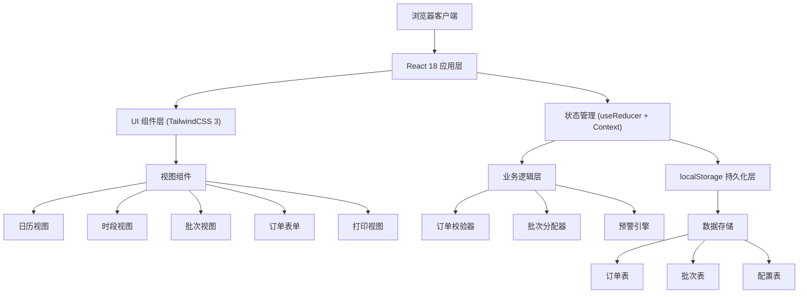
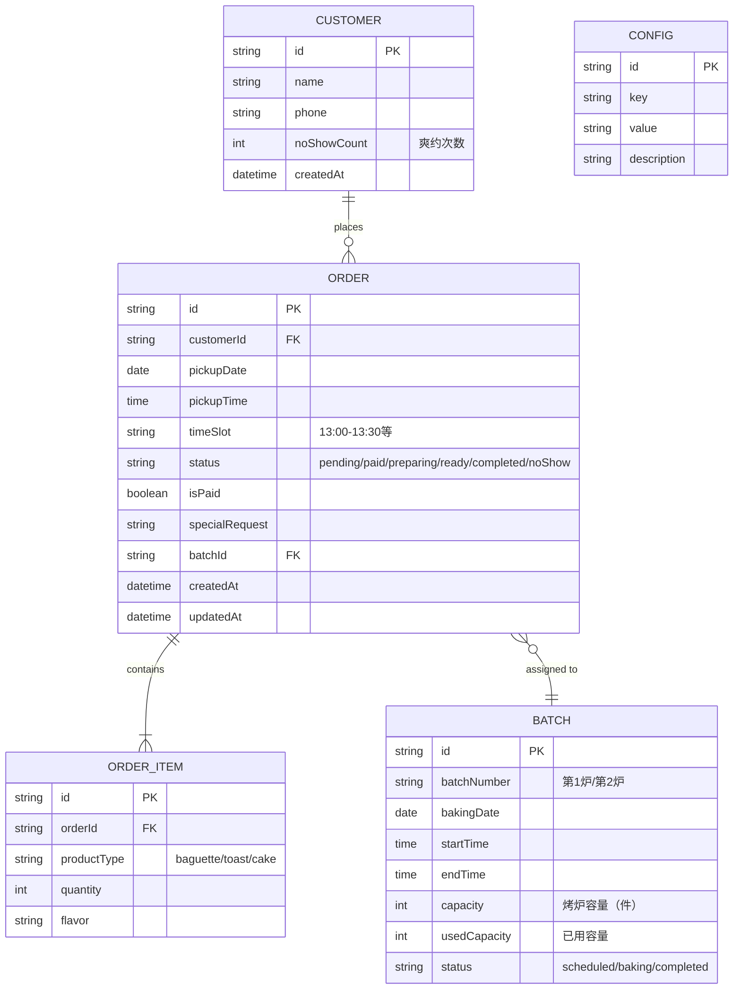

## 1. 架构设计



## 2. 技术栈说明

- **前端框架**：React 18 + TypeScript
- **构建工具**：Vite 5
- **样式方案**：TailwindCSS 3
- **状态管理**：React useReducer + Context API（轻量场景无需 Redux）
- **图标库**：Lucide React（线性图标，配合面包 emoji）
- **日期处理**：date-fns（轻量级日期库）
- **打印方案**：原生 window.print() + CSS @media print
- **数据持久化**：localStorage（键值存储，JSON 序列化）
- **后端**：无后端，纯前端应用，数据本地存储
- **数据库**：localStorage 模拟（订单/批次/配置三张逻辑表）

### 技术选型理由
1. **React 18**：并发渲染、自动批处理，提升复杂交互体验
2. **TailwindCSS 3**：快速构建面包店暖色调 UI，响应式开箱即用
3. **localStorage**：无需服务端，刷新后订单不丢失，满足小店需求
4. **date-fns**：轻量日期处理，支持按周/月/批次分组
5. **Lucide React**：线性图标与面包 emoji 混搭，风格统一

## 3. 路由定义

| 路由 | 页面用途 |
|------|---------|
| `/` | 日历主视图（默认月视图） |
| `/day/:date` | 日视图 + 时段时间轴 |
| `/batch` | 烤炉批次管理视图 |
| `/order/new` | 新建订单（弹窗式，无需独立路由） |
| `/print/pickup/:date` | 取货清单打印页 |
| `/print/baking/:batchId` | 烘焙清单打印页 |
| `/print/packing/:date` | 包装清单打印页 |
| `/settings` | 系统设置页 |

## 4. 核心数据模型

### 4.1 实体关系图



### 4.2 TypeScript 类型定义

```typescript
// 产品类型
type ProductType = 'baguette' | 'toast' | 'cake';

// 订单状态
type OrderStatus = 'pending' | 'paid' | 'preparing' | 'ready' | 'completed' | 'noShow';

// 批次状态
type BatchStatus = 'scheduled' | 'baking' | 'completed';

// 顾客信息
interface Customer {
  id: string;
  name: string;
  phone: string;
  noShowCount: number;
  createdAt: string;
}

// 订单项
interface OrderItem {
  id: string;
  orderId: string;
  productType: ProductType;
  quantity: number;
  flavor: string;
}

// 订单
interface Order {
  id: string;
  customerId: string;
  customerName: string;
  customerPhone: string;
  pickupDate: string; // YYYY-MM-DD
  pickupTime: string; // HH:mm
  timeSlot: string; // HH:mm-HH:mm
  status: OrderStatus;
  isPaid: boolean;
  specialRequest: string;
  batchId: string | null;
  items: OrderItem[];
  noShowHistory: string[]; // 爽约记录的订单ID
  createdAt: string;
  updatedAt: string;
}

// 烤炉批次
interface Batch {
  id: string;
  batchNumber: number;
  bakingDate: string;
  startTime: string;
  endTime: string;
  capacity: number;
  usedCapacity: number;
  status: BatchStatus;
  productSummary: {
    baguette: number;
    toast: number;
    cake: number;
  };
}

// 系统配置
interface AppConfig {
  ovenCapacity: number; // 每炉容量
  timeSlotDuration: number; // 时段长度（分钟）
  peakHours: string[]; // 热门时段 ['15:00-16:00', '16:00-17:00']
  pickupStartTime: string; // 取货开始时间
  pickupEndTime: string; // 取货结束时间
  bakingInterval: number; // 烤炉间隔（分钟）
  prepTime: number; // 提前准备时间（分钟）
}

// 预警类型
type WarningType = 
  | 'duplicate_order' 
  | 'batch_full' 
  | 'unpaid_peak' 
  | 'no_show_history'
  | 'batch_conflict';

interface Warning {
  type: WarningType;
  message: string;
  severity: 'info' | 'warning' | 'error';
  orderId?: string;
}
```

### 4.3 核心业务逻辑

#### 4.3.1 订单校验器 (OrderValidator)
```typescript
class OrderValidator {
  // 检查同一顾客当日重复下单
  checkDuplicateOrder(customerId: string, date: string): Warning | null;
  
  // 检查烤炉批次容量
  checkBatchCapacity(date: string, items: OrderItem[]): Warning | null;
  
  // 检查未付款占用热门时段
  checkUnpaidPeakHour(timeSlot: string, isPaid: boolean): Warning | null;
  
  // 检查顾客爽约历史
  checkNoShowHistory(customerId: string): Warning | null;
  
  // 综合校验，返回所有预警
  validate(order: OrderDraft): Warning[];
}
```

#### 4.3.2 批次分配器 (BatchAllocator)
```typescript
class BatchAllocator {
  // 根据取货时间自动分配烘焙批次
  // 规则：取货时间 - 准备时间 = 出炉时间，往前推烘焙时间
  allocateBatch(pickupDateTime: Date, items: OrderItem[]): Batch | null;
  
  // 计算产品占用容量（法棍=1，吐司=2，蛋糕=3）
  calculateCapacity(items: OrderItem[]): number;
  
  // 查找可用批次，自动创建新批次
  findOrCreateBatch(bakingDate: Date, requiredCapacity: number): Batch;
  
  // 按批次分组订单，用于后厨查看
  groupOrdersByBatch(date: string): Map<string, Order[]>;
}
```

#### 4.3.3 订单状态机
```
pending → paid → preparing → ready → completed
              ↓                    ↓
            unpaid 超时 → canceled  超时未取 → noShow
```

## 5. 项目目录结构

```
src/
├── components/
│   ├── calendar/
│   │   ├── MonthView.tsx        # 月历视图
│   │   ├── DayView.tsx          # 日视图+时段轴
│   │   ├── BatchView.tsx        # 批次视图
│   │   └── CalendarHeader.tsx   # 日历头部
│   ├── order/
│   │   ├── OrderForm.tsx        # 订单录入表单
│   │   ├── OrderCard.tsx        # 订单卡片
│   │   ├── OrderList.tsx        # 订单列表
│   │   └── OrderDetail.tsx      # 订单详情
│   ├── batch/
│   │   ├── BatchCard.tsx        # 批次卡片
│   │   ├── BatchProgress.tsx    # 批次进度条
│   │   └── BatchList.tsx        # 批次列表
│   ├── print/
│   │   ├── PickupListPrint.tsx  # 取货清单打印
│   │   ├── BakingListPrint.tsx  # 烘焙清单打印
│   │   └── PackingListPrint.tsx # 包装清单打印
│   ├── common/
│   │   ├── Toast.tsx            # 通知提示
│   │   ├── Modal.tsx            # 弹窗
│   │   ├── Button.tsx           # 按钮组件
│   │   └── WarningBadge.tsx     # 预警徽章
│   └── layout/
│       ├── Header.tsx           # 顶部导航
│       ├── Sidebar.tsx          # 侧边栏
│       └── AppLayout.tsx        # 主布局
├── hooks/
│   ├── useOrders.ts             # 订单管理Hook
│   ├── useBatch.ts              # 批次管理Hook
│   ├── useWarning.ts            # 预警Hook
│   ├── useLocalStorage.ts       # 本地存储Hook
│   └── usePrint.ts              # 打印Hook
├── store/
│   ├── AppContext.tsx           # 全局Context
│   ├── appReducer.ts            # 状态Reducer
│   └── initialState.ts          # 初始状态（含Mock数据）
├── types/
│   └── index.ts                 # 类型定义
├── utils/
│   ├── dateUtils.ts             # 日期工具
│   ├── orderValidator.ts        # 订单校验
│   ├── batchAllocator.ts        # 批次分配
│   ├── storage.ts               # 存储工具
│   └── printUtils.ts            # 打印工具
├── data/
│   └── mockData.ts              # 模拟数据
├── App.tsx
├── main.tsx
└── index.css
```

## 6. 状态管理设计

### 6.1 State 结构
```typescript
interface AppState {
  orders: Order[];
  batches: Batch[];
  customers: Customer[];
  config: AppConfig;
  currentView: 'calendar' | 'day' | 'batch';
  selectedDate: string;
  selectedBatchId: string | null;
  warnings: Warning[];
  isLoading: boolean;
}
```

### 6.2 Action 类型
```typescript
type AppAction =
  | { type: 'ADD_ORDER'; payload: Order }
  | { type: 'UPDATE_ORDER'; payload: Order }
  | { type: 'DELETE_ORDER'; payload: string }
  | { type: 'MARK_NO_SHOW'; payload: string }
  | { type: 'ADD_BATCH'; payload: Batch }
  | { type: 'UPDATE_BATCH'; payload: Batch }
  | { type: 'ALLOCATE_BATCH'; payload: { orderId: string; batchId: string } }
  | { type: 'SET_VIEW'; payload: AppState['currentView'] }
  | { type: 'SET_DATE'; payload: string }
  | { type: 'UPDATE_CONFIG'; payload: Partial<AppConfig> }
  | { type: 'ADD_WARNING'; payload: Warning }
  | { type: 'CLEAR_WARNINGS' }
  | { type: 'LOAD_FROM_STORAGE'; payload: Partial<AppState> };
```

## 7. 性能优化策略

1. **数据持久化**：使用 debounce 保存到 localStorage，避免频繁写入
2. **列表虚拟滚动**：订单量大时使用 `react-window` 按需渲染
3. **记忆化计算**：使用 `useMemo` 缓存批次统计、日订单汇总等计算结果
4. **懒加载**：打印组件按需加载，减少首屏包体积
5. **批量更新**：使用 React 18 `useTransition` 优化日历切换时的渲染
6. **本地缓存**：常用查询结果（当日订单、当前批次）使用 React Query 风格的缓存机制

## 8. 数据持久化方案

### localStorage 键名约定
- `bread_booking_orders` - 订单数据
- `bread_booking_batches` - 批次数据
- `bread_booking_customers` - 顾客数据
- `bread_booking_config` - 系统配置
- `bread_booking_version` - 数据版本号（用于迁移）

### 数据迁移策略
- 每次应用启动时检查版本号
- 版本不匹配时执行迁移函数
- 迁移前自动备份旧数据
