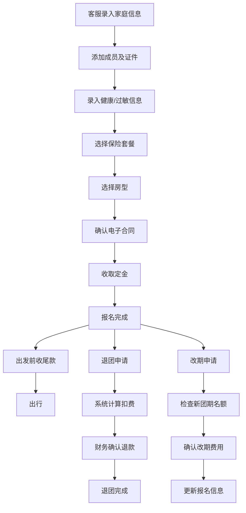

# 亲子游报名合同台 - 产品需求文档

## 1. 产品概述

亲子游报名合同台是一款面向旅行社客服、领队和财务人员的报名管理系统，解决群聊报名信息混乱、容易遗漏、人工计算易错等痛点，实现报名全流程数字化管理。

- **核心问题**：群聊报名信息散乱，证件、保险、房型、合同、付款等信息容易遗漏；人工计算定金、退团费用容易出错
- **目标用户**：旅行社客服、领队、财务人员、随队老师
- **产品价值**：提升报名效率、减少人工错误、确保信息完整、支持多角色协作

## 2. 核心功能

### 2.1 用户角色

| 角色 | 核心权限 |
|------|----------|
| 客服 | 报名登记、合同确认、收款登记、改期/退团申请、补材料登记 |
| 领队 | 查看报名列表、导出出行名单、分房分车管理、特殊照护备注打印 |
| 财务 | 查看收款退款记录、导出收款退款报表 |
| 管理员 | 全部功能、系统配置 |

### 2.2 功能模块

1. **报名登记台**：家庭成员信息、证件信息、过敏备注、保险选择、房型选择、合同确认、付款记录
2. **后台管理**：报名列表、改期管理、退团管理、补材料管理、智能提醒中心
3. **分房分车**：按家庭自动分房、手动调整、按家庭分车、特殊照护汇总
4. **数据导出**：出行名单导出、收款退款导出、分房表导出、特殊照护单打印

### 2.3 页面详情

| 页面名称 | 模块名称 | 功能描述 |
|----------|----------|----------|
| 报名登记页 | 家庭信息卡 | 录入家长姓名、联系电话、家庭人数 |
| 报名登记页 | 成员列表 | 添加/编辑/删除家庭成员，区分家长和孩子 |
| 报名登记页 | 证件信息 | 录入身份证号、证件类型、证件有效期，自动校验 |
| 报名登记页 | 健康信息 | 过敏史、特殊疾病、饮食禁忌、特殊照护备注 |
| 报名登记页 | 保险选择 | 选择保险套餐，显示保险详情和费用 |
| 报名登记页 | 房型选择 | 选择房型、房间数量、拼房需求 |
| 报名登记页 | 合同确认 | 电子合同展示、确认签署、签署时间记录 |
| 报名登记页 | 付款记录 | 定金/尾款金额、付款方式、付款时间、票据信息 |
| 报名列表页 | 筛选搜索 | 按团期、姓名、状态、付款状态筛选 |
| 报名列表页 | 报名卡片 | 显示家庭概览、状态标签、快捷操作 |
| 报名详情页 | 完整信息 | 展示全部报名信息，支持编辑修改 |
| 报名详情页 | 操作日志 | 记录所有变更操作和操作人 |
| 智能提醒中心 | 证件过期提醒 | 证件即将过期或已过期的报名提醒 |
| 智能提醒中心 | 年龄不符提醒 | 孩子年龄不符合项目要求的提醒 |
| 智能提醒中心 | 合同未确认提醒 | 已收尾款但合同未确认的风险提醒 |
| 智能提醒中心 | 退团扣费提醒 | 退团日期对应的扣费比例提示 |
| 分房分车页 | 分房管理 | 按家庭自动分房、手动拖拽调整 |
| 分房分车页 | 分车管理 | 按家庭分配车辆、统计乘车人数 |
| 分房分车页 | 特殊照护 | 汇总所有特殊照护备注，支持打印 |
| 数据导出页 | 出行名单 | 按团期导出完整出行名单Excel |
| 数据导出页 | 收款退款 | 导出收款和退款明细报表 |
| 数据导出页 | 分房表 | 导出房间分配明细表 |

## 3. 核心流程

### 3.1 报名流程

客服录入家庭信息 → 添加成员及证件 → 选择保险和房型 → 确认合同 → 收取定金 → 报名完成 → 出发前收尾款 → 出行

### 3.2 退团流程

客户申请退团 → 客服录入退团日期 → 系统自动计算扣费比例 → 计算退款金额 → 财务确认退款 → 退团完成

### 3.3 改期流程

客户申请改期 → 客服选择新团期 → 系统检查新团期名额 → 确认改期费用 → 更新报名信息

## 4. 用户界面设计

### 4.1 设计风格

- **主色调**：温暖琥珀色 (#f59e0b) - 代表亲子、温暖、活力
- **辅助色**：森林绿 (#10b981) - 代表安全、健康、自然
- **警示色**：珊瑚红 (#ef4444) - 用于错误提醒和风险提示
- **中性色**：暖灰色系 - 营造温馨专业的氛围
- **整体风格**：卡片式布局、圆角设计、柔和阴影、温馨亲子感
- **按钮风格**：大圆角按钮，悬停有轻微上浮效果
- **字体**：中文使用 Noto Sans SC，清晰易读
- **图标风格**：使用 lucide-react 线性图标，统一风格

### 4.2 页面设计概览

| 页面名称 | 模块名称 | UI元素 |
|----------|----------|--------|
| 报名登记页 | 步骤导航 | 顶部步骤条，显示当前进度，已完成步骤打勾 |
| 报名登记页 | 信息卡片 | 白色卡片，浅灰色边框，柔和阴影，卡片内分组 |
| 报名登记页 | 成员卡片 | 每个成员一张小卡片，头像+姓名+关系标签 |
| 报名列表页 | 筛选栏 | 顶部搜索和筛选，状态标签筛选 |
| 报名列表页 | 列表卡片 | 左侧家庭概览，右侧状态标签和快捷操作按钮 |
| 智能提醒中心 | 提醒卡片 | 彩色左侧边框，图标+标题+详情+操作按钮 |
| 分房分车页 | 房间网格 | 网格布局展示房间，可拖拽调整 |
| 数据导出页 | 导出卡片 | 图标+标题+描述+导出按钮 |

### 4.3 响应式设计

- 桌面端优先设计（1280px 及以上）
- 平板端自适应（768px - 1279px）
- 手机端单列布局（375px - 767px）
- 支持触控操作，按钮最小 44x44px

### 4.4 交互动效

- 页面切换：淡入淡出过渡
- 卡片悬停：轻微上浮 + 阴影加深
- 按钮点击：缩放反馈
- 表单验证：错误提示抖动动画
- 步骤切换：平滑滚动到下一步
- 提醒出现：从右侧滑入
