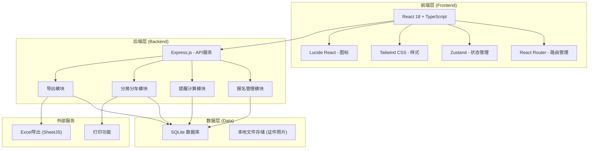
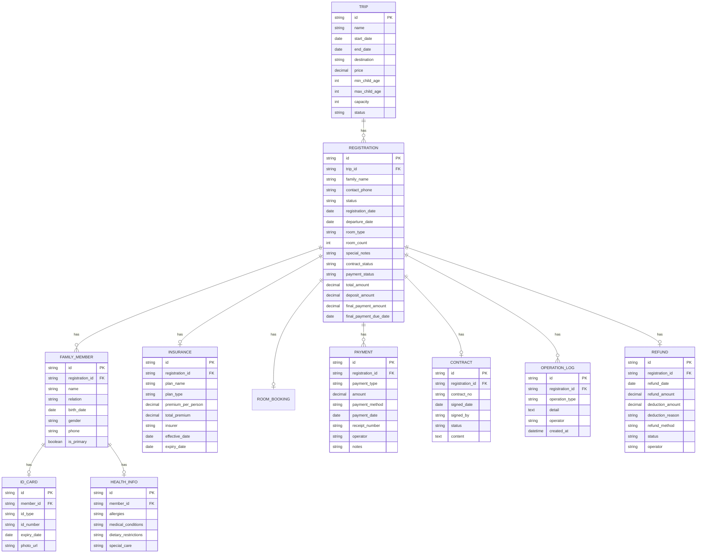

# 亲子游报名合同台 - 技术架构文档

## 1. 架构设计



## 2. 技术栈说明

- **前端框架**：React 18 + TypeScript
- **构建工具**：Vite
- **路由管理**：react-router-dom
- **状态管理**：zustand
- **样式方案**：Tailwind CSS 3
- **图标库**：lucide-react
- **后端框架**：Express.js 4
- **数据库**：SQLite（轻量级，便于本地部署）
- **Excel导出**：SheetJS (xlsx)
- **HTTP客户端**：fetch API

## 3. 路由定义

| 路由路径 | 页面名称 | 说明 |
|----------|----------|------|
| / | 首页/工作台 | 快捷入口、数据概览、提醒统计 |
| /register | 报名登记 | 新报名录入，多步骤表单 |
| /register/:id | 报名详情 | 查看/编辑单个报名详情 |
| /list | 报名列表 | 所有报名列表，筛选搜索 |
| /reminders | 智能提醒 | 证件过期、年龄不符等提醒 |
| /rooming | 分房分车 | 房间分配、车辆分配、特殊照护 |
| /export | 数据导出 | 出行名单、收款退款等导出 |
| /settings | 系统设置 | 团期管理、保险配置、房型配置 |

## 4. 数据模型

### 4.1 ER图



### 4.2 核心数据结构 (TypeScript)

```typescript
// 报名状态
type RegistrationStatus = 'pending' | 'confirmed' | 'deposit_paid' | 'fully_paid' | 'departed' | 'cancelled' | 'refunded';

// 合同状态
type ContractStatus = 'unsigned' | 'signed' | 'waived';

// 付款状态
type PaymentStatus = 'unpaid' | 'deposit_paid' | 'fully_paid' | 'partial_refund' | 'full_refund';

interface FamilyMember {
  id: string;
  registrationId: string;
  name: string;
  relation: 'father' | 'mother' | 'child' | 'grandpa' | 'grandma' | 'other';
  birthDate: string;
  gender: 'male' | 'female';
  phone?: string;
  isPrimary: boolean;
  idCard?: {
    type: 'id_card' | 'passport' | 'birth_certificate' | 'other';
    number: string;
    expiryDate?: string;
  };
  health?: {
    allergies?: string;
    medicalConditions?: string;
    dietaryRestrictions?: string;
    specialCare?: string;
  };
}

interface Registration {
  id: string;
  tripId: string;
  tripName: string;
  departureDate: string;
  familyName: string;
  contactPhone: string;
  status: RegistrationStatus;
  members: FamilyMember[];
  insurance?: {
    planName: string;
    planType: string;
    premiumPerPerson: number;
    totalPremium: number;
    insurer: string;
  };
  roomBooking: {
    roomType: string;
    roomCount: number;
    roomPrice: number;
    hasExtraBed: boolean;
    sharingRequest?: string;
  };
  contract: {
    status: ContractStatus;
    signedDate?: string;
    signedBy?: string;
    contractNo?: string;
  };
  payments: Payment[];
  refund?: Refund;
  totalAmount: number;
  depositAmount: number;
  finalPaymentAmount: number;
  finalPaymentDueDate: string;
  specialNotes?: string;
  createdAt: string;
  updatedAt: string;
}

interface Payment {
  id: string;
  registrationId: string;
  paymentType: 'deposit' | 'final' | 'supplement' | 'other';
  amount: number;
  paymentMethod: 'cash' | 'wechat' | 'alipay' | 'bank_transfer' | 'credit_card';
  paymentDate: string;
  receiptNumber?: string;
  operator: string;
  notes?: string;
}

interface Refund {
  id: string;
  registrationId: string;
  refundDate: string;
  refundAmount: number;
  deductionAmount: number;
  deductionReason: string;
  refundMethod: string;
  status: 'pending' | 'completed' | 'cancelled';
  operator: string;
}

// 提醒类型
interface Reminder {
  id: string;
  type: 'id_expiry' | 'age_mismatch' | 'contract_unsigned' | 'final_payment_due' | 'document_missing';
  level: 'info' | 'warning' | 'error';
  title: string;
  description: string;
  registrationId: string;
  registrationName: string;
  relatedMemberId?: string;
  relatedMemberName?: string;
  date?: string;
  createdAt: string;
}

// 分房记录
interface RoomAssignment {
  id: string;
  tripId: string;
  roomNo: string;
  roomType: string;
  capacity: number;
  registrationIds: string[];
  memberIds: string[];
  notes?: string;
}

// 分车记录
interface BusAssignment {
  id: string;
  tripId: string;
  busNo: string;
  capacity: number;
  registrationIds: string[];
  seatAssignments: { memberId: string; seatNo: string }[];
}
```

## 5. 核心计算规则

### 5.1 退团扣费规则

| 退团时间 | 扣费比例 |
|----------|----------|
| 出发前30天及以上 | 10% |
| 出发前15-29天 | 30% |
| 出发前7-14天 | 50% |
| 出发前3-6天 | 70% |
| 出发前2天及以内 | 100% |

### 5.2 年龄校验规则

- 根据不同团期设定的最小/最大儿童年龄
- 自动计算孩子年龄
- 超出范围给出提醒标记

### 5.3 证件过期提醒

- 证件有效期不足6个月 → 警告提醒
- 证件已过期 → 错误提醒
- 证件在出行期间过期 → 错误提醒

### 5.4 合同与付款规则

- 定金比例：默认总金额的30%
- 尾款截止：出发前7天
- 合同未确认不能收尾款（强提醒）
- 已收尾款但合同未确认 → 红色风险提醒

## 6. 导出数据格式

### 6.1 出行名单导出

字段：序号、家庭、姓名、关系、性别、出生日期、证件类型、证件号、联系电话、保险、房型、房号、特殊照护备注

### 6.2 收款退款导出

字段：日期、报名编号、家庭名称、团期、类型（收款/退款）、金额、付款方式、操作人、备注

### 6.3 分房表导出

字段：房号、房型、入住人、性别、家庭、特殊需求

## 7. API接口定义

```typescript
// 报名相关
GET /api/registrations          // 获取报名列表（支持筛选）
GET /api/registrations/:id      // 获取报名详情
POST /api/registrations         // 创建报名
PUT /api/registrations/:id      // 更新报名
DELETE /api/registrations/:id   // 删除报名

// 成员管理
POST /api/registrations/:id/members     // 添加成员
PUT /api/registrations/:id/members/:mid // 更新成员
DELETE /api/registrations/:id/members/:mid // 删除成员

// 付款管理
POST /api/registrations/:id/payments    // 添加付款记录
GET /api/registrations/:id/payments     // 获取付款记录

// 退团管理
POST /api/registrations/:id/cancel      // 申请退团
POST /api/registrations/:id/refund      // 确认退款

// 改期管理
POST /api/registrations/:id/reschedule  // 改期申请

// 提醒
GET /api/reminders                      // 获取所有提醒
GET /api/reminders/:type                // 获取指定类型提醒

// 分房分车
GET /api/trips/:id/room-assignments     // 获取分房
PUT /api/trips/:id/room-assignments     // 更新分房
GET /api/trips/:id/bus-assignments      // 获取分车
PUT /api/trips/:id/bus-assignments      // 更新分车
POST /api/trips/:id/auto-rooming        // 自动分房
POST /api/trips/:id/auto-busing         // 自动分车

// 导出
GET /api/export/trip-list/:tripId       // 导出出行名单
GET /api/export/payments                // 导出收款退款
GET /api/export/rooming/:tripId         // 导出分房表
GET /api/export/special-care/:tripId    // 导出特殊照护单

// 团期管理
GET /api/trips                          // 获取团期列表
POST /api/trips                         // 创建团期
PUT /api/trips/:id                      // 更新团期
DELETE /api/trips/:id                   // 删除团期
```
