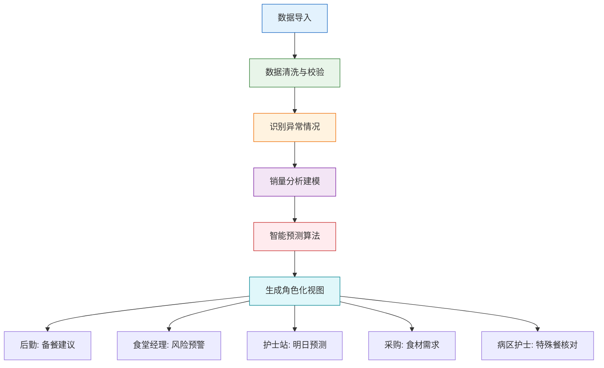

## 1. 产品概述

医院陪护餐销量分析系统，解决病区报餐、线上订餐与现场退餐数据不一致问题，通过多维度数据分析和预测，优化备餐效率，减少浪费，提升服务质量。

- 核心目标：整合订餐记录、病区人数、退餐表和节假日数据，提供精准的销量分析和预测
- 目标用户：后勤管理人员、食堂经理、护士站、采购人员、病区护士
- 市场价值：降低餐饮浪费率30%以上，减少缺餐投诉，提升医院后勤管理效率

## 2. 核心 Features

### 2.1 用户角色

| 角色 | 注册方式 | 核心权限 |
|------|----------|----------|
| 后勤管理人员 | 工号登录 | 查看备餐建议、整体数据概览 |
| 食堂经理 | 工号登录 | 查看浪费/缺餐风险、销量趋势、成本分析 |
| 护士站 | 工号登录 | 查看明日订餐变化、提交病区人数、核对特殊餐 |
| 采购人员 | 工号登录 | 查看食材需求预测、采购建议 |
| 病区护士 | 工号登录 | 核对本病区特殊餐、提交临时变更 |

### 2.2 Feature 模块

1. **数据导入页**：订餐记录导入、病区人数导入、退餐表导入、节假日备注管理
2. **销量分析页**：多维度销量图表、病区/餐次/日期交叉分析、异常情况标注
3. **综合驾驶舱**：多角色Dashboard视图、核心指标展示、预警信息
4. **备餐建议页**：智能备餐量计算、浪费风险预警、缺餐风险预警
5. **预测分析页**：明日订餐变化预测、食材需求预测、节假日影响分析
6. **特殊餐管理页**：特殊餐核对、饮食禁忌管理、病区核对确认

### 2.3 页面详情

| 页面名称 | 模块名称 | Feature 描述 |
|----------|----------|-------------|
| 数据导入页 | 订餐记录导入 | 支持Excel/CSV批量导入，自动解析字段，数据校验，重复订餐识别 |
| 数据导入页 | 病区人数导入 | 按病区按日期上报人数，支持批量导入和手动录入 |
| 数据导入页 | 退餐表导入 | 导入退餐记录，自动关联原订单，标注退餐原因（出院/封控/其他） |
| 数据导入页 | 节假日备注 | 管理节假日、特殊事件，标注对销量的影响因子 |
| 销量分析页 | 销量概览图表 | 折线图展示销量趋势，柱状图对比各病区，饼图展示餐次占比 |
| 销量分析页 | 多维交叉分析 | 按病区×餐次×日期三维筛选，支持下钻分析 |
| 销量分析页 | 异常标注模块 | 标注出院退餐、重复订餐、病区封控、跨午夜餐次等特殊情况 |
| 综合驾驶舱 | 角色Dashboard | 根据登录角色展示个性化仪表盘，核心KPI卡片 |
| 综合驾驶舱 | 实时预警模块 | 缺餐预警、浪费预警、异常数据预警 |
| 备餐建议页 | 智能备餐计算 | 基于历史数据+病区人数+预测模型，计算建议备餐量 |
| 备餐建议页 | 风险预警矩阵 | 浪费风险/缺餐风险二维矩阵，颜色标注风险等级 |
| 预测分析页 | 明日订餐预测 | 按病区展示明日订餐变化趋势，对比今日/上周同期 |
| 预测分析页 | 食材需求预测 | 基于餐品配方，分解为具体食材采购需求 |
| 特殊餐管理页 | 特殊餐列表 | 糖尿病餐、低盐餐、流质餐等特殊饮食分类展示 |
| 特殊餐管理页 | 病区核对功能 | 病区护士确认特殊餐信息，支持修改和备注 |

## 3. 核心流程

### 核心流程说明

1. **数据导入阶段**：支持多种数据源导入，包括订餐记录、病区人数、退餐表
2. **数据清洗阶段**：自动识别重复订餐、数据缺失、格式错误等问题
3. **异常识别阶段**：智能标注出院退餐、病区封控、跨午夜餐次等特殊场景
4. **分析建模阶段**：建立多维度销量分析模型，支持交叉分析
5. **智能预测阶段**：基于时间序列模型，结合节假日、病区动态等因素进行预测
6. **角色化输出阶段**：根据不同用户角色，展示针对性的数据视图和操作功能

## 4. 用户界面设计

### 4.1 设计风格

- **主色调**：医疗蓝 (#1976D2) - 专业、信任、冷静
- **辅助色**：
  - 健康绿 (#4CAF50) - 正常、备餐充足
  - 警告橙 (#FF9800) - 缺餐预警
  - 危险红 (#F44336) - 浪费预警
  - 信息紫 (#9C27B0) - 特殊标注
- **中性色**：
  - 深灰 (#37474F) - 主文字
  - 中灰 (#78909C) - 次要文字
  - 浅灰 (#ECEFF1) - 背景、边框
- **按钮风格**：圆角8px，扁平化设计，hover状态有微阴影
- **字体**：
  - 标题：Noto Sans SC，字重600-700
  - 正文：Noto Sans SC，字重400-500
  - 数字：JetBrains Mono，等宽字体增强数据可读性
- **布局风格**：卡片式布局，顶部导航+侧边栏，响应式设计
- **图标风格**：线性图标 (lucide-react)，统一24px尺寸，颜色与功能语义匹配

### 4.2 页面设计概览

| 页面名称 | 模块名称 | UI 元素 |
|----------|----------|---------|
| 数据导入页 | 导入区域 | 拖拽上传区，文件列表，进度条，校验结果表格 |
| 销量分析页 | 图表区域 | 可切换图表类型（折线/柱状/饼图），筛选器组，时间范围选择器 |
| 销量分析页 | 异常标注 | 数据点悬浮提示，颜色编码，图例说明，异常详情抽屉 |
| 综合驾驶舱 | KPI卡片 | 大数字展示，趋势箭头，对比指标，颜色状态标识 |
| 备餐建议页 | 风险矩阵 | 二维网格，色块填充，hover详情，风险等级说明 |
| 预测分析页 | 趋势对比 | 双折线对比图，数据表格，预测区间阴影 |
| 特殊餐管理页 | 核对列表 | 病区分组，特殊标签，核对状态，操作按钮 |

### 4.3 响应式设计

- **设计原则**：Desktop-first，向下兼容平板和移动设备
- **断点设置**：
  - Desktop: ≥1280px (4列网格)
  - Tablet: 768px-1279px (2列网格)
  - Mobile: <768px (1列网格)
- **触摸优化**：按钮最小高度48px，适当增加间距，支持横向滑动查看数据表格

### 4.4 数据可视化规范

- **图表库**：Recharts
- **动画效果**：数据加载时渐入动画，切换时平滑过渡
- **交互设计**：
  - 数据点hover显示详情
  - 点击数据点可下钻查看明细
  - 支持框选时间范围放大查看
  - 图例可点击切换显示/隐藏
- **特殊标注**：
  - 出院退餐：红色虚线边框 + 🔴图标
  - 重复订餐：紫色背景 + ⚡图标
  - 病区封控：橙色斜纹 + 🚫图标
  - 跨午夜餐次：深蓝色渐变 + 🌙图标
  - 节假日：金色边框 + 🎉图标
