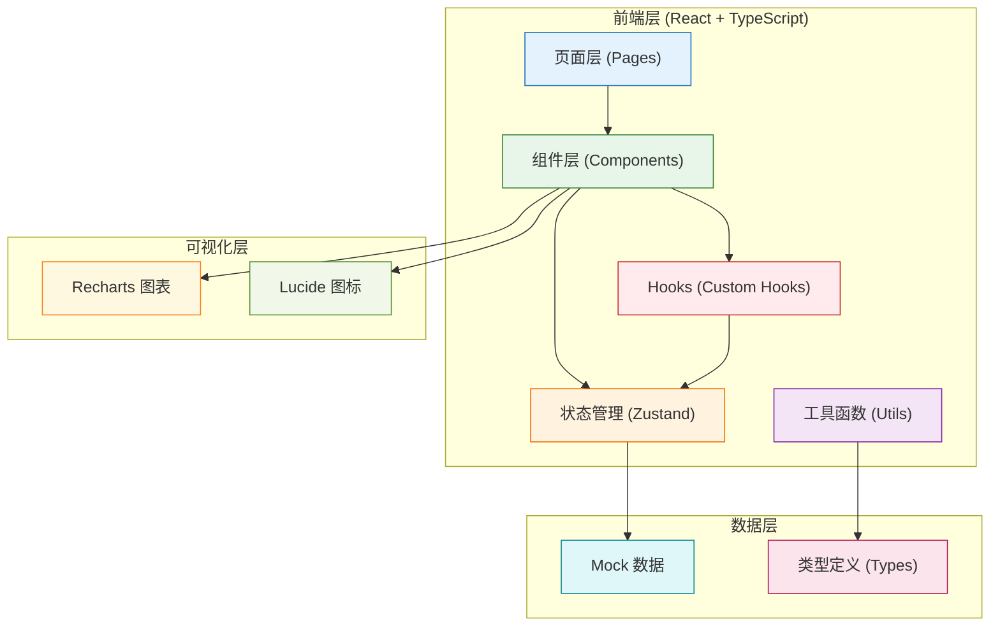
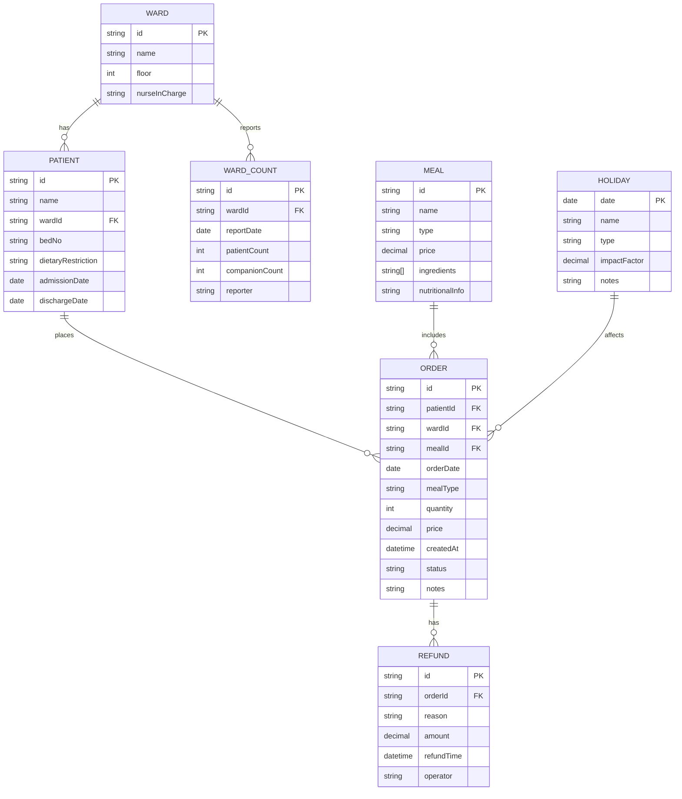

## 1. 架构设计



## 2. 技术描述

- **前端框架**: React@18 + TypeScript@5
- **构建工具**: Vite@5
- **样式方案**: TailwindCSS@3
- **状态管理**: Zustand@4
- **路由管理**: React Router DOM@6
- **图表库**: Recharts@2
- **图标库**: lucide-react@0.344
- **数据处理**: date-fns@3, papaparse@5 (CSV解析)
- **初始化工具**: vite-init
- **后端**: 无 (纯前端应用，使用Mock数据)
- **数据库**: 无 (本地状态管理 + localStorage持久化)

## 3. 路由定义

| 路由路径 | 页面名称 | 用途 |
|----------|----------|------|
| / | 综合驾驶舱 | 根据角色展示个性化Dashboard，核心KPI和预警信息 |
| /sales | 销量分析 | 多维度销量图表，病区/餐次/日期交叉分析 |
| /preparation | 备餐建议 | 智能备餐量计算，风险预警矩阵 |
| /forecast | 预测分析 | 明日订餐变化预测，食材需求预测 |
| /special-meals | 特殊餐管理 | 特殊餐核对，饮食禁忌管理 |
| /data-import | 数据导入 | 订餐记录/病区人数/退餐表/节假日数据导入 |
| /settings | 系统设置 | 角色切换，参数配置 |

## 4. 数据模型

### 4.1 数据模型定义



### 4.2 TypeScript 类型定义

```typescript
// 基础类型
export type MealType = 'breakfast' | 'lunch' | 'dinner' | 'supper';
export type OrderStatus = 'pending' | 'confirmed' | 'completed' | 'refunded';
export type RefundReason = 'discharge' | 'lockdown' | 'duplicate' | 'other';
export type UserRole = 'logistics' | 'canteen_manager' | 'nurse_station' | 'procurement' | 'ward_nurse';
export type RiskLevel = 'low' | 'medium' | 'high' | 'critical';

// 订餐记录
export interface Order {
  id: string;
  patientId: string;
  patientName: string;
  wardId: string;
  wardName: string;
  mealId: string;
  mealName: string;
  mealType: MealType;
  orderDate: string;
  quantity: number;
  price: number;
  status: OrderStatus;
  isSpecial: boolean;
  dietaryType?: string;
  createdAt: string;
  notes?: string;
  flags: {
    isDuplicate: boolean;
    isCrossMidnight: boolean;
    isHoliday: boolean;
  };
}

// 退餐记录
export interface Refund {
  id: string;
  orderId: string;
  reason: RefundReason;
  reasonDetail?: string;
  amount: number;
  refundTime: string;
  operator: string;
}

// 病区人数
export interface WardCount {
  id: string;
  wardId: string;
  wardName: string;
  reportDate: string;
  patientCount: number;
  companionCount: number;
  specialMealCount: number;
  reporter: string;
  isLockedDown: boolean;
}

// 病区信息
export interface Ward {
  id: string;
  name: string;
  floor: number;
  nurseInCharge: string;
  phone: string;
}

// 节假日
export interface Holiday {
  date: string;
  name: string;
  type: 'public' | 'hospital' | 'event';
  impactFactor: number;
  notes?: string;
}

// 餐品信息
export interface Meal {
  id: string;
  name: string;
  type: MealType;
  price: number;
  ingredients: string[];
  nutritionalInfo: string;
  isSpecial: boolean;
  dietaryType?: string;
}

// 分析数据
export interface SalesAnalysis {
  date: string;
  wardId: string;
  wardName: string;
  mealType: MealType;
  orderCount: number;
  refundCount: number;
  netSales: number;
  wardReportedCount: number;
  variance: number;
  varianceRate: number;
}

// 备餐建议
export interface PreparationSuggestion {
  date: string;
  mealType: MealType;
  wardId: string;
  wardName: string;
  suggestedQuantity: number;
  historicalAverage: number;
  wardReported: number;
  adjustmentReason: string;
  wasteRisk: RiskLevel;
  shortageRisk: RiskLevel;
  confidence: number;
}

// 预测数据
export interface ForecastData {
  date: string;
  wardId: string;
  wardName: string;
  mealType: MealType;
  predictedQuantity: number;
  historicalTrend: number[];
  lowerBound: number;
  upperBound: number;
  changeFromToday: number;
  changeFromLastWeek: number;
  holidayImpact: number;
}

// 食材需求
export interface IngredientDemand {
  name: string;
  unit: string;
  requiredQuantity: number;
  currentStock?: number;
  needToPurchase: number;
  priority: 'high' | 'medium' | 'low';
}

// 特殊餐
export interface SpecialMeal {
  orderId: string;
  patientName: string;
  wardName: string;
  bedNo: string;
  dietaryType: string;
  mealName: string;
  mealDate: string;
  mealType: MealType;
  isVerified: boolean;
  verifiedBy?: string;
  verifiedAt?: string;
  notes?: string;
}

// 用户信息
export interface User {
  id: string;
  name: string;
  role: UserRole;
  wardId?: string;
  avatar?: string;
}

// 预警信息
export interface Alert {
  id: string;
  type: 'waste' | 'shortage' | 'anomaly' | 'verification';
  level: RiskLevel;
  title: string;
  message: string;
  relatedData?: any;
  createdAt: string;
  isRead: boolean;
}
```

## 5. 目录结构

```
yzz100498/
├── src/
│   ├── components/           # 可复用组件
│   │   ├── charts/          # 图表组件
│   │   │   ├── SalesTrendChart.tsx
│   │   │   ├── WardComparisonChart.tsx
│   │   │   ├── MealTypePieChart.tsx
│   │   │   ├── RiskMatrixChart.tsx
│   │   │   └── ForecastChart.tsx
│   │   ├── layout/          # 布局组件
│   │   │   ├── Header.tsx
│   │   │   ├── Sidebar.tsx
│   │   │   └── Layout.tsx
│   │   ├── ui/              # 基础UI组件
│   │   │   ├── Card.tsx
│   │   │   ├── Button.tsx
│   │   │   ├── Table.tsx
│   │   │   ├── DatePicker.tsx
│   │   │   ├── Select.tsx
│   │   │   ├── Badge.tsx
│   │   │   ├── Alert.tsx
│   │   │   └── Progress.tsx
│   │   └── features/        # 功能组件
│   │       ├── KPICard.tsx
│   │       ├── DataImport.tsx
│   │       ├── WardFilter.tsx
│   │       ├── DateRangeFilter.tsx
│   │       ├── SpecialMealList.tsx
│   │       └── AlertList.tsx
│   ├── pages/               # 页面组件
│   │   ├── Dashboard.tsx
│   │   ├── SalesAnalysis.tsx
│   │   ├── Preparation.tsx
│   │   ├── Forecast.tsx
│   │   ├── SpecialMeals.tsx
│   │   ├── DataImport.tsx
│   │   └── Settings.tsx
│   ├── hooks/               # 自定义Hooks
│   │   ├── useSalesData.ts
│   │   ├── useForecast.ts
│   │   ├── usePreparation.ts
│   │   ├── useRoleAccess.ts
│   │   └── useAlerts.ts
│   ├── store/               # Zustand状态管理
│   │   ├── useUserStore.ts
│   │   ├── useDataStore.ts
│   │   ├── useAlertStore.ts
│   │   └── useFilterStore.ts
│   ├── types/               # TypeScript类型定义
│   │   └── index.ts
│   ├── utils/               # 工具函数
│   │   ├── dateUtils.ts
│   │   ├── calculation.ts
│   │   ├── forecast.ts
│   │   ├── dataParser.ts
│   │   └── riskAssessment.ts
│   ├── data/                # Mock数据
│   │   ├── orders.ts
│   │   ├── refunds.ts
│   │   ├── wards.ts
│   │   ├── wardCounts.ts
│   │   ├── holidays.ts
│   │   ├── meals.ts
│   │   └── specialMeals.ts
│   ├── router/              # 路由配置
│   │   └── index.tsx
│   ├── App.tsx
│   ├── main.tsx
│   └── index.css
├── .trae/
│   └── documents/
│       ├── PRD-医院陪护餐销量分析系统.md
│       └── TECH-医院陪护餐销量分析系统.md
├── package.json
├── tsconfig.json
├── vite.config.ts
├── tailwind.config.js
└── postcss.config.js
```

## 6. 核心算法说明

### 6.1 备餐量计算算法

```typescript
// 基于加权移动平均 + 节假日因子 + 病区人数的综合预测模型
function calculatePreparationSuggestion(
  historicalData: SalesAnalysis[],
  wardCount: WardCount,
  holiday: Holiday | null,
  mealType: MealType
): PreparationSuggestion {
  // 1. 计算历史加权平均值 (近期数据权重更高)
  const weights = [0.05, 0.1, 0.15, 0.25, 0.45]; // 最近5天权重
  const weightedAvg = calculateWeightedAverage(historicalData, weights);
  
  // 2. 病区人数影响因子
  const wardFactor = wardCount.companionCount / historicalAverageCompanion;
  
  // 3. 节假日影响因子
  const holidayFactor = holiday ? holiday.impactFactor : 1.0;
  
  // 4. 餐类型因子 (跨午夜餐次特殊处理)
  const mealTypeFactor = mealType === 'supper' ? 0.85 : 1.0;
  
  // 5. 综合计算
  const suggestedQuantity = Math.round(
    weightedAvg * wardFactor * holidayFactor * mealTypeFactor
  );
  
  // 6. 风险评估
  const wasteRisk = assessWasteRisk(suggestedQuantity, historicalData);
  const shortageRisk = assessShortageRisk(suggestedQuantity, wardCount);
  
  return {
    suggestedQuantity,
    historicalAverage: Math.round(weightedAvg),
    wardReported: wardCount.companionCount,
    adjustmentReason: generateAdjustmentReason(wardFactor, holidayFactor),
    wasteRisk,
    shortageRisk,
    confidence: calculateConfidence(historicalData)
  };
}
```

### 6.2 异常检测算法

```typescript
// 识别异常订餐情况
function detectAnomalies(orders: Order[], refunds: Refund[], wardCounts: WardCount[]): Order[] {
  return orders.map(order => {
    const flags = {
      isDuplicate: checkDuplicateOrder(order, orders),
      isCrossMidnight: checkCrossMidnight(order),
      isHoliday: checkHoliday(order.orderDate)
    };
    
    const refund = refunds.find(r => r.orderId === order.id);
    if (refund) {
      order.status = 'refunded';
      order.notes = generateRefundNote(refund);
    }
    
    return { ...order, flags };
  });
}

// 检查重复订餐 (同一家属同一天同一餐次多次下单)
function checkDuplicateOrder(order: Order, allOrders: Order[]): boolean {
  return allOrders.some(o => 
    o.id !== order.id &&
    o.patientId === order.patientId &&
    o.orderDate === order.orderDate &&
    o.mealType === order.mealType &&
    o.status !== 'refunded'
  );
}
```

### 6.3 明日预测算法

```typescript
// 基于时间序列的明日订餐预测
function forecastTomorrowSales(
  historicalData: SalesAnalysis[],
  wardCount: WardCount,
  tomorrow: string,
  mealType: MealType
): ForecastData {
  // 使用指数平滑法进行预测
  const alpha = 0.3; // 平滑系数
  const historicalTrend = historicalData.map(d => d.netSales);
  
  let forecast = historicalTrend[0];
  for (let i = 1; i < historicalTrend.length; i++) {
    forecast = alpha * historicalTrend[i] + (1 - alpha) * forecast;
  }
  
  // 应用调整因子
  const dayOfWeek = getDayOfWeek(tomorrow);
  const weekFactor = getWeekDayFactor(dayOfWeek);
  const holiday = getHoliday(tomorrow);
  const holidayFactor = holiday ? holiday.impactFactor : 1.0;
  
  const finalForecast = Math.round(forecast * weekFactor * holidayFactor);
  
  // 计算预测区间
  const stdDev = calculateStandardDeviation(historicalTrend);
  const marginOfError = stdDev * 1.96; // 95%置信区间
  
  // 计算变化率
  const todayData = historicalData[historicalData.length - 1];
  const lastWeekData = historicalData[historicalData.length - 8];
  
  return {
    date: tomorrow,
    wardId: wardCount.wardId,
    wardName: wardCount.wardName,
    mealType,
    predictedQuantity: finalForecast,
    historicalTrend: historicalTrend.slice(-7),
    lowerBound: Math.max(0, finalForecast - marginOfError),
    upperBound: finalForecast + marginOfError,
    changeFromToday: finalForecast - todayData.netSales,
    changeFromLastWeek: finalForecast - (lastWeekData?.netSales || finalForecast),
    holidayImpact: holiday ? holidayFactor : 1.0
  };
}
```

## 7. 性能优化策略

1. **数据懒加载**：图表数据按需加载，使用虚拟滚动处理大量数据表格
2. **Memo优化**：使用 React.memo、useMemo、useCallback 减少不必要的重渲染
3. **状态分片**：Zustand 状态按功能分片，避免全局状态更新导致的全量重渲染
4. **Web Worker**：复杂预测计算在 Web Worker 中执行，避免阻塞主线程
5. **防抖节流**：筛选器、搜索框等高频操作应用防抖
6. **数据缓存**：计算结果缓存到 localStorage，减少重复计算
