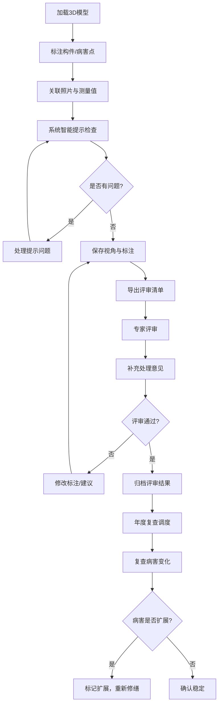

## 1. 产品概述

古建筑梁架标注系统——面向文保团队的3D构件标注与病害管理平台。在3D建筑模型上直接标注梁、檩、柱、斗拱等构件与病害点，关联现场照片、测量数据、负责人和修缮建议，支持视角保存、评审导出、年度复查与专家补充意见。

- 解决文保团队"照片文字难对应真实构件"的痛点，让修缮记录从散落表格回归三维空间
- 面向文物保护项目负责人、现场勘查人员、评审专家三类角色

## 2. 核心功能

### 2.1 用户角色

| 角色 | 进入方式 | 核心权限 |
|------|----------|----------|
| 勘查人员 | 项目邀请加入 | 标注构件、上传照片、录入测量值与修缮建议、保存视角 |
| 项目负责人 | 创建项目 | 全部操作权限 + 年度复查管理 + 导出评审清单 + 分配任务 |
| 评审专家 | 评审链接进入 | 查看标注与照片、补充处理意见、标注评审状态 |

### 2.2 功能模块

1. **3D标注工作台**: 三维模型查看、构件选中与标注、病害点标记、视角保存与恢复
2. **构件信息面板**: 构件属性编辑、照片关联、测量值录入、修缮建议、编号管理
3. **智能提示中心**: 编号缺失预警、照片角度不明提醒、复查结论冲突标记
4. **评审导出模块**: 生成专家评审清单（含构件定位与原始照片链接）、导出PDF/Excel
5. **年度复查追踪**: 按年度对比病害变化、修缮后扩展判定、复查任务调度
6. **专家评审台**: 在线评审、补充处理意见、评审状态流转

### 2.3 页面详情

| 页面名称 | 模块名称 | 功能描述 |
|----------|----------|----------|
| 3D标注工作台 | 三维模型视口 | 加载古建筑3D模型，支持旋转/缩放/平移，点击构件高亮选中 |
| 3D标注工作台 | 构件标注工具栏 | 选择标注类型（梁/檩/柱/斗拱/病害点），在模型表面放置标注 |
| 3D标注工作台 | 视角管理 | 保存当前相机视角为命名视角，一键恢复已保存视角 |
| 3D标注工作台 | 构件树面板 | 左侧树状展示所有构件分类与层级，点击定位到3D模型 |
| 构件信息面板 | 基本属性 | 构件名称、编号、类型、材质、尺寸等基础信息编辑 |
| 构件信息面板 | 照片关联 | 上传现场照片，标记拍摄角度（正视/侧视/俯视/仰视/不详） |
| 构件信息面板 | 测量值记录 | 录入裂缝宽度/深度/长度等测量数据，支持多次记录时间线 |
| 构件信息面板 | 修缮建议 | 填写修缮方案、负责人、计划完成时间 |
| 智能提示中心 | 编号缺失预警 | 列出所有未分配编号的构件，一键跳转编辑 |
| 智能提示中心 | 照片角度提醒 | 标记角度为"不详"的照片，提醒补拍 |
| 智能提示中心 | 复查结论冲突 | 同一病害多次复查结论不一致时高亮标记，显示差异对比 |
| 评审导出模块 | 清单生成 | 按构件/病害类型筛选，生成含3D视角截图和原始照片的评审文档 |
| 评审导出模块 | 导出格式 | 支持PDF和Excel格式导出，每个条目含构件定位链接 |
| 年度复查追踪 | 复查时间线 | 按年度展示同一病害的变化趋势图表 |
| 年度复查追踪 | 扩展判定 | 修缮后病害是否继续扩展的判定与记录 |
| 年度复查追踪 | 任务调度 | 创建年度复查任务，指派负责人，设定截止日期 |
| 专家评审台 | 评审清单查看 | 浏览导出的评审清单，点击条目定位到3D构件与照片 |
| 专家评审台 | 补充意见 | 在评审条目下添加处理意见、标注同意/需修改/驳回 |
| 专家评审台 | 状态流转 | 评审条目状态：待评审 → 评审中 → 已评审 |

## 3. 核心流程

**标注与评审主流程**: 勘查人员在3D模型上标注构件和病害 → 关联照片与测量值 → 系统自动检测编号缺失/照片角度/结论冲突 → 项目负责人审核并导出评审清单 → 专家在线评审并补充意见 → 负责人根据意见修改 → 按年度复查病害变化

## 4. 用户界面设计

### 4.1 设计风格

- **主色调**: 沉稳的檀木棕 (#5C3A21) 为品牌色，搭配暖石灰 (#A89880) 为辅助色
- **强调色**: 朱砂红 (#C73E3A) 用于病害/警告提示，青绿 (#4A7C6F) 用于安全/已完成状态
- **按钮风格**: 圆角矩形，轻微阴影，hover 时微抬效果
- **字体**: 标题使用"思源宋体"风格衬线体（Noto Serif SC），正文使用"思源黑体"（Noto Sans SC）
- **布局**: 左侧构件树 + 中央3D视口 + 右侧信息面板的三栏布局
- **图标**: 线性风格，与古建筑线条美学呼应

### 4.2 页面设计概览

| 页面名称 | 模块名称 | UI要素 |
|----------|----------|--------|
| 3D标注工作台 | 三维模型视口 | 深色背景(接近墨色)，模型以暖光渲染，标注点为发光标记 |
| 3D标注工作台 | 构件标注工具栏 | 浮动工具栏，半透明毛玻璃效果，图标+文字标签 |
| 3D标注工作台 | 视角管理 | 视口右下角缩略图列表，点击切换，支持命名 |
| 3D标注工作台 | 构件树面板 | 左侧可折叠树，节点含构件类型图标，选中高亮 |
| 构件信息面板 | 基本属性 | 右侧抽屉式面板，表单布局，分区显示 |
| 构件信息面板 | 照片关联 | 缩略图网格，悬停显示角度标签，点击放大查看 |
| 构件信息面板 | 测量值记录 | 时间线图表 + 数据表格双视图切换 |
| 智能提示中心 | 提示列表 | 右上角铃铛图标入口，下拉面板按严重程度分色 |
| 评审导出模块 | 清单预览 | 预览面板展示导出效果，含3D截图和照片缩略图 |
| 年度复查追踪 | 复查时间线 | 横向时间轴 + 病害变化趋势折线图 |
| 专家评审台 | 评审清单 | 卡片式列表，每张卡片含构件缩略图+关键信息摘要 |

### 4.3 响应式策略

- 桌面优先设计（1920×1080为基准），三栏布局
- 平板（768-1024px）隐藏构件树为抽屉，信息面板覆盖式
- 移动端（<768px）仅保留3D视口和简化信息卡片

### 4.4 3D场景指引

- **环境/HDRI**: 暖色调室内光环境，模拟古建筑内部光线
- **灯光**: 主光为暖黄色点光源模拟烛光效果，补光为冷色调环境光
- **相机**: 透视相机，默认45°俯视角度，近截面0.1远截面1000
- **交互**: 左键旋转、右键平移、滚轮缩放、双击构件聚焦
- **标注点**: 发光球体标记，hover显示名称气泡，点击展开详情
- **性能**: 模型面数控制在50万以内，使用LOD分级加载
