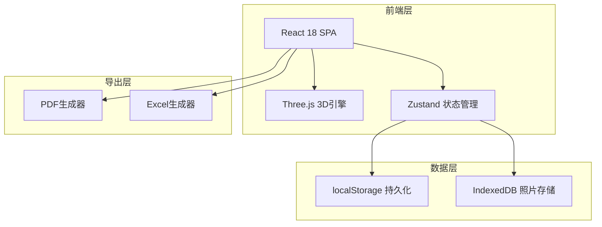
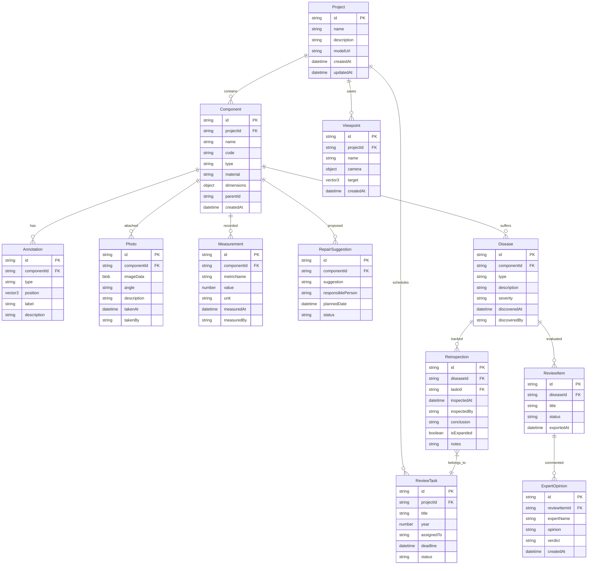

## 1. 架构设计



## 2. 技术说明

- **前端**: React@18 + TypeScript + TailwindCSS@3 + Vite
- **3D引擎**: Three.js + @react-three/fiber + @react-three/drei
- **状态管理**: Zustand（含persist中间件，localStorage持久化）
- **照片存储**: IndexedDB（通过idb库封装），支持大文件二进制存储
- **导出**: jsPDF（PDF生成）+ SheetJS/xlsx（Excel生成）
- **后端**: 无后端，纯前端应用，数据全部本地持久化
- **初始化工具**: vite-init

## 3. 路由定义

| 路由 | 用途 |
|------|------|
| / | 3D标注工作台主页 |
| /component/:id | 构件详情（右侧面板内嵌，非独立页面） |
| /alerts | 智能提示中心 |
| /export | 评审导出模块 |
| /review | 年度复查追踪 |
| /expert | 专家评审台 |

## 4. 数据模型

### 4.1 数据模型定义



### 4.2 数据定义

```sql
-- 项目表
CREATE TABLE project (
    id TEXT PRIMARY KEY,
    name TEXT NOT NULL,
    description TEXT,
    model_url TEXT,
    created_at TEXT DEFAULT (datetime('now')),
    updated_at TEXT DEFAULT (datetime('now'))
);

-- 构件表
CREATE TABLE component (
    id TEXT PRIMARY KEY,
    project_id TEXT NOT NULL REFERENCES project(id),
    name TEXT NOT NULL,
    code TEXT,
    type TEXT NOT NULL,
    material TEXT,
    dimensions TEXT,
    parent_id TEXT REFERENCES component(id),
    position_x REAL, position_y REAL, position_z REAL,
    created_at TEXT DEFAULT (datetime('now'))
);

-- 标注表
CREATE TABLE annotation (
    id TEXT PRIMARY KEY,
    component_id TEXT NOT NULL REFERENCES component(id),
    type TEXT NOT NULL,
    position_x REAL, position_y REAL, position_z REAL,
    label TEXT,
    description TEXT
);

-- 照片表（实际图像存IndexedDB）
CREATE TABLE photo (
    id TEXT PRIMARY KEY,
    component_id TEXT NOT NULL REFERENCES component(id),
    angle TEXT,
    description TEXT,
    taken_at TEXT,
    taken_by TEXT
);

-- 测量值表
CREATE TABLE measurement (
    id TEXT PRIMARY KEY,
    component_id TEXT NOT NULL REFERENCES component(id),
    metric_name TEXT NOT NULL,
    value REAL NOT NULL,
    unit TEXT NOT NULL,
    measured_at TEXT,
    measured_by TEXT
);

-- 修缮建议表
CREATE TABLE repair_suggestion (
    id TEXT PRIMARY KEY,
    component_id TEXT NOT NULL REFERENCES component(id),
    suggestion TEXT NOT NULL,
    responsible_person TEXT,
    planned_date TEXT,
    status TEXT DEFAULT 'pending'
);

-- 病害表
CREATE TABLE disease (
    id TEXT PRIMARY KEY,
    component_id TEXT NOT NULL REFERENCES component(id),
    type TEXT NOT NULL,
    description TEXT,
    severity TEXT,
    discovered_at TEXT,
    discovered_by TEXT
);

-- 复查记录表
CREATE TABLE reinspection (
    id TEXT PRIMARY KEY,
    disease_id TEXT NOT NULL REFERENCES disease(id),
    task_id TEXT REFERENCES review_task(id),
    inspected_at TEXT,
    inspected_by TEXT,
    conclusion TEXT,
    is_expanded INTEGER DEFAULT 0,
    notes TEXT
);

-- 视角表
CREATE TABLE viewpoint (
    id TEXT PRIMARY KEY,
    project_id TEXT NOT NULL REFERENCES project(id),
    name TEXT NOT NULL,
    camera TEXT NOT NULL,
    target_x REAL, target_y REAL, target_z REAL,
    created_at TEXT DEFAULT (datetime('now'))
);

-- 复查任务表
CREATE TABLE review_task (
    id TEXT PRIMARY KEY,
    project_id TEXT NOT NULL REFERENCES project(id),
    title TEXT NOT NULL,
    year INTEGER NOT NULL,
    assigned_to TEXT,
    deadline TEXT,
    status TEXT DEFAULT 'pending'
);

-- 评审条目表
CREATE TABLE review_item (
    id TEXT PRIMARY KEY,
    disease_id TEXT NOT NULL REFERENCES disease(id),
    title TEXT,
    status TEXT DEFAULT 'pending',
    exported_at TEXT
);

-- 专家意见表
CREATE TABLE expert_opinion (
    id TEXT PRIMARY KEY,
    review_item_id TEXT NOT NULL REFERENCES review_item(id),
    expert_name TEXT NOT NULL,
    opinion TEXT NOT NULL,
    verdict TEXT,
    created_at TEXT DEFAULT (datetime('now'))
);
```
