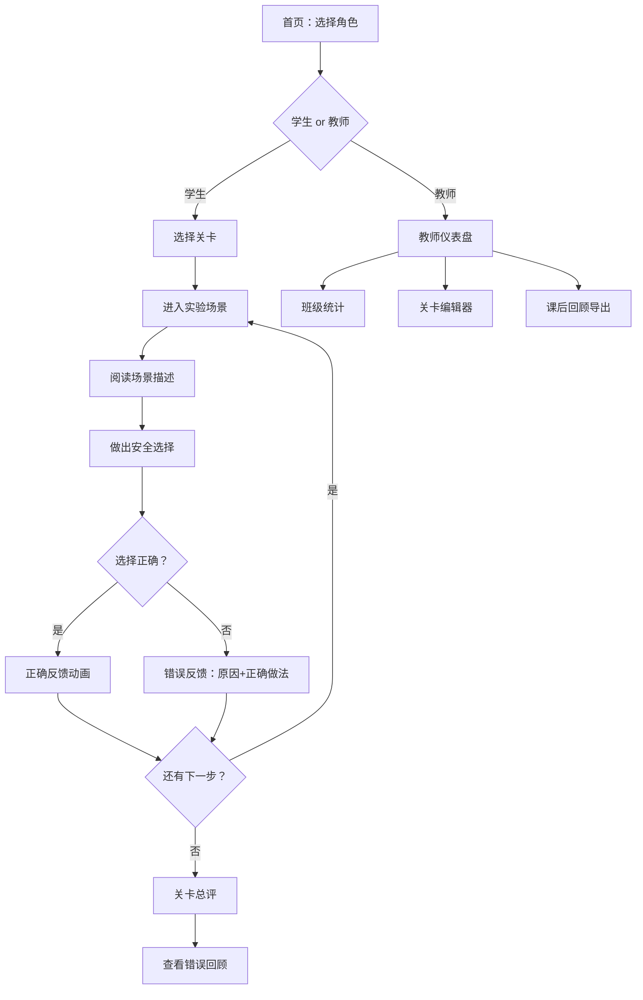

## 1. 产品概述

"课堂实验安全选择"是一款面向中学化学课堂的安全教育互动游戏。学生通过剧情式选择体验实验操作场景，在戴护目镜、取用试剂、处理洒液、报告破损仪器等关键节点做出判断。系统对危险操作（如水倒进浓酸、闻气味过近、火焰旁放纸巾、同学受伤仍继续实验）即时给出原因与正确做法，帮助老师发现班级薄弱环节、定制本校关卡，并在课后回顾中标记错误步骤。

- 目标用户：中学化学教师及学生
- 核心价值：将"背诵安全守则"转化为"情境中判断"，降低实验事故率，提升安全意识内化效率

## 2. 核心功能

### 2.1 用户角色

| 角色 | 登录方式 | 核心权限 |
|------|----------|----------|
| 学生 | 输入班级+姓名 | 参与安全选择游戏、快速测验、查看个人回顾 |
| 教师 | 输入教师码 | 管理关卡、查看班级统计、编辑本校事故关卡、导出课后回顾 |

### 2.2 功能模块

1. **学生游戏页**：剧情式安全选择闯关，每关3-6步决策点，含正确/错误反馈与原因说明
2. **快速测验页**：实验前5-10题快速安全知识测验，限时作答
3. **教师关卡编辑器**：添加/编辑关卡，自定义剧情步骤、选项与反馈
4. **班级统计面板**：查看班级最易错步骤、安全薄弱点排行、学生完成率
5. **课后回顾页**：危险动作截图标记错误步骤编号，学生与教师均可查看

### 2.3 页面详情

| 页面名称 | 模块名称 | 功能描述 |
|----------|----------|----------|
| 首页 | 角色选择 | 学生/教师入口，动画氛围营造 |
| 学生游戏页 | 剧情场景卡 | 展示当前实验场景描述与插图，2-3个选择按钮 |
| 学生游戏页 | 反馈弹窗 | 选择后弹出正确/错误动画，显示原因与正确做法 |
| 学生游戏页 | 步骤进度条 | 显示当前第几步/共几步，标记错误步骤 |
| 快速测验页 | 倒计时题目 | 限时单选/判断题，答完即时反馈 |
| 快速测验页 | 测验结果 | 得分、错题回顾 |
| 教师仪表盘 | 班级统计图 | 最易错步骤柱状图、安全薄弱点排行 |
| 教师仪表盘 | 学生列表 | 每位学生完成情况、错误步骤分布 |
| 关卡编辑器 | 关卡列表 | 已有关卡的增删改，预览 |
| 关卡编辑器 | 步骤编辑 | 每步场景描述、选项（正确/错误标记）、反馈内容 |
| 课后回顾 | 错误截图列表 | 危险动作截图+步骤编号+错误原因+正确做法 |
| 课后回顾 | 学生回顾 | 个人游戏过程回放，标记每步对错 |

## 3. 核心流程

**学生游戏流程**：学生进入 → 选择关卡 → 阅读场景描述 → 做出选择 → 查看反馈（正确继续/错误看原因和正确做法） → 完成关卡 → 查看总评与错误回顾

**教师管理流程**：教师登录 → 查看/编辑关卡 → 查看班级统计 → 导出课后回顾

**快速测验流程**：实验前 → 开始测验 → 限时答题 → 即时反馈 → 查看结果与错题

## 4. 用户界面设计

### 4.1 设计风格

- **主色调**：深墨绿（#0D3B2E）+ 警示橙（#FF6B35）+ 安全绿（#2ECC71）
- **辅助色**：实验室白烟灰（#F5F0EB）、试剂瓶深蓝（#1A365D）
- **按钮风格**：圆角药片形按钮，正确选项绿色描边，危险选项橙色脉冲
- **字体**：标题用"ZCOOL KuaiLe"（活泼感），正文用"Noto Sans SC"
- **布局**：卡片式场景叙事，纵向滚动推进剧情
- **图标**：使用实验室元素（护目镜、试管、酒精灯、急救箱）
- **动画**：选择正确时绿色对勾绽放，错误时橙色警告抖动，场景切换有烧杯冒泡过渡

### 4.2 页面设计概览

| 页面名称 | 模块名称 | UI元素 |
|----------|----------|--------|
| 首页 | 角色选择 | 深墨绿背景，两个大卡片（学生：烧杯图标/教师：显微镜图标），悬浮动画 |
| 学生游戏页 | 剧情场景卡 | 居中大卡片，顶部步骤进度条，底部2-3个选项按钮，背景有试管/烧杯装饰 |
| 学生游戏页 | 反馈弹窗 | 居中模态框，正确：绿色边框+对勾动画，错误：橙色边框+警告图标+原因文字 |
| 快速测验页 | 倒计时题目 | 顶部倒计时环，居中题目卡片，底部选项列表，答题后即时变色反馈 |
| 教师仪表盘 | 班级统计图 | 左侧柱状图（最易错步骤），右侧排行榜（薄弱安全点），下方学生表格 |
| 关卡编辑器 | 步骤编辑 | 左侧步骤时间线，右侧编辑面板（场景文本框、选项编辑区、反馈编辑区） |
| 课后回顾 | 错误截图列表 | 卡片列表，每张含截图缩略图+步骤编号徽章+错误原因标签 |

### 4.3 响应式设计

- 桌面优先设计，平板和手机自适应
- 游戏页在移动端纵向全屏卡片，选项按钮加大触摸区域
- 教师仪表盘在小屏幕下图表纵向堆叠

## 5. 关卡数据示例

### 关卡1：酸碱实验
| 步骤 | 场景描述 | 选项A | 选项B | 正确答案 | 错误反馈 |
|------|----------|-------|-------|----------|----------|
| 1 | 准备做酸碱中和实验，首先要 | 直接拿试剂瓶开始 | 先戴好护目镜和手套 | B | 任何时候接触酸碱都必须先佩戴防护装备，酸碱飞溅可能灼伤眼睛和皮肤 |
| 2 | 需要稀释浓硫酸，应该 | 把水倒进浓硫酸 | 把浓硫酸沿壁缓慢倒入水中 | B | 水倒进浓酸会剧烈放热导致酸液飞溅，正确做法是"酸入水，沿壁慢倒，不断搅拌" |
| 3 | 不小心把少量稀盐酸洒在桌上 | 用抹布擦掉 | 用碳酸氢钠粉覆盖后清理 | B | 酸液不能直接擦，应先用弱碱中和，避免腐蚀桌面和皮肤 |

### 关卡2：酒精灯使用
| 步骤 | 场景描述 | 选项A | 选项B | 正确答案 | 错误反馈 |
|------|----------|-------|-------|----------|----------|
| 1 | 需要点燃酒精灯 | 用另一个燃着的酒精灯点燃 | 用打火机直接点 | A | 禁止用打火机直接点燃，酒精蒸气可能引起爆燃，应用燃着的酒精灯对接 |
| 2 | 桌上放着纸巾离酒精灯很近 | 先把纸巾移远再继续 | 纸巾离得不远没关系 | A | 纸巾是易燃物，酒精灯火焰周围必须清除所有可燃物，以防引燃 |
| 3 | 熄灭酒精灯 | 用嘴吹灭 | 用灯帽盖灭 | B | 用嘴吹灭可能引起灯内酒精蒸气爆燃，必须用灯帽盖灭 |
