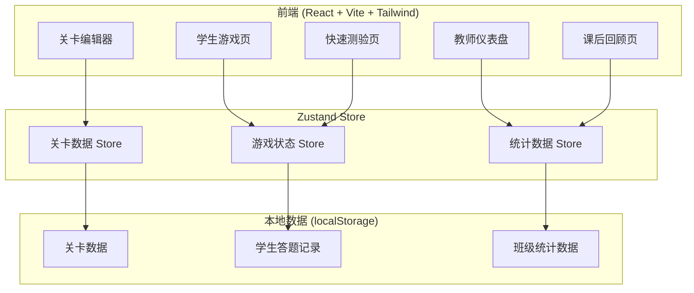
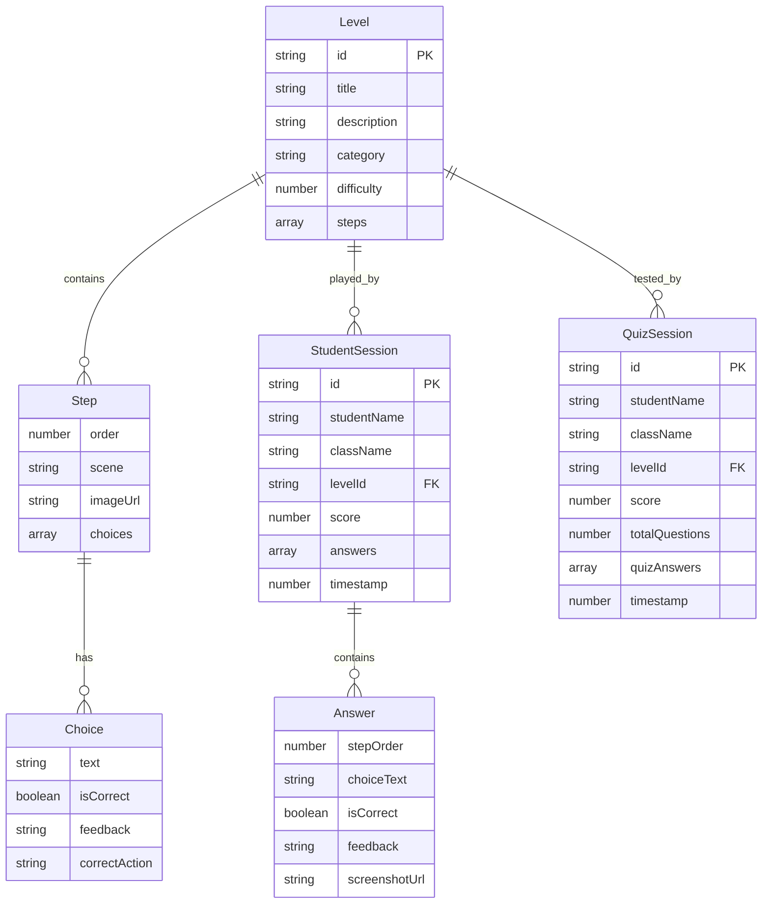

## 1. 架构设计



## 2. 技术说明

- **前端**：React@18 + TypeScript + Tailwind CSS@3 + Vite
- **初始化工具**：vite-init (react-ts 模板)
- **状态管理**：Zustand
- **路由**：react-router-dom@6
- **图表**：recharts（班级统计柱状图/排行榜）
- **截图**：html2canvas（危险动作截图）
- **后端**：无（纯前端，数据存储在 localStorage）
- **数据库**：localStorage 模拟持久化

## 3. 路由定义

| 路由 | 用途 |
|------|------|
| `/` | 首页：角色选择入口 |
| `/student` | 学生主页：关卡选择列表 |
| `/student/play/:levelId` | 学生游戏页：剧情式安全选择 |
| `/student/quiz/:levelId` | 快速测验页 |
| `/student/review/:sessionId` | 学生课后回顾 |
| `/teacher` | 教师仪表盘：班级统计 |
| `/teacher/levels` | 关卡管理列表 |
| `/teacher/levels/edit/:levelId` | 关卡编辑器 |
| `/teacher/review` | 课后回顾管理 |
| `/login` | 登录页（班级+姓名/教师码） |

## 4. 数据模型

### 4.1 数据模型定义



### 4.2 数据结构定义

```typescript
interface Level {
  id: string;
  title: string;
  description: string;
  category: 'acid-base' | 'alcohol-lamp' | 'glassware' | 'general' | 'custom';
  difficulty: 1 | 2 | 3;
  steps: Step[];
  isCustom?: boolean;
  createdAt: number;
}

interface Step {
  order: number;
  scene: string;
  imageUrl?: string;
  choices: Choice[];
}

interface Choice {
  id: string;
  text: string;
  isCorrect: boolean;
  feedback: string;
  correctAction: string;
}

interface StudentSession {
  id: string;
  studentName: string;
  className: string;
  levelId: string;
  score: number;
  totalSteps: number;
  answers: Answer[];
  completedAt: number;
}

interface Answer {
  stepOrder: number;
  choiceId: string;
  choiceText: string;
  isCorrect: boolean;
  feedback: string;
  correctAction: string;
  screenshotDataUrl?: string;
}

interface QuizSession {
  id: string;
  studentName: string;
  className: string;
  levelId: string;
  score: number;
  totalQuestions: number;
  quizAnswers: QuizAnswer[];
  completedAt: number;
}

interface QuizAnswer {
  questionIndex: number;
  selectedChoice: string;
  isCorrect: boolean;
}

interface ClassStats {
  className: string;
  totalStudents: number;
  completedStudents: number;
  stepErrorRates: { stepOrder: number; errorRate: number; scene: string }[];
  safetyWeakPoints: { category: string; errorCount: number }[];
}
```

## 5. 关键技术实现

### 5.1 危险动作截图
- 使用 html2canvas 在学生做出错误选择时对当前场景卡截图
- 截图以 DataURL 形式存入 Answer 记录
- 课后回顾页展示截图并标注步骤编号

### 5.2 班级统计聚合
- 从 localStorage 读取所有 StudentSession
- 按 className 聚合，计算每步错误率和安全薄弱点
- 使用 recharts 渲染柱状图和排行榜

### 5.3 关卡编辑器
- 教师可增删改关卡和步骤
- 每步提供场景文本、2-3个选项、正确标记、反馈内容编辑
- 自定义关卡标记 isCustom，与内置关卡区分
- 编辑后数据持久化到 localStorage

### 5.4 快速测验
- 从当前关卡的步骤中提取安全知识点生成5-10道题
- 限时模式（每题15秒）
- 答题后即时反馈正确/错误
- 测验结果存入 QuizSession
