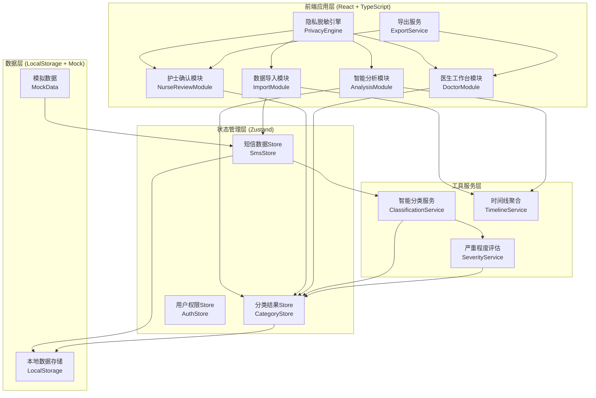
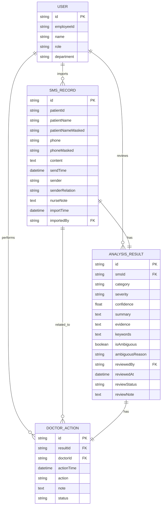

## 1. 架构设计



## 2. 技术描述

- **前端框架**：React@18 + TypeScript@5
- **构建工具**：Vite@5
- **样式方案**：TailwindCSS@3 + CSS Variables
- **状态管理**：Zustand@4（轻量级，适合医疗数据场景）
- **路由管理**：React Router@6
- **图标库**：Lucide React（线性风格，符合医疗专业感）
- **动画库**：Framer Motion（流畅的列表排序和卡片动效）
- **文件处理**：PapaParse（CSV解析）+ SheetJS（Excel解析）
- **导出功能**：jspdf + xlsx（支持PDF和Excel导出）
- **数据持久化**：LocalStorage（模拟后端存储）
- **后端**：无（纯前端应用，内置Mock数据）
- **数据库**：无（前端LocalStorage模拟）

## 3. 路由定义

| 路由路径 | 页面名称 | 访问权限 | 主要功能 |
|----------|----------|----------|----------|
| `/` | 登录页 | 公开 | 工号登录、角色选择 |
| `/nurse/import` | 数据导入页 | 护士 | 导入短信、添加备注 |
| `/nurse/analysis` | 智能分析页 | 护士 | 查看分类结果、患者时间线 |
| `/nurse/review` | 护士确认页 | 护士 | 审核、编辑、确认摘要 |
| `/doctor/workspace` | 医生工作台 | 医生 | 待处理清单、排序筛选、处理标记 |
| `/doctor/history` | 历史记录页 | 医生 | 查看已处理记录 |

## 4. 数据类型定义

```typescript
// 短信记录
interface SmsRecord {
  id: string;
  patientId: string;
  patientName: string;
  patientNameMasked: string;
  phone: string;
  phoneMasked: string;
  content: string;
  sendTime: Date;
  sender: 'patient' | 'family'; // 发送者：患者本人/家属
  senderRelation?: string; // 家属关系
  nurseNote?: string; // 护士人工备注
  importTime: Date;
  importedBy: string;
}

// 分类类型
type CategoryType = 
  | 'symptom_change'    // 症状变化
  | 'medication_issue'  // 用药问题
  | 'adverse_reaction'  // 不良反应
  | 'need_visit'        // 需回诊
  | 'observation_only'; // 只需观察

// 严重程度
type SeverityLevel = 'critical' | 'high' | 'medium' | 'low' | 'unknown';

// 分析结果
interface AnalysisResult {
  smsId: string;
  category: CategoryType;
  severity: SeverityLevel;
  confidence: number; // 置信度 0-1
  summary: string; // 摘要
  evidence: string[]; // 原句依据
  keywords: string[]; // 关键词
  isAmbiguous: boolean; // 是否模糊
  ambiguousReason?: string; // 模糊原因
  reviewedBy?: string; // 审核人工号
  reviewedAt?: Date;
  reviewStatus: 'pending' | 'confirmed' | 'modified' | 'rejected';
  reviewNote?: string; // 审核备注
}

// 患者时间线
interface PatientTimeline {
  patientId: string;
  patientName: string;
  records: {
    date: Date;
    smsIds: string[];
    category: CategoryType;
    severity: SeverityLevel;
    summary: string;
    trend: 'improving' | 'worsening' | 'stable' | 'unknown';
  }[];
}

// 医生处理记录
interface DoctorAction {
  resultId: string;
  doctorId: string;
  actionTime: Date;
  action: 'reviewed' | 'callback' | 'schedule_visit' | 'medication_adjust';
  note: string;
  status: 'pending' | 'completed';
}

// 用户信息
interface User {
  id: string;
  employeeId: string;
  name: string;
  role: 'nurse' | 'doctor';
  department: string;
}
```

## 5. 核心服务接口

```typescript
// 智能分类服务
interface IClassificationService {
  classify(sms: SmsRecord): Promise<AnalysisResult>;
  batchClassify(smsList: SmsRecord[]): Promise<AnalysisResult[]>;
  extractEvidence(content: string): string[];
  calculateSeverity(category: CategoryType, content: string): SeverityLevel;
}

// 隐私脱敏服务
interface IPrivacyEngine {
  maskName(name: string): string; // 张三 → 张*
  maskPhone(phone: string): string; // 13800138000 → 138****8000
  maskIdCard(idCard: string): string;
  maskAll(text: string): string; // 文本中的所有隐私信息脱敏
}

// 导出服务
interface IExportService {
  exportToExcel(results: AnalysisResult[], options: ExportOptions): Blob;
  exportToPDF(results: AnalysisResult[], options: ExportOptions): Blob;
  generateDoctorList(results: AnalysisResult[]): DoctorListData;
}

// 时间线服务
interface ITimelineService {
  aggregateByPatient(smsList: SmsRecord[], results: AnalysisResult[]): PatientTimeline[];
  calculateTrend(records: AnalysisResult[]): 'improving' | 'worsening' | 'stable' | 'unknown';
}
```

## 6. 数据模型

### 6.1 实体关系图



### 6.2 Mock数据初始化

系统内置20条模拟短信数据，覆盖以下场景：
- 症状好转（如"好多了，不咳嗽了"）
- 症状加重（如"停药后头晕得厉害"）
- 用药问题（如"这个药饭前还是饭后吃？"）
- 不良反应（如"吃了药后皮疹很严重"）
- 需回诊（如"最近感觉胸闷，想再来看看"）
- 只需观察（如"就是有点累，其他还好"）
- 家属代发（如"我是他女儿，我爸最近脚肿"）
- 口语缩写（如"药吃完了，要不要续？"）
- 模糊症状（如"就是不舒服，说不上来"）
- 同一患者连续多天反馈
- 仅发药盒照片的情况（用文字描述模拟）
