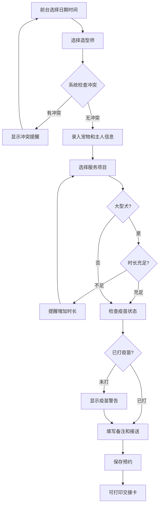

## 1. 产品概述

宠物美容洗护预约管理系统——专为周末预约爆满的宠物美容店打造，解决前台靠聊天记录排重、时长冲突、疫苗遗漏等问题。面向前台接待、造型师和店长三类角色，实现预约录入与智能提醒、交接卡打印、工作量导出和接送路线安排。

- 核心痛点：周末预约爆满，聊天记录排重困难；大型犬时长不足、造型师时间重叠、未打疫苗等风险容易遗漏
- 目标价值：零冲突排班、零遗漏提醒、一键打印交接卡、数据导出支撑经营决策

## 2. 核心功能

### 2.1 用户角色

| 角色 | 使用方式 | 核心权限 |
|------|----------|----------|
| 前台接待 | 默认角色 | 录入/编辑预约、打印交接卡、接送路线安排、查看日历 |
| 造型师 | 切换视图 | 查看本人排班、宠物性格备注、安排助理 |
| 店长 | 切换视图 | 导出造型师工作量、爽约记录、全局数据查看 |

### 2.2 功能模块

1. **预约日历页**：日/周视图切换、预约卡片、时间冲突高亮、快速录入
2. **预约录入页**：宠物信息、主人信息、服务项目选择、造型师分配、时长预估、过敏/咬人备注、接送时间
3. **造型师工作台**：当日排班列表、宠物性格备注、助理安排、服务状态更新
4. **店长数据页**：造型师工作量统计、爽约记录、导出CSV
5. **交接卡打印**：预约详情打印格式、包含所有关键信息

### 2.3 页面详情

| 页面名称 | 模块名称 | 功能描述 |
|----------|----------|----------|
| 预约日历页 | 日历视图 | 日/周视图切换，按造型师筛选，时间槽展示预约卡片 |
| 预约日历页 | 快速录入弹窗 | 点击时间槽快速创建预约，自动填充时间和造型师 |
| 预约日历页 | 冲突提醒 | 大型犬时长不足、造型师重叠、未打疫苗、主人提前到实时提醒 |
| 预约录入页 | 宠物信息 | 姓名、品种、体型（大/中/小）、体重、疫苗状态 |
| 预约录入页 | 主人信息 | 姓名、电话、地址（接送用） |
| 预约录入页 | 服务选择 | 洗护、剃毛、剪指甲、接送等多选，自动计算总时长 |
| 预约录入页 | 备注区域 | 过敏信息、咬人警告、性格标签（紧张/温顺/活泼等） |
| 预约录入页 | 时长与接送 | 预计时长（可手动调整）、接送时间、接送地址 |
| 造型师工作台 | 排班列表 | 当日预约列表，按时间排序，显示宠物名和服务类型 |
| 造型师工作台 | 性格备注 | 突出显示咬人/紧张/过敏等警告标签 |
| 造型师工作台 | 助理安排 | 为每个预约分配助理，标记需避开紧张狗狗的助理 |
| 造型师工作台 | 状态更新 | 标记服务进行中/已完成 |
| 店长数据页 | 工作量统计 | 各造型师每日/每周服务数量、总时长柱状图 |
| 店长数据页 | 爽约记录 | 未到店记录列表，支持筛选和导出 |
| 店长数据页 | 数据导出 | CSV导出工作量数据和爽约记录 |
| 交接卡打印 | 打印预览 | 包含宠物名、品种、服务项、备注、造型师、时间段 |
| 接送路线页 | 路线安排 | 按区域聚类显示接送点，优化路线顺序 |
| 接送路线页 | 通知发送 | 按路线顺序通知主人预计到达时间 |

## 3. 核心流程

### 3.1 预约录入流程

前台选择日期和时间段 → 选择造型师 → 系统检查冲突 → 录入宠物和主人信息 → 选择服务项目（自动计算时长） → 大型犬自动检查时长是否充足 → 检查疫苗状态 → 填写备注和接送信息 → 保存预约 → 可打印交接卡

### 3.2 造型师工作流程

造型师登录查看当日排班 → 查看宠物性格备注 → 根据备注安排助理（避开紧张狗狗） → 开始服务标记状态 → 完成服务更新状态

### 3.3 店长管理流程

店长查看各造型师工作量 → 查看爽约记录 → 导出数据 → 调整排班策略

## 4. 用户界面设计

### 4.1 设计风格

- **主色调**：暖棕色 (#8B6914) 搭配奶油白 (#FFF8F0)，传达宠物店的温暖和亲和力
- **辅助色**：珊瑚橙 (#FF6B4A) 用于提醒和警告，薄荷绿 (#4ECDC4) 用于成功状态
- **按钮风格**：圆角按钮（rounded-xl），柔和阴影，hover时微浮起
- **字体**：标题使用 Noto Serif SC（优雅中文衬线体），正文使用 Noto Sans SC
- **布局风格**：左侧导航栏 + 主内容区，卡片式布局，日历为核心交互
- **图标风格**：Lucide 图标库，线条风格，与整体温暖调性搭配
- **装饰元素**：爪印图案作为品牌元素，微妙的毛发纹理背景

### 4.2 页面设计概览

| 页面名称 | 模块名称 | UI元素 |
|----------|----------|--------|
| 预约日历页 | 日历视图 | 网格布局，时间纵轴造型师横轴，卡片圆角阴影，冲突红色边框 |
| 预约日历页 | 快速录入弹窗 | 居中模态框，表单分区（宠物/主人/服务/备注），底部操作按钮 |
| 预约日历页 | 提醒横幅 | 顶部固定横幅，按严重程度分色（红/橙/黄），可关闭 |
| 预约录入页 | 表单区域 | 分步表单，进度指示器，自动填充建议，实时计算时长 |
| 造型师工作台 | 排班卡片 | 紧凑卡片列表，左侧时间线，警告标签用红色/橙色高亮 |
| 造型师工作台 | 助理面板 | 右侧滑出面板，拖拽分配助理，紧张狗狗标记 |
| 店长数据页 | 统计图表 | 柱状图/折线图，时间筛选器，汇总数字卡片 |
| 交接卡打印 | 打印布局 | A5尺寸，品牌header，分栏信息，底部签名区 |
| 接送路线页 | 路线地图 | 区域分组卡片，拖拽排序，时间估算，通知按钮 |

### 4.3 响应式设计

- 桌面优先设计，主要在收银台电脑使用
- 日历视图在1024px以下切换为列表模式
- 打印布局固定A5尺寸，不随屏幕变化
- 造型师手机端可查看简化版排班和备注

### 4.4 智能提醒规则

| 提醒类型 | 触发条件 | 严重程度 | 表现形式 |
|----------|----------|----------|----------|
| 大型犬时长不足 | 体型=大型犬 且 服务总时长 < 90分钟 | 高 | 红色横幅 + 表单阻止提交 |
| 造型师时间重叠 | 同一造型师在同一时间段有其他预约 | 高 | 红色边框 + 冲突详情弹窗 |
| 未打疫苗 | 疫苗状态=未接种 | 中 | 橙色警告标签 + 确认弹窗 |
| 主人提前到 | 主人到达时间早于预约开始时间且服务未完成 | 低 | 黄色提醒通知 |
