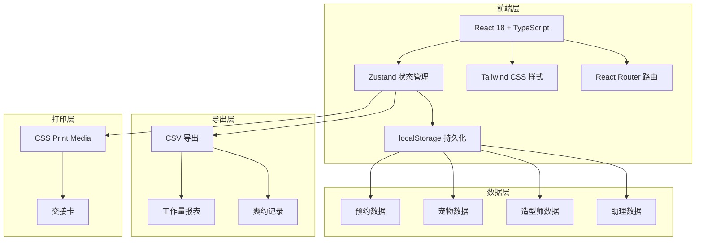
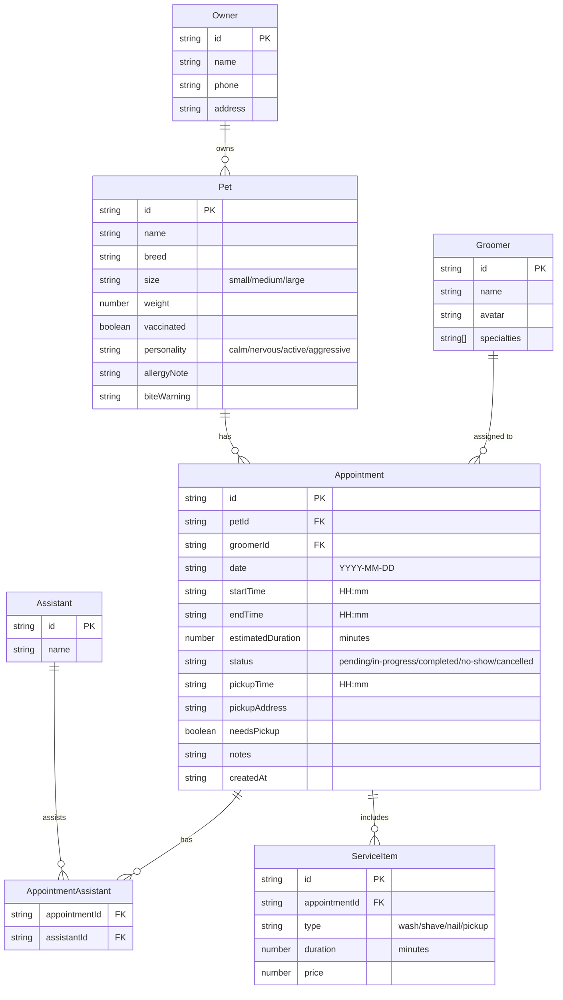

## 1. 架构设计



## 2. 技术说明

- **前端框架**：React@18 + TypeScript + Vite
- **样式方案**：Tailwind CSS@3
- **状态管理**：Zustand（含 localStorage 中间件持久化）
- **路由**：React Router DOM v6
- **图标库**：lucide-react
- **初始化工具**：vite-init（react-ts 模板）
- **后端**：无（纯前端，数据持久化到 localStorage）
- **数据库**：无（localStorage 模拟）

## 3. 路由定义

| 路由 | 用途 |
|------|------|
| / | 预约日历页（首页），日/周视图，快速录入 |
| /booking/new | 新建预约页面，完整表单 |
| /booking/:id | 编辑预约页面 |
| /groomer | 造型师工作台，查看排班和宠物备注 |
| /manager | 店长数据页，统计和导出 |
| /route | 接送路线安排页 |

## 4. 数据模型

### 4.1 数据模型定义



### 4.2 服务时长规则

| 服务类型 | 小型犬 | 中型犬 | 大型犬 |
|----------|--------|--------|--------|
| 洗护 | 40分钟 | 60分钟 | 90分钟 |
| 剃毛 | 30分钟 | 45分钟 | 60分钟 |
| 剪指甲 | 10分钟 | 15分钟 | 20分钟 |
| 接送 | 30分钟 | 30分钟 | 30分钟 |

### 4.3 提醒规则实现

| 提醒类型 | 检测逻辑 |
|----------|----------|
| 大型犬时长不足 | `pet.size === 'large' && totalDuration < 90` |
| 造型师重叠 | 同一 groomerId 在同一天的时间段 `[startTime, endTime]` 与已有预约重叠 |
| 未打疫苗 | `pet.vaccinated === false` |
| 主人提前到 | 主人签到时间 < appointment.startTime && appointment.status !== 'completed' |

## 5. 状态管理架构

```typescript
interface AppointmentStore {
  appointments: Appointment[];
  pets: Pet[];
  owners: Owner[];
  groomers: Groomer[];
  assistants: Assistant[];
  serviceCatalog: ServiceCatalogItem[];

  // 预约操作
  addAppointment: (apt: Appointment) => void;
  updateAppointment: (id: string, data: Partial<Appointment>) => void;
  deleteAppointment: (id: string) => void;

  // 宠物操作
  addPet: (pet: Pet) => void;
  updatePet: (id: string, data: Partial<Pet>) => void;

  // 主人操作
  addOwner: (owner: Owner) => void;
  updateOwner: (id: string, data: Partial<Owner>) => void;

  // 查询
  getAppointmentsByDate: (date: string) => Appointment[];
  getAppointmentsByGroomer: (groomerId: string, date: string) => Appointment[];
  getConflicts: (groomerId: string, date: string, start: string, end: string, excludeId?: string) => Appointment[];

  // 提醒
  getAlerts: (appointment: Appointment) => Alert[];

  // 导出
  exportWorkload: (startDate: string, endDate: string) => WorkloadData[];
  exportNoShows: (startDate: string, endDate: string) => Appointment[];
}
```

## 6. 项目结构

```
src/
├── components/
│   ├── calendar/          # 日历相关组件
│   │   ├── DayView.tsx
│   │   ├── WeekView.tsx
│   │   ├── AppointmentCard.tsx
│   │   └── TimeSlot.tsx
│   ├── booking/           # 预约表单组件
│   │   ├── BookingForm.tsx
│   │   ├── PetInfoSection.tsx
│   │   ├── OwnerInfoSection.tsx
│   │   ├── ServiceSelector.tsx
│   │   ├── NotesSection.tsx
│   │   └── PickupSection.tsx
│   ├── alerts/            # 提醒组件
│   │   ├── AlertBanner.tsx
│   │   └── ConflictDialog.tsx
│   ├── groomer/           # 造型师工作台组件
│   │   ├── GroomerSchedule.tsx
│   │   ├── PetPersonalityTag.tsx
│   │   └── AssistantPanel.tsx
│   ├── manager/           # 店长数据组件
│   │   ├── WorkloadChart.tsx
│   │   ├── NoShowTable.tsx
│   │   └── ExportButton.tsx
│   ├── print/             # 打印组件
│   │   └── HandoverCard.tsx
│   ├── route/             # 接送路线组件
│   │   ├── RoutePlanner.tsx
│   │   └── RouteCard.tsx
│   └── shared/            # 通用组件
│       ├── Layout.tsx
│       ├── Sidebar.tsx
│       └── StatusBadge.tsx
├── pages/
│   ├── CalendarPage.tsx
│   ├── BookingPage.tsx
│   ├── GroomerPage.tsx
│   ├── ManagerPage.tsx
│   └── RoutePage.tsx
├── store/
│   └── useStore.ts        # Zustand store
├── utils/
│   ├── duration.ts        # 时长计算
│   ├── conflicts.ts       # 冲突检测
│   ├── alerts.ts          # 提醒逻辑
│   ├── export.ts          # 导出功能
│   └── seed.ts            # 初始种子数据
├── types/
│   └── index.ts           # TypeScript 类型定义
├── App.tsx
└── main.tsx
```
