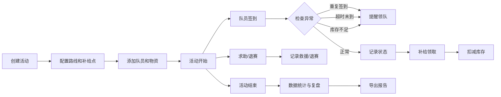

## 1. 产品概述
骑行俱乐部补给台是一款面向骑行俱乐部活动的综合管理系统，解决周末拉练活动中路线登记、队员管理、补给分配、签到追踪、求助响应和活动复盘等痛点。
- 核心目标：让领队、补给车司机、队医三方协同高效，实时掌握活动状态
- 目标用户：骑行俱乐部领队、补给车司机、队医、活动参与队员

## 2. 核心功能

### 2.1 用户角色
| 角色 | 核心权限 | 主要场景 |
|------|----------|----------|
| 领队 | 路线/队员/补给点/物资管理、实时监控、导出复盘 | 活动前配置、活动中监控、活动后复盘 |
| 补给车司机 | 导航顺序查看、物资出库登记 | 按路线顺序配送物资 |
| 队医 | 需要关注队员列表、健康状态查看 | 重点关注有伤病/特殊情况的队员 |
| 队员 | 签到、求助、查看路线和补给点 | 参与活动，记录行程 |

### 2.2 功能模块
1. **活动管理**：创建活动、配置路线、设置补给点、分配物资
2. **队员管理**：队员登记、分组、特殊健康情况标记
3. **签到系统**：到达签到、重复签到提醒、超时未到预警
4. **补给管理**：物资库存、补给领取、库存不足提醒
5. **求助救援**：求助提交、救援记录、退赛登记
6. **实时监控**：领队视图、补给车导航视图、队医视图
7. **数据导出**：用量统计、掉队原因、复盘报告

### 2.3 页面详情
| 页面名称 | 模块名称 | 功能描述 |
|-----------|-------------|---------------------|
| 活动总览 | 活动卡片、快速操作 | 查看当前活动状态，快速进入各功能模块 |
| 路线管理 | 路线列表、点位编辑、临时改道 | 配置路线点位，支持临时改道通知 |
| 队员管理 | 队员列表、分组、健康标记 | 管理队员信息，标记需关注队员 |
| 补给管理 | 物资库存、补给点分配、领取记录 | 管理水、能量胶等物资，跟踪库存 |
| 签到记录 | 实时签到列表、签到统计 | 查看各点位签到情况，超时预警 |
| 求助救援 | 求助列表、救援记录、退赛登记 | 处理求助请求，记录救援和退赛 |
| 领队视图 | 实时状态面板、提醒通知 | 全局监控活动状态，处理异常 |
| 补给车视图 | 导航顺序、物资配送清单 | 按路线顺序查看待配送物资 |
| 队医视图 | 重点关注队员、健康记录 | 查看需关注队员的状态 |
| 数据导出 | 用量统计、掉队分析、复盘报告 | 活动结束后导出数据和报告 |

## 3. 核心流程

### 3.1 活动筹备流程
领队创建活动 → 配置路线和补给点 → 添加队员信息 → 分配物资到补给点 → 活动开始

### 3.2 活动进行流程
队员到达点位签到 → 系统记录时间 → 检查重复签到/超时未到 → 补给领取扣减库存 → 异常情况触发提醒 → 领队实时查看状态

### 3.3 活动结束流程
活动结束 → 统计物资用量 → 分析掉队/退赛原因 → 生成复盘报告 → 导出数据

### 3.4 Mermaid 流程图

## 4. 用户界面设计

### 4.1 设计风格
- 主色调：深青色/湖蓝色系（户外运动、活力、专业）
- 辅助色：橙色（提醒/警告）、绿色（正常/完成）、红色（危险/求助）
- 整体风格：现代运动风，信息密度适中，强调数据可视化
- 布局：侧边导航 + 主内容区，卡片式布局
- 图标风格：线性图标，简洁明快

### 4.2 页面设计概述
| 页面名称 | 模块名称 | UI 元素 |
|-----------|-------------|-------------|
| 活动总览 | 状态概览卡片 | 大号数字指标、进度条、状态标签、渐变色卡片 |
| 签到记录 | 实时签到流 | 时间线布局、头像、点位标记、状态徽章 |
| 领队视图 | 实时监控面板 | 多卡片网格、提醒浮层、实时刷新动画 |
| 补给车视图 | 导航路线卡片 | 步骤式布局、物资清单、当前位置高亮 |

### 4.3 响应式设计
- 桌面端优先，侧边导航固定
- 平板端：侧边栏可收起
- 移动端：底部 Tab 导航，卡片单列布局

### 4.4 交互细节
- 实时数据自动刷新，新数据入场有滑入动画
- 提醒通知从右侧滑入，有震动/高亮效果
- 状态变更有颜色过渡动画
- 按钮悬停有微缩放和阴影变化
