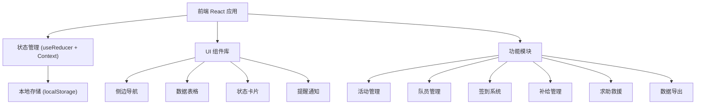
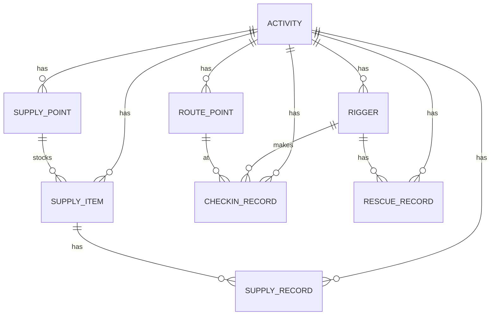

## 1. 架构设计



## 2. 技术选型

- **前端框架**: React 18 + TypeScript
- **构建工具**: Vite
- **样式方案**: Tailwind CSS 3
- **状态管理**: React Context + useReducer
- **数据持久化**: localStorage
- **图标库**: Lucide React
- **图表库**: Recharts（数据统计可视化）

## 3. 路由定义

| 路由路径 | 页面名称 | 说明 |
|----------|----------|------|
| /dashboard | 活动总览 | 活动状态概览、快速入口 |
| /routes | 路线管理 | 路线点位配置、临时改道 |
| /riders | 队员管理 | 队员信息、分组、健康标记 |
| /supplies | 补给管理 | 物资库存、补给点分配 |
| /checkin | 签到记录 | 实时签到、超时预警 |
| /rescue | 求助救援 | 求助列表、退赛登记 |
| /leader | 领队视图 | 全局监控、提醒中心 |
| /supply-vehicle | 补给车视图 | 导航顺序、配送清单 |
| /medic | 队医视图 | 重点关注队员 |
| /export | 数据导出 | 用量统计、复盘报告 |

## 4. 数据模型

### 4.1 实体关系图



### 4.2 数据类型定义

```typescript
// 活动
interface Activity {
  id: string;
  name: string;
  date: string;
  status: 'draft' | 'ongoing' | 'completed';
  description?: string;
}

// 路线路由点
interface RoutePoint {
  id: string;
  activityId: string;
  name: string;
  distance: number; // 公里数
  order: number; // 顺序
  type: 'start' | 'checkpoint' | 'supply' | 'end';
  estimatedArrival?: string; // 预计到达时间
  isDetour?: boolean; // 是否为改道点
  note?: string;
}

// 队员
interface Rigger {
  id: string;
  activityId: string;
  name: string;
  phone: string;
  group?: string; // 分组
  emergencyContact?: string;
  healthNotes?: string; // 健康注意事项
  needsAttention: boolean; // 是否需要重点关注
  status: 'active' | 'dropped' | 'rescued' | 'finished';
  dropReason?: string;
  currentPointId?: string; // 当前到达点位
}

// 补给点
interface SupplyPoint {
  id: string;
  activityId: string;
  routePointId: string; // 关联的路线路由点
  name: string;
}

// 物资
interface SupplyItem {
  id: string;
  supplyPointId: string;
  name: string;
  category: 'water' | 'energy' | 'food' | 'medical' | 'other';
  quantity: number; // 当前库存
  initialQuantity: number; // 初始数量
  unit: string; // 单位：瓶、包、个
}

// 签到记录
interface CheckinRecord {
  id: string;
  riggerId: string;
  routePointId: string;
  timestamp: string;
  isDuplicate: boolean;
  note?: string;
}

// 补给领取记录
interface SupplyRecord {
  id: string;
  riggerId: string;
  supplyItemId: string;
  quantity: number;
  timestamp: string;
}

// 求助/救援记录
interface RescueRecord {
  id: string;
  activityId: string;
  riggerId: string;
  type: 'help' | 'rescue' | 'drop';
  status: 'pending' | 'processing' | 'resolved';
  description: string;
  location?: string;
  timestamp: string;
  resolvedAt?: string;
  resolution?: string;
}

// 提醒
interface Alert {
  id: string;
  activityId: string;
  type: 'duplicate_checkin' | 'low_stock' | 'detour' | 'overdue' | 'help_request';
  title: string;
  message: string;
  severity: 'info' | 'warning' | 'danger';
  read: boolean;
  timestamp: string;
  relatedId?: string;
}
```

## 5. 状态管理架构

```
AppState
├── currentActivity: Activity | null
├── activities: Activity[]
├── routePoints: RoutePoint[]
├── riggers: Rigger[]
├── supplyPoints: SupplyPoint[]
├── supplyItems: SupplyItem[]
├── checkinRecords: CheckinRecord[]
├── supplyRecords: SupplyRecord[]
├── rescueRecords: RescueRecord[]
├── alerts: Alert[]
└── currentView: 'leader' | 'supply' | 'medic'
```

## 6. 核心模块说明

### 6.1 签到系统
- 支持队员到达点位手动签到
- 自动检测重复签到并触发提醒
- 根据预计时间计算超时未到队员
- 实时更新队员当前位置状态

### 6.2 补给管理
- 按补给点管理物资库存
- 补给领取自动扣减库存
- 库存低于阈值自动触发低库存提醒
- 补给车按导航顺序查看物资清单

### 6.3 提醒系统
- 重复签到提醒
- 物资库存不足提醒
- 临时改道通知
- 长时间未到下一点提醒
- 新求助请求提醒

### 6.4 数据导出
- 导出物资用量统计（CSV/JSON）
- 导出掉队/退赛原因分析
- 生成活动复盘报告
- 支持导出签到完整记录
