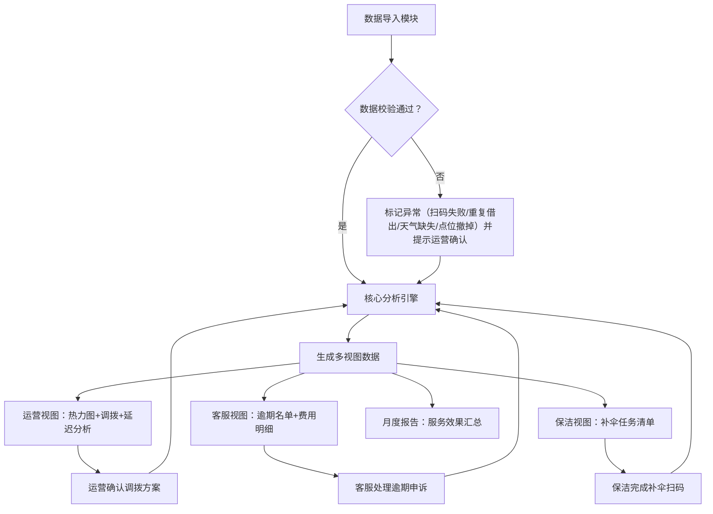

## 1. 产品概述

共享雨伞归还图是一款面向多角色的数据分析与运营调度系统，解决雨天借空、晴天堆积、库存失衡的运营痛点。系统通过整合借还记录、点位库存与天气数据，按点位×时段×雨量多维度分析缺伞风险、逾期行为与跨点归还特征，为运营提供热力图调拨决策、为客服提供逾期费用溯源、为保洁员提供补伞任务清单，月底自动生成商场服务报告。

- 目标用户：运营调度员、客服专员、保洁补货员、商场管理层
- 核心价值：从"只看总借出数"升级为"可预测、可追溯、可调度"的精细化运营

---

## 2. 核心功能

### 2.1 用户角色

| 角色 | 登录方式 | 核心权限 |
|------|----------|----------|
| 运营调度 | 工号登录 | 热力图查看、调拨建议生成、雨停延迟分析、参数配置、月度报告导出 |
| 客服专员 | 工号登录 | 逾期名单查询、费用明细溯源、异常申诉处理、用户沟通记录 |
| 保洁补货 | 工号登录 / 扫码登录 | 补伞任务列表、任务完成确认、缺货上报 |
| 商场管理 | 工号登录 | 月度服务报告、点位利用率、服务质量指标总览 |

### 2.2 功能模块

1. **数据导入页**：借还记录CSV导入、点位库存JSON导入、天气API/CSV导入、数据校验与异常标记
2. **运营仪表盘**：全局热力图、点位状态矩阵、时段×雨量交叉分析、调拨建议清单、雨停归还延迟分析
3. **客服工作台**：逾期用户名单、逾期费用计算明细、异常申诉（扫码失败/重复借出/撤点）、用户联系
4. **保洁任务**：待补伞点位列表（按优先级排序）、扫码补伞确认、库存上报
5. **月度报告**：服务覆盖人数、借还周转率、逾期率、跨点归还率、异常事件统计、ROI估算

### 2.3 页面详情

| 页面名称 | 模块名称 | 功能描述 |
|----------|----------|----------|
| 登录页 | 角色选择 | 四种角色切换登录，工号+密码（演示模式模拟登录） |
| 数据导入页 | 文件上传 | 支持借还记录CSV、点位库存JSON、天气CSV三种文件，拖拽上传+进度条 |
| 数据导入页 | 数据校验 | 自动识别扫码失败、重复借出、天气缺失、点位撤掉四类异常，标红并给出说明 |
| 运营仪表盘 | 全局热力图 | 地图式点位热力图（颜色深度=缺伞指数），点击点位弹出详情侧栏 |
| 运营仪表盘 | 时段×雨量矩阵 | 行=时段（0-6/6-12/12-18/18-24），列=雨量等级（晴/小雨/中雨/大雨），单元格=缺伞率/周转率 |
| 运营仪表盘 | 调拨建议 | 算法生成：从富余点→缺货点的最优调拨方案（数量、预计耗时、优先级） |
| 运营仪表盘 | 雨停延迟分析 | X轴=雨停后小时数，Y轴=归还量/逾期率曲线，可调节免罚时长滑块实时预览效果 |
| 客服工作台 | 逾期名单 | 可筛选（逾期天数、点位、是否申诉），显示用户手机号脱敏、逾期伞数、累计费用 |
| 客服工作台 | 费用明细弹层 | 逐条展示：免费时长→起步价→超时阶梯价→跨点服务费→减免项，附计算公式 |
| 客服工作台 | 异常处理 | 扫码失败/重复借出/天气缺失/点位撤掉四类标签，支持申诉通过并减免 |
| 保洁任务 | 任务列表 | 卡片式，按优先级排序，显示点位名称、当前库存、建议补伞数、预计到达时间 |
| 保洁任务 | 扫码确认 | 模拟扫码补伞，输入补伞数量后标记任务完成 |
| 月度报告 | 数据总览 | 关键指标卡+趋势图+点位排行榜 |
| 月度报告 | 导出 | 支持PDF/Excel导出，可附加备注说明 |

---

## 3. 核心流程

**核心分析逻辑说明**：
1. 缺伞指数 = f(当前库存, 历史同时段借出量, 实时雨量等级, 雨停后时长)
2. 逾期判定 = 借伞时刻 + 免罚时长 + 阶梯超时区间
3. 调拨优先级 = 缺货紧急度 × 距离权重 × 富余点可调度量
4. 雨停归还延迟 = 雨停时刻 → 实际归还时刻的分布统计

---

## 4. 用户界面设计

### 4.1 设计风格

**美学方向：数据驱动的"气候极简主义"(Climate Minimalism)**

- **主色调**：深青色 `#0F4C5C`（信任、雨天氛围）+ 暖琥珀 `#E36414`（紧急调拨警示）
- **辅助色**：薄荷绿 `#5FAD56`（正常库存）、柠檬黄 `#F2C14E`（低库存预警）、砖红 `#B23A48`（缺伞/逾期）
- **背景**：浅灰蓝渐变 + 细密雨滴纹理（淡到几乎不可察，营造雨天氛围感）
- **字体**：
  - 标题：`Fraunces`（衬线体，给数据报告以质感）
  - 正文：`Lora`（优雅衬线，适合长时间数据阅读）
  - 数字：`JetBrains Mono`（等宽，数据对齐美观）
- **按钮风格**：圆角 8px，微投影，悬停时颜色加深+轻微上浮
- **图标**：Line Awesome 线性图标，搭配天气emoji辅助
- **布局**：顶部角色导航栏 + 左侧子菜单 + 主内容卡片栅格，采用数据看板式的信息密度

### 4.2 页面设计概述

| 页面名称 | 模块名称 | UI 元素 |
|----------|----------|---------|
| 登录页 | 角色卡片区 | 四张卡片对应四种角色，选中有琥珀色描边+阴影，Fraunces大标题"雨伞归还图"下方有流动雨丝SVG动画 |
| 运营仪表盘 | 全局热力图 | 自定义SVG城市点位图（12个点位），根据缺伞指数渐变色填充，鼠标悬停弹出微气泡，点击展开右侧抽屉 |
| 运营仪表盘 | 时段×雨量矩阵 | 4×4 热力格子，每个格子内显示两个数字（缺伞率/周转率），悬停放大并显示详细柱图 |
| 运营仪表盘 | 调拨建议卡 | 时间线式设计：起点(富余点) → 箭头(数量) → 终点(缺货点)，优先级用琥珀色徽章 |
| 运营仪表盘 | 雨停延迟曲线 | 面积图，带可调滑块（免罚时长），滑块拖动时实时重算"预计减免逾期数" |
| 客服工作台 | 逾期名单 | 斑马纹表格 + 行内操作（查看明细/标记处理），逾期天数>7用砖红背景条 |
| 客服工作台 | 费用明细弹层 | 账单式排版：项目/单价/时长/小计，底部合计，附"费用公式"折叠说明 |
| 保洁任务 | 任务卡片 | 竖排卡片，左侧大数字显示补伞数，右上角优先级标签，底部有大尺寸扫码确认按钮 |
| 月度报告 | 报告正文 | A4纸模拟效果，Fraunces衬线大标题，关键指标用大号数字+趋势箭头，点位排行榜用柱状图 |

### 4.3 响应式

- 桌面端优先设计（运营/客服主要使用）
- 保洁任务页适配移动端（竖屏单列、大按钮、字体放大）
- 热力图在平板端支持双指缩放
- 表格在窄屏自动切换为卡片列表

### 4.4 动效与交互

- **入场动画**：仪表盘加载时，热力点位逐个"点亮"出现（stagger delay）
- **微交互**：调拨卡片悬停时箭头轻微颤动，模拟"运输中"
- **滑块反馈**：调节免罚时长时，逾期曲线实时平滑过渡
- **状态切换**：角色切换时，雨丝密度对应变化（运营=中雨、保洁=停雨后微晴）
