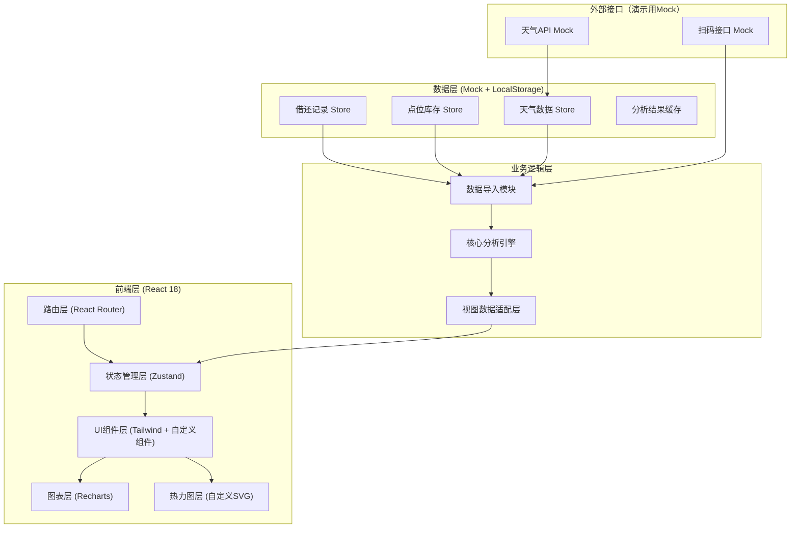
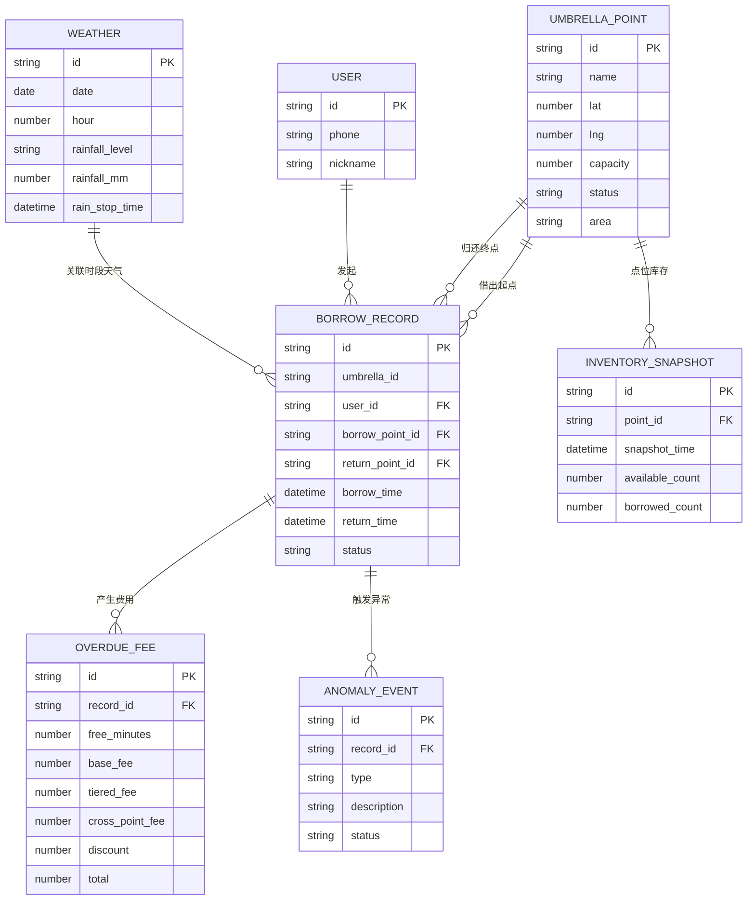

## 1. 架构设计



## 2. 技术描述

- **前端框架**：React 18 + TypeScript + Vite
- **样式方案**：Tailwind CSS 3 + CSS Variables（主题系统）
- **状态管理**：Zustand（轻量，适合多Store拆分）
- **图表库**：Recharts（面积图/柱状图/折线图）
- **路由**：React Router 6
- **日期处理**：date-fns
- **数据校验**：zod
- **Mock方案**：内置生成器（faker.js风格手动实现），数据持久化到 LocalStorage
- **导出方案**：jsPDF（月度报告PDF）、xlsx（Excel导出）

## 3. 路由定义

| 路由 | 页面 | 角色权限 |
|------|------|----------|
| `/login` | 登录页（角色选择） | 全部 |
| `/import` | 数据导入页 | 运营 |
| `/dashboard` | 运营仪表盘 | 运营 |
| `/customer-service` | 客服工作台 | 客服 |
| `/cleaning-tasks` | 保洁任务 | 保洁 |
| `/monthly-report` | 月度报告 | 运营 / 商场管理 |

## 4. 数据模型

### 4.1 ER 图



### 4.2 核心 TypeScript 类型定义

```typescript
// 点位
export interface UmbrellaPoint {
  id: string;
  name: string;
  lat: number;
  lng: number;
  capacity: number;
  status: 'active' | 'temporary_removed' | 'maintenance';
  area: 'mall_entrance' | 'subway_exit' | 'bus_station' | 'office_building' | 'school';
  currentInventory: number;
}

// 借还记录
export interface BorrowRecord {
  id: string;
  umbrellaId: string;
  userId: string;
  userPhone: string;
  borrowPointId: string;
  returnPointId: string | null;
  borrowTime: Date;
  returnTime: Date | null;
  status: 'borrowing' | 'returned' | 'overdue' | 'lost';
  scanFailCount: number;
  crossPointReturn: boolean;
}

// 天气
export interface WeatherRecord {
  date: string;
  hour: number;
  rainfallLevel: 'sunny' | 'light' | 'moderate' | 'heavy';
  rainfallMm: number;
  rainStopTime: Date | null;
  dataMissing: boolean;
}

// 异常事件
export type AnomalyType = 'scan_fail' | 'duplicate_borrow' | 'weather_missing' | 'point_removed';
export interface AnomalyEvent {
  id: string;
  recordId: string | null;
  pointId: string | null;
  type: AnomalyType;
  description: string;
  status: 'pending' | 'resolved' | 'waived';
  reportedAt: Date;
}

// 分析结果
export interface AnalysisResult {
  shortageIndex: Record<string, number>;
  transferSuggestions: TransferSuggestion[];
  overdueList: OverdueItem[];
  rainStopDelay: RainStopDelayPoint[];
  timeRainMatrix: TimeRainMatrixCell[][];
  anomalies: AnomalyEvent[];
}

export interface TransferSuggestion {
  id: string;
  fromPointId: string;
  toPointId: string;
  quantity: number;
  priority: 'high' | 'medium' | 'low';
  estimatedMinutes: number;
}

export interface OverdueItem {
  recordId: string;
  userPhone: string;
  overdueDays: number;
  umbrellaCount: number;
  totalFee: number;
  feeBreakdown: FeeBreakdown;
  hasAnomaly: boolean;
  anomalyType?: AnomalyType;
}

export interface FeeBreakdown {
  freeMinutes: number;
  usedMinutes: number;
  baseFee: number;
  tieredFee: Array<{ range: string; rate: number; minutes: number; amount: number }>;
  crossPointFee: number;
  discount: number;
  formula: string;
}

export interface RainStopDelayPoint {
  hoursAfterRainStop: number;
  returnCount: number;
  overdueRate: number;
  cumulativeReturnRate: number;
}

export interface TimeRainMatrixCell {
  timeSlot: string;
  rainLevel: string;
  shortageRate: number;
  turnoverRate: number;
  sampleSize: number;
}

export interface CleaningTask {
  id: string;
  pointId: string;
  pointName: string;
  currentInventory: number;
  suggestedRefill: number;
  priority: 'high' | 'medium' | 'low';
  estimatedArrival: string;
  area: string;
  completed: boolean;
}

export interface MonthlyReport {
  period: string;
  totalBorrows: number;
  totalReturns: number;
  turnoverRate: number;
  overdueRate: number;
  crossPointRate: number;
  servedUsers: number;
  topPoints: Array<{ name: string; borrows: number; satisfaction: number }>;
  anomalyStats: Record<AnomalyType, number>;
  roiEstimate: { revenue: number; cost: number; profit: number };
}
```

## 5. 核心分析引擎算法说明

### 5.1 缺伞指数计算

```
缺伞指数 S = w1 * (1 - 库存充足率) + w2 * 历史借出压力 + w3 * 天气因子 + w4 * 雨停因子
其中：
- 库存充足率 = 当前库存 / 点位容量
- 历史借出压力 = 同时段历史平均借出量 / 点位容量
- 天气因子 = {晴: 0.1, 小雨: 0.4, 中雨: 0.7, 大雨: 1.0}
- 雨停因子 = exp(-雨停后小时数 / 4) （前4小时快速衰减）
- w1=0.35, w2=0.25, w3=0.30, w4=0.10
```

### 5.2 调拨最优匹配

贪心算法：
1. 按缺伞指数降序排列缺货点位
2. 对每个缺货点，计算所有富余点的"调拨价值" = 可调拨量 / 距离
3. 选取调拨价值最高的富余点，按容量匹配分配
4. 重复直到缺货消除或无富余库存

### 5.3 逾期费用计算

```
总费用 = 起步价 + Σ(阶梯超时费) + 跨点服务费 - 减免
阶梯费率：
- 0~30分钟：免费
- 30~120分钟：1元/30分钟（起步价2元）
- 120~360分钟：2元/60分钟
- 360分钟以上：3元/60分钟
- 跨点归还：一次性 +2元
```

### 5.4 雨停归还延迟分析

以雨停时刻为 T0：
- 分桶：0-1h, 1-2h, 2-4h, 4-8h, 8-12h, 12-24h, 24h+
- 每桶统计：归还数量、占比、其中被判定为逾期的比例
- 输出累计归还率曲线，用于辅助设置免罚时长阈值

## 6. 目录结构

```
src/
├── assets/              # 静态资源、SVG雨丝动画、字体文件
├── components/
│   ├── layout/          # 导航栏、侧边栏、角色切换
│   ├── charts/          # 热力图、时段矩阵、雨停延迟曲线
│   ├── cards/           # 调拨建议卡、逾期行、保洁任务卡
│   ├── modals/          # 费用明细弹层、申诉处理弹层
│   └── common/          # 按钮、标签、进度条等基础组件
├── pages/
│   ├── LoginPage.tsx
│   ├── ImportPage.tsx
│   ├── DashboardPage.tsx
│   ├── CustomerServicePage.tsx
│   ├── CleaningTasksPage.tsx
│   └── MonthlyReportPage.tsx
├── store/
│   ├── authStore.ts
│   ├── dataStore.ts
│   └── analysisStore.ts
├── engine/
│   ├── dataImporter.ts      # CSV/JSON解析+校验
│   ├── anomalyDetector.ts   # 四类异常识别
│   ├── shortageAnalyzer.ts  # 缺伞指数计算
│   ├── transferPlanner.ts   # 调拨建议生成
│   ├── overdueCalculator.ts # 逾期+费用计算
│   └── rainDelayAnalyzer.ts # 雨停延迟分析
├── data/
│   ├── mockPoints.ts
│   ├── mockRecords.ts
│   ├── mockWeather.ts
│   └── mockUsers.ts
├── hooks/               # 自定义hooks
├── utils/               # 日期、金额、格式化工具
├── types/               # 全局类型定义
├── router/              # 路由配置+权限守卫
└── App.tsx
```
