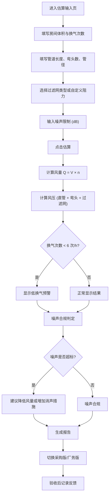

## 1. 产品概述

小型风机通风量估算工具，面向厂务和采购人员，解决小车间加装排风时"不确定风量和噪声是否超标"的痛点。输入房间体积、换气次数、管道参数和噪声限制后，自动估算所需风量与风压范围，并分别输出采购版（推荐范围）和厂务版（管道阻力与不确定项详情）报告，支持验收后记录实际风感反馈。

- 目标用户：厂务工程师、采购人员
- 核心价值：将"凭经验选风机"变为"有数据支撑的估算"，避免风量不足或噪声超标

## 2. 核心功能

### 2.1 用户角色

| 角色 | 核心权限 |
|------|----------|
| 厂务工程师 | 完整输入、查看厂务版报告（含阻力计算详情与不确定项）、记录验收反馈 |
| 采购人员 | 查看采购版报告（推荐风量/风压/噪声范围，无需管道细节） |

### 2.2 功能模块

1. **估算输入页**：房间体积、目标换气次数、管道长度、弯头数、过滤网类型/阻力、噪声限制等参数输入，支持 m³/h↔CFM、米↔英尺实时换算
2. **估算结果页**：风量与风压估算结果、换气次数偏低预警、噪声合规判定，可切换采购版/厂务版报告
3. **验收反馈页**：验收后记录实际风感（风速体感、噪声体感、异味改善程度）

### 2.3 页面详情

| 页面名称 | 模块名称 | 功能描述 |
|----------|----------|----------|
| 估算输入页 | 房间参数 | 输入房间体积（m³/ft³）、目标换气次数（次/h），低换气次数自动预警提示 |
| 估算输入页 | 管道参数 | 输入管道长度（m/ft）、弯头数量、管道直径，支持公英制切换 |
| 估算输入页 | 过滤网参数 | 选择过滤网类型（初效/中效/高效/自定义），自定义时输入阻力值（Pa），未选时标注"未知"并使用保守估算 |
| 估算输入页 | 噪声限制 | 输入噪声限制值（dB），单独列出，作为风量计算约束条件 |
| 估算输入页 | 气味来源 | 描述气味来源（可选），用于报告备注 |
| 估算结果页 | 风量估算 | 显示所需风量（m³/h 和 CFM 双单位）、基于 Q = V × n 计算 |
| 估算结果页 | 风压估算 | 显示系统总阻力（Pa），含直管摩擦、弯头局部阻力、过滤网阻力分项 |
| 估算结果页 | 噪声判定 | 将噪声限制与推荐风机噪声范围对比，标注是否合规 |
| 估算结果页 | 采购版报告 | 仅展示推荐风量范围、风压范围、噪声要求，简洁明了 |
| 估算结果页 | 厂务版报告 | 展示完整管道阻力计算、不确定项标注（如过滤网阻力为估算值）、安全系数建议 |
| 验收反馈页 | 反馈记录 | 记录风速体感（弱/适中/强）、噪声体感（安静/可接受/较吵）、异味改善程度（无改善/部分改善/明显改善），附文字备注 |

## 3. 核心流程

用户进入估算输入页，填写房间参数、管道参数、过滤网参数和噪声限制，点击"开始估算"。系统计算风量和风压，判断换气次数是否过低及噪声是否合规，生成估算结果。用户可切换采购版/厂务版报告查看。验收完成后，进入验收反馈页记录实际风感体验。

## 4. 用户界面设计

### 4.1 设计风格

- 主色调：深青灰 (#1B2B3A) 搭配活力橙 (#F97316) 作为强调色，传达工业专业感
- 辅助色：浅灰底 (#F1F5F9)、白色卡片
- 按钮风格：圆角矩形（8px），主操作按钮使用活力橙填充
- 字体：正文使用系统无衬线体，数值展示使用等宽字体突出精度感
- 布局：单栏居中，卡片式分区，步骤引导式输入
- 图标风格：线性图标（lucide-react），工业/通风主题

### 4.2 页面设计概览

| 页面名称 | 模块名称 | UI 元素 |
|----------|----------|---------|
| 估算输入页 | 房间参数 | 数字输入框+单位切换按钮（m³↔ft³），换气次数滑块+数字输入，低值时橙色警告条 |
| 估算输入页 | 管道参数 | 数字输入框+单位切换（m↔ft），弯头数量步进器，管径输入 |
| 估算输入页 | 过滤网参数 | 下拉选择（初效/中效/高效/自定义/未知），自定义时展开Pa输入，未知时显示保守估算提示 |
| 估算输入页 | 噪声限制 | 数字输入框（dB），右侧刻度提示常见场景对应值 |
| 估算结果页 | 风量风压 | 大字数值展示（双单位），仪表盘风格进度条 |
| 估算结果页 | 报告切换 | Tab 切换采购版/厂务版，采购版用绿色/蓝色系，厂务版用深色系 |
| 验收反馈页 | 反馈表单 | 三组单选按钮（风速/噪声/异味），文本域备注，提交按钮 |

### 4.3 响应式设计

- 桌面优先，最小宽度 1024px
- 移动端适配：卡片堆叠，数值展示适当缩小

### 4.4 3D 场景

不适用
