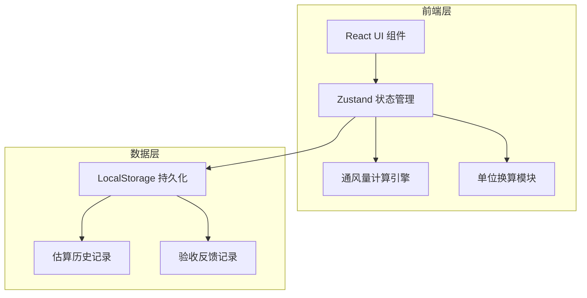
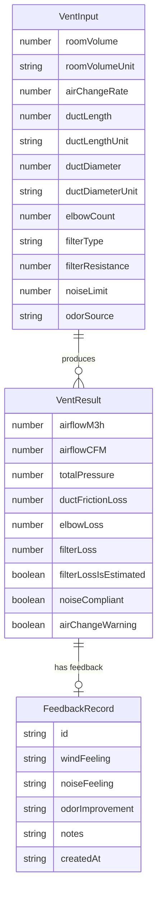

## 1. 架构设计



纯前端应用，无需后端服务。所有计算在浏览器端完成，估算记录和验收反馈存储于 LocalStorage。

## 2. 技术说明

- 前端：React@18 + TypeScript + Tailwind CSS@3 + Vite
- 初始化工具：vite-init（react-ts 模板）
- 状态管理：Zustand
- 后端：无
- 数据库：无，使用 LocalStorage 持久化
- 图标：lucide-react

## 3. 路由定义

| 路由 | 用途 |
|------|------|
| `/` | 估算输入页：房间/管道/过滤网/噪声参数输入 |
| `/result` | 估算结果页：风量风压结果、双版报告切换 |
| `/feedback` | 验收反馈页：记录实际风感体验 |

## 4. API 定义

无后端 API，所有逻辑前端完成。

### 核心计算接口（TypeScript 类型）

```typescript
interface VentInput {
  roomVolume: number;
  roomVolumeUnit: "m3" | "ft3";
  airChangeRate: number;
  ductLength: number;
  ductLengthUnit: "m" | "ft";
  ductDiameter: number;
  ductDiameterUnit: "mm" | "in";
  elbowCount: number;
  filterType: "none" | "coarse" | "medium" | "fine" | "custom" | "unknown";
  filterResistance: number | null;
  noiseLimit: number;
  odorSource: string;
}

interface VentResult {
  airflowM3h: number;
  airflowCFM: number;
  totalPressure: number;
  ductFrictionLoss: number;
  elbowLoss: number;
  filterLoss: number;
  filterLossIsEstimated: boolean;
  noiseCompliant: boolean;
  airChangeWarning: boolean;
  recommendedAirflowRange: { min: number; max: number };
  recommendedPressureRange: { min: number; max: number };
}

interface FeedbackRecord {
  id: string;
  ventInput: VentInput;
  ventResult: VentResult;
  windFeeling: "weak" | "moderate" | "strong";
  noiseFeeling: "quiet" | "acceptable" | "loud";
  odorImprovement: "none" | "partial" | "obvious";
  notes: string;
  createdAt: string;
}
```

## 5. 服务器架构图

不适用（纯前端应用）

## 6. 数据模型

### 6.1 数据模型定义



### 6.2 计算公式

**风量计算：**
- Q = V × n
  - Q：风量（m³/h）
  - V：房间体积（m³）
  - n：换气次数（次/h）
- CFM = m³/h × 0.5886

**风压计算（系统总阻力）：**
- ΔP_total = ΔP_duct + ΔP_elbow + ΔP_filter
- 直管摩擦阻力：ΔP_duct = f × (L/D) × (ρv²/2)
  - f：摩擦系数（镀锌钢板取 0.025）
  - L：管道长度（m）
  - D：管道直径（m）
  - ρ：空气密度（1.2 kg/m³）
  - v：管道风速 = Q/(3600 × A)，A = π(D/2)²
- 弯头局部阻力：ΔP_elbow = N × ζ × (ρv²/2)
  - N：弯头数量
  - ζ：单个弯头局部阻力系数（90°弯头取 0.5）
- 过滤网阻力：ΔP_filter
  - 初效：50 Pa（估算值）
  - 中效：120 Pa（估算值）
  - 高效：250 Pa（估算值）
  - 自定义：用户输入值
  - 未知：150 Pa（保守估算值，标注不确定）

**噪声判定：**
- 将噪声限制与推荐风机噪声范围对比
- 一般同风量轴流风机噪声约 55-75 dB(A)

**换气次数预警：**
- n < 6 次/h：黄色预警（一般车间最低建议）
- n < 3 次/h：红色警告（严重不足）

**安全系数：**
- 推荐风量范围：Q × 1.0 ~ Q × 1.2
- 推荐风压范围：ΔP_total × 1.1 ~ ΔP_total × 1.3
