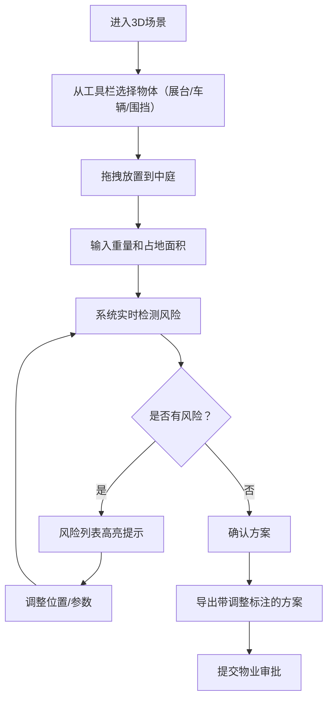
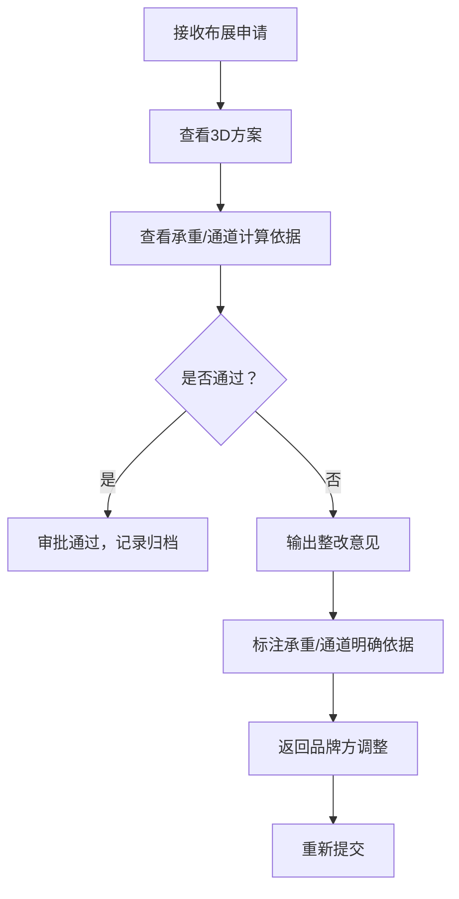
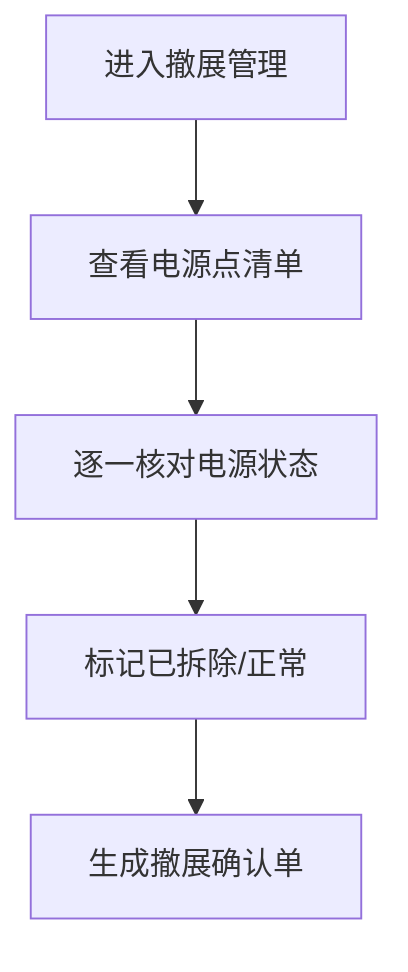

## 1. 产品概述

商场中庭布展承重规划系统，解决品牌方与物业方在汽车和家电展览中的核心冲突：品牌方希望展台居中展示效果最佳，物业方需确保楼板承重安全、消防通道畅通、客流组织合理。系统通过3D可视化场景实现展台、车辆、围挡、电源、消防通道和客流入口的交互式规划，实时检测超重、通道不足、电源线跨人流等风险，为品牌方输出调整方案、为物业方提供审批依据和整改意见，撤展时支持电源点核对。

## 2. 核心功能

### 2.1 用户角色
| 角色 | 注册方式 | 核心权限 |
|------|----------|----------|
| 品牌方策划 | 账号登录 | 布展规划、参数输入、查看风险、导出方案 |
| 物业审批 | 账号登录 | 查看方案、审批记录、输出整改意见、电源核对 |
| 系统管理员 | 后台配置 | 商场参数配置、用户管理 |

### 2.2 功能模块
1. **3D布展场景**：商场中庭可视化、展台/车辆/围挡/电源/消防通道/客流入口模型
2. **拖拽交互**：展台位置拖动、实时风险更新
3. **参数输入**：重量、占地面积、单位选择、输入校验
4. **风险检测**：承重超载、消防通道不足、电源线跨人流
5. **方案导出**：品牌方方案（标注需调整位置）
6. **审批管理**：物业审批记录、整改意见输出
7. **撤展管理**：电源点核对清单

### 2.3 页面详情
| 页面名称 | 模块名称 | 功能描述 |
|-----------|-------------|---------------------|
| 主页面 | 3D场景画布 | 展示中庭3D模型，支持拖拽放置展台、车辆等物体，鼠标旋转/缩放场景 |
| 主页面 | 左侧工具栏 | 物体选择面板（展台、汽车、围挡、电源、消防标识） |
| 主页面 | 右侧属性面板 | 选中物体的参数输入（重量、面积）、单位选择、风险提示 |
| 主页面 | 底部风险列表 | 实时显示所有风险项（超重、通道不足、跨线），支持点击定位 |
| 方案导出页 | 方案预览 | 2D俯视图，标注需调整位置，显示承重/通道数据依据 |
| 方案导出页 | 导出操作 | PDF导出、打印、发送邮件 |
| 审批记录页 | 审批列表 | 历史审批记录、状态、审批人、时间 |
| 审批记录页 | 整改意见 | 编辑整改意见模板，生成正式文件 |
| 撤展管理页 | 电源核对 | 电源点清单、核对状态、核对人签字 |

## 3. 核心流程

### 3.1 品牌方布展流程

### 3.2 物业审批流程

### 3.3 撤展核对流程

## 4. 用户界面设计

### 4.1 设计风格
- **主色调**：工业蓝 `#165DFF`（专业、可信赖），警示橙 `#FF7D00`（风险提示），安全绿 `#00B42A`（合规）
- **按钮风格**：圆角矩形，悬停微动画，点击反馈
- **字体**：标题用 `Noto Sans SC Bold`，正文用 `Noto Sans SC Regular`，数字用 `JetBrains Mono`
- **布局风格**：三栏布局（左工具栏+中3D场景+右属性面板），深色主题适合3D场景
- **图标**：lucide-react 图标库，统一线性风格

### 4.2 页面设计概述
| 页面名称 | 模块名称 | UI元素 |
|-----------|-------------|----------|
| 主页面 | 3D场景画布 | 深色背景、网格地面、半透明楼板、中庭结构、物体模型带发光边缘 |
| 主页面 | 左侧工具栏 | 卡片式物体选择，悬停放大，选中高亮边框 |
| 主页面 | 右侧属性面板 | 分组表单，输入框带单位下拉，风险提示用红色背景卡片 |
| 主页面 | 底部风险列表 | 横向滚动列表，风险项带颜色编码，点击平滑定位到3D场景 |
| 方案导出页 | 方案预览 | 2D俯视图，风险区域用红色虚线框标注，附带数据表格 |

### 4.3 响应式
- 桌面端优先设计，三栏布局
- 平板端：左右面板可折叠，3D场景自适应
- 移动端：单列布局，3D场景简化为2D俯视图

### 4.4 3D场景指引
- **环境**：室内中庭，柔和顶光，地面网格辅助对齐
- **光照**：主光+环境光，物体带柔和阴影，选中物体有高亮外发光
- **相机**：默认45度俯视角，支持轨道控制（旋转/缩放/平移），拖拽物体时相机跟随
- **交互**：物体拖拽时显示半透明预览，吸附到网格，释放时有放置动画
- **后处理**：轻微泛光，选中物体有轮廓高亮，风险物体有红色脉冲闪烁
- **模型**：展台（长方体，可自定义尺寸）、汽车（简化模型）、围挡（矮墙）、电源点（发光球体）、消防通道（半透明红色区域）
