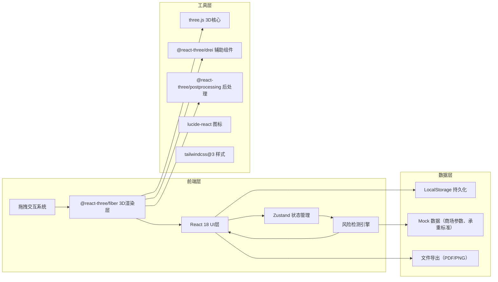
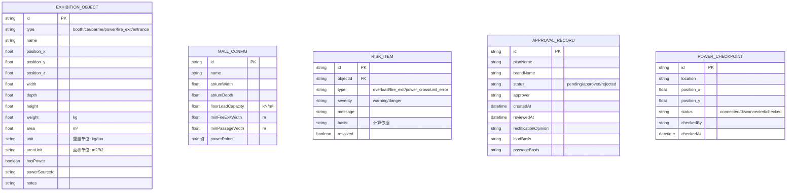

## 1. 架构设计



## 2. 技术描述

- **前端框架**：React@18 + TypeScript
- **构建工具**：Vite 5.x
- **3D引擎**：three.js + @react-three/fiber + @react-three/drei + @react-three/postprocessing
- **状态管理**：Zustand
- **样式方案**：tailwindcss@3
- **图标库**：lucide-react
- **后端**：无后端，使用 LocalStorage 持久化 + Mock 数据
- **文件导出**：html2canvas + jsPDF

## 3. 路由定义

| 路由 | 页面 | 功能 |
|-------|------|------|
| `/` | 首页 | 3D布展主场景，拖拽放置、参数输入、风险检测 |
| `/export` | 方案导出 | 2D俯视图预览、标注调整位置、PDF导出 |
| `/approval` | 审批管理 | 审批记录列表、整改意见编辑 |
| `/dismantle` | 撤展管理 | 电源点核对清单、状态标记 |

## 4. 数据模型

### 4.1 数据模型定义



### 4.2 TypeScript 类型定义

```typescript
// 物体类型
type ObjectType = 'booth' | 'car' | 'barrier' | 'power' | 'fire_exit' | 'entrance';

// 展览物体
interface ExhibitionObject {
  id: string;
  type: ObjectType;
  name: string;
  position: [number, number, number];
  dimensions: { width: number; depth: number; height: number };
  weight: number;
  weightUnit: 'kg' | 'ton';
  area: number;
  areaUnit: 'm2' | 'ft2';
  hasPower: boolean;
  powerSourceId?: string;
  notes?: string;
}

// 商场配置
interface MallConfig {
  id: string;
  name: string;
  atriumDimensions: { width: number; depth: number; height: number };
  floorLoadCapacity: number; // kN/m²
  minFireExitWidth: number; // m
  minPassageWidth: number; // m
  powerPoints: PowerPoint[];
}

// 电源点
interface PowerPoint {
  id: string;
  name: string;
  position: [number, number, number];
}

// 风险项
type RiskType = 'overload' | 'fire_exit_blocked' | 'passage_too_narrow' | 'power_crosses_flow' | 'unit_error' | 'area_error';
type RiskSeverity = 'warning' | 'danger';

interface RiskItem {
  id: string;
  objectId: string;
  type: RiskType;
  severity: RiskSeverity;
  message: string;
  basis: string;
  resolved: boolean;
  suggestedPosition?: [number, number, number];
}

// 审批记录
interface ApprovalRecord {
  id: string;
  planName: string;
  brandName: string;
  status: 'pending' | 'approved' | 'rejected';
  objects: ExhibitionObject[];
  approver?: string;
  createdAt: string;
  reviewedAt?: string;
  rectificationOpinion?: string;
  loadBasis?: string;
  passageBasis?: string;
}

// 撤展电源核对
interface PowerCheckpoint {
  id: string;
  powerPointId: string;
  name: string;
  location: string;
  position: [number, number, number];
  status: 'connected' | 'disconnected' | 'checked';
  checkedBy?: string;
  checkedAt?: string;
}
```

## 5. 核心模块设计

### 5.1 目录结构

```
src/
├── components/
│   ├── three/               # 3D组件
│   │   ├── Scene.tsx        # 3D场景主组件
│   │   ├── Atrium.tsx       # 中庭模型
│   │   ├── Booth.tsx        # 展台模型
│   │   ├── Car.tsx          # 汽车模型
│   │   ├── Barrier.tsx      # 围挡模型
│   │   ├── PowerPoint.tsx   # 电源点模型
│   │   ├── FireExit.tsx     # 消防通道
│   │   ├── Entrance.tsx     # 客流入口
│   │   ├── Draggable.tsx    # 可拖拽物体HOC
│   │   └── PowerLine.tsx    # 电源线渲染
│   ├── ui/                  # UI组件
│   │   ├── Toolbar.tsx      # 左侧工具栏
│   │   ├── PropertyPanel.tsx # 右侧属性面板
│   │   ├── RiskList.tsx     # 底部风险列表
│   │   ├── InputWithUnit.tsx # 带单位的输入框
│   │   └── Navbar.tsx       # 顶部导航
│   └── layout/
│       └── AppLayout.tsx    # 三栏布局
├── pages/
│   ├── Index.tsx            # 3D布展主页
│   ├── Export.tsx           # 方案导出页
│   ├── Approval.tsx         # 审批管理页
│   └── Dismantle.tsx        # 撤展管理页
├── store/
│   ├── useObjectStore.ts    # 物体状态管理
│   ├── useRiskStore.ts      # 风险状态管理
│   ├── useMallStore.ts      # 商场配置
│   └── useApprovalStore.ts  # 审批记录
├── hooks/
│   ├── useDragDrop.ts       # 拖拽逻辑
│   ├── useRiskDetection.ts  # 风险检测逻辑
│   └── useExport.ts         # 导出逻辑
├── utils/
│   ├── geometry.ts          # 几何计算（碰撞、距离）
│   ├── unitConversion.ts    # 单位转换
│   ├── riskEngine.ts        # 风险检测引擎
│   └── mockData.ts          # Mock数据
├── types/
│   └── index.ts             # 类型定义
└── App.tsx                  # 路由入口
```

### 5.2 风险检测引擎核心算法

```typescript
// 承重检测：压力 = 重量(kg) × 9.8N/kg ÷ 1000 = kN
// 单位面积承重 = 压力 ÷ 面积(m²)
function checkOverload(obj: ExhibitionObject, mall: MallConfig): RiskItem | null {
  const weightKg = obj.weightUnit === 'ton' ? obj.weight * 1000 : obj.weight;
  const areaM2 = obj.areaUnit === 'ft2' ? obj.area * 0.0929 : obj.area;
  const pressure = (weightKg * 9.8) / 1000; // kN
  const loadPerM2 = pressure / areaM2; // kN/m²
  
  if (loadPerM2 > mall.floorLoadCapacity) {
    return {
      type: 'overload',
      severity: 'danger',
      message: `承重超载：${loadPerM2.toFixed(2)} kN/m² > 限值 ${mall.floorLoadCapacity} kN/m²`,
      basis: `物体重量${obj.weight}${obj.weightUnit}，面积${obj.area}${obj.areaUnit}，` +
             `计算得单位面积承重${loadPerM2.toFixed(2)}kN/m²，超过楼板承重限值${mall.floorLoadCapacity}kN/m²`
    };
  }
  return null;
}

// 消防通道检测：检测物体是否与消防通道区域重叠
function checkFireExit(obj: ExhibitionObject, exits: FireExitZone[]): RiskItem | null {
  for (const exit of exits) {
    if (checkOverlap(obj, exit)) {
      const overlapArea = calculateOverlapArea(obj, exit);
      return {
        type: 'fire_exit_blocked',
        severity: 'danger',
        message: `堵塞消防通道，重叠面积 ${overlapArea.toFixed(2)} m²`,
        basis: `消防通道最小宽度要求${mall.minFireExitWidth}m，物体位置与通道区域重叠`
      };
    }
  }
  return null;
}

// 通道宽度检测：检测物体间距是否满足最小通行宽度
function checkPassageWidth(objs: ExhibitionObject[], minWidth: number): RiskItem[] {
  const risks: RiskItem[] = [];
  for (let i = 0; i < objs.length; i++) {
    for (let j = i + 1; j < objs.length; j++) {
      const distance = calculateDistance(objs[i], objs[j]);
      if (distance < minWidth) {
        risks.push({
          type: 'passage_too_narrow',
          severity: 'warning',
          message: `通道宽度不足：${distance.toFixed(2)}m < 要求 ${minWidth}m`,
          basis: `两物体边缘距离${distance.toFixed(2)}m，小于最小通行宽度${minWidth}m要求`
        });
      }
    }
  }
  return risks;
}

// 电源线跨人流检测：检测电源线是否经过客流主要通道
function checkPowerCrossFlow(
  obj: ExhibitionObject, 
  entrances: EntranceZone[]
): RiskItem | null {
  if (!obj.hasPower || !obj.powerSourceId) return null;
  
  const powerPoint = mall.powerPoints.find(p => p.id === obj.powerSourceId);
  if (!powerPoint) return null;
  
  const line = [powerPoint.position, obj.position];
  for (const entrance of entrances) {
    if (lineIntersectsZone(line, entrance)) {
      return {
        type: 'power_crosses_flow',
        severity: 'warning',
        message: '电源线横跨客流入口，存在安全隐患',
        basis: '电源线从电源点到展台的路径经过客流主要入口区域，易造成绊倒风险'
      };
    }
  }
  return null;
}

// 单位输入校验
function checkUnitInput(obj: ExhibitionObject): RiskItem | null {
  if (obj.weight <= 0) {
    return { type: 'unit_error', severity: 'danger', message: '重量必须大于0' };
  }
  if (obj.area <= 0) {
    return { type: 'unit_error', severity: 'danger', message: '面积必须大于0' };
  }
  // 合理性校验：汽车面积不可能小于1m²
  if (obj.type === 'car' && obj.area < 1) {
    return {
      type: 'area_error',
      severity: 'warning',
      message: '面积值异常，请确认单位是否正确',
      basis: `汽车占地面积通常约4-6m²，当前输入${obj.area}${obj.areaUnit}可能有误`
    };
  }
  return null;
}
```

## 6. 状态管理设计

```typescript
// useObjectStore.ts
interface ObjectState {
  objects: ExhibitionObject[];
  selectedId: string | null;
  addObject: (obj: Omit<ExhibitionObject, 'id'>) => void;
  updateObject: (id: string, updates: Partial<ExhibitionObject>) => void;
  removeObject: (id: string) => void;
  selectObject: (id: string | null) => void;
  clearAll: () => void;
}

// useRiskStore.ts
interface RiskState {
  risks: RiskItem[];
  updateRisks: (objects: ExhibitionObject[], mall: MallConfig) => void;
  resolveRisk: (riskId: string) => void;
  focusRisk: (riskId: string) => void;
  focusedRiskId: string | null;
}

// useMallStore.ts
interface MallState {
  config: MallConfig;
  updateConfig: (config: Partial<MallConfig>) => void;
}

// useApprovalStore.ts
interface ApprovalState {
  records: ApprovalRecord[];
  createRecord: (plan: Omit<ApprovalRecord, 'id' | 'createdAt' | 'status'>) => void;
  updateRecord: (id: string, updates: Partial<ApprovalRecord>) => void;
}
```

## 7. 性能优化

1. **3D渲染优化**：
   - 使用 `InstancedMesh` 渲染重复物体（如围挡）
   - 启用 `frustumCulled` 视锥体剔除
   - 后处理效果仅在选中物体时启用

2. **状态更新优化**：
   - 风险检测防抖（300ms），避免频繁重计算
   - 使用 Zustand `subscribe` 细粒度订阅，避免不必要重渲染

3. **导出优化**：
   - 3D场景转2D俯视图使用 `renderToCanvas` 离屏渲染
   - PDF生成使用分页渲染，避免内存溢出
