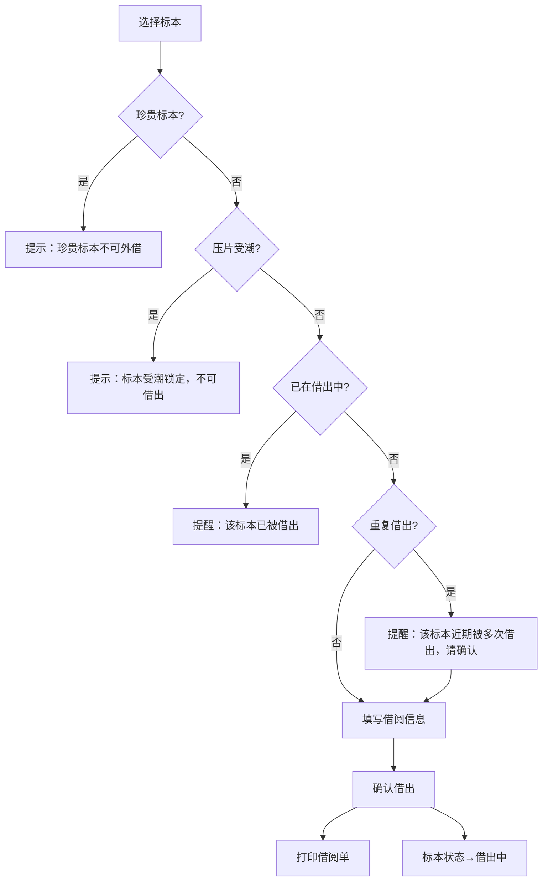

## 1. 产品概述

植物标本借阅柜是一款面向植物标本馆的桌面端标本借阅管理系统，解决登记本模式下借阅追溯困难、标本状态追踪缺失、角色分工不清的问题。
- 目标用户：标本馆馆员、带课教师、修复师三类角色，实现标本借还全流程数字化
- 核心价值：杜绝珍贵标本外借、受潮压片锁定、重复借出预警，让每一份标本的流转有据可查、有责可追

## 2. 核心功能

### 2.1 用户角色

| 角色 | 进入方式 | 核心权限 |
|------|----------|----------|
| 馆员 | 首页角色选择 | 全部权限：标本录入/编辑、借阅登记/归还、打印借阅单、统计分析、导出报表 |
| 教师 | 首页角色选择 | 借阅登记/归还、查看课程使用统计、导出课程使用和待修复标本清单 |
| 修复师 | 首页角色选择 | 查看脆弱标本清单、标记修复状态、查看待修复标本 |

### 2.2 功能模块

1. **标本台账页**：标本卡片列表、搜索筛选、新增/编辑标本、状态标签
2. **借阅管理页**：借阅登记、归还登记（含归还检查项）、借阅记录列表、借阅单打印
3. **统计分析页**：按采集地统计、按科属统计、热门标本排行、维护预警
4. **我的工作台**：根据角色显示——馆员看全局概览+快捷操作，教师看课程借阅和待归还，修复师看脆弱标本清单

### 2.3 页面详情

| 页面名称 | 模块名称 | 功能描述 |
|----------|----------|----------|
| 标本台账 | 标本卡片列表 | 展示编号、科属、采集地、珍贵等级、压片状态、借阅状态；支持按科属/采集地/状态筛选 |
| 标本台账 | 新增/编辑标本 | 录入编号、科、属、采集地、采集人、采集日期、珍贵等级、压片状态、备注 |
| 标本台账 | 状态标签 | 珍贵（不可外借）、受潮锁定（不可借出）、借出中、在馆、待修复 |
| 借阅管理 | 借阅登记 | 选择标本（自动校验借阅规则）、填写借阅人、用途（课程/科研/拍照）、拍照申请勾选、预计归还日期 |
| 借阅管理 | 归还登记 | 选择借阅记录、归还检查（标签完好/压片完好/标本完好）、记录异常情况 |
| 借阅管理 | 借阅记录列表 | 展示所有借还记录，支持按借阅人/标本/状态/日期筛选 |
| 借阅管理 | 借阅单打印 | 生成格式化借阅单，含标本信息、借阅人、用途、拍照申请、日期 |
| 统计分析 | 采集地统计 | 柱状图展示各采集地借阅频次，辅助判断哪些地区标本需提前维护 |
| 统计分析 | 科属统计 | 柱状图展示各科属借阅频次，识别热门科属 |
| 统计分析 | 维护预警 | 列出高频借阅标本、受潮标本、脆弱标本，建议维护优先级 |
| 我的工作台 | 馆员视图 | 在馆/借出/受潮/待修复数量概览、今日借还动态、快捷操作入口 |
| 我的工作台 | 教师视图 | 课程相关借阅列表、待归还标本、导出课程使用和待修复清单 |
| 我的工作台 | 修复师视图 | 脆弱标本清单（受潮+待修复）、按优先级排序、标记修复进度 |

## 3. 核心流程

**借阅流程**：馆员或教师选择标本 → 系统校验（珍贵标本拒绝/受潮锁定拒绝/重复借出提醒）→ 填写借阅信息（借阅人、用途、拍照申请、预计归还日期）→ 确认借出 → 标本状态变为"借出中" → 可打印借阅单

**归还流程**：选择借阅记录 → 归还检查（标签/压片/标本完好度）→ 记录异常 → 确认归还 → 标本状态更新（如有异常标记"待修复"）→ 通知修复师

**修复流程**：修复师查看脆弱标本清单 → 标记修复中 → 修复完成 → 更新标本状态（受潮解除/待修复解除）

## 4. 用户界面设计

### 4.1 设计风格

- **主色调**：深森林绿(#2D5016)搭配暖沙色(#D4A574)，呼应植物标本馆自然气息
- **辅助色**：苔藓绿(#6B8F3C)、旧纸米(#F5F0E8)、枯叶棕(#8B6914)
- **警示色**：琥珀橙(#D97706)用于警告提醒，锈红(#B91C1C)用于锁定/禁止
- **按钮风格**：圆角微凸，带细微阴影，主按钮深绿底白字，次要按钮米色边框
- **字体**：标题用 Noto Serif SC（宋体气质），正文用 Noto Sans SC，数据用 JetBrains Mono
- **布局**：左侧导航栏 + 右侧内容区，卡片式布局，标本卡片带微妙纸纹理质感
- **图标**：线性图标搭配植物叶片装饰元素，Lucide 图标库

### 4.2 页面设计概览

| 页面名称 | 模块名称 | UI 元素 |
|----------|----------|---------|
| 标本台账 | 标本卡片列表 | 网格布局卡片，每张卡片含编号/科属/采集地/状态标签，右上角珍贵/受潮图标 |
| 借阅管理 | 借阅登记表单 | 分步表单，左侧标本选择器+右侧表单区，校验失败时字段下方红色提示 |
| 借阅管理 | 归还检查 | 三项勾选（标签/压片/标本），异常时展开文本框填写详情 |
| 统计分析 | 图表区 | 柱状图（采集地/科属），配色与主色调统一，悬停显示详细数据 |
| 我的工作台 | 概览卡片 | 大数字+标签的统计卡片，今日动态时间线，快捷操作按钮组 |

### 4.3 响应式设计

- 桌面优先设计，最小宽度 1024px
- 标本卡片网格自适应列数（4/3/2列）
- 侧边导航可折叠为图标模式
- 打印借阅单使用 @media print 样式

### 4.4 3D 场景

不适用
