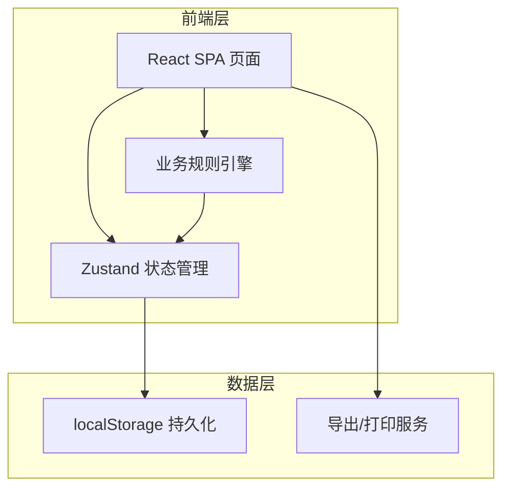
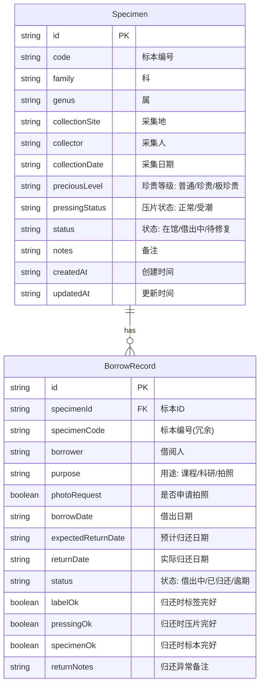

## 1. 架构设计



纯前端架构，无后端服务。数据通过 localStorage 持久化，关闭浏览器后数据不丢失。

## 2. 技术说明

- **前端框架**：React@18 + TypeScript
- **样式方案**：Tailwind CSS@3
- **构建工具**：Vite
- **状态管理**：Zustand（轻量、支持持久化中间件）
- **图表库**：Recharts
- **图标库**：Lucide React
- **字体**：Noto Serif SC、Noto Sans SC、JetBrains Mono（Google Fonts）
- **打印**：@media print + window.print()
- **导出**：CSV 导出（纯前端生成）
- **后端**：无
- **数据库**：localStorage（Zustand persist 中间件）

## 3. 路由定义

| 路由 | 用途 |
|------|------|
| / | 角色选择首页 |
| /dashboard | 我的工作台（根据角色显示不同内容） |
| /specimens | 标本台账（列表+增删改） |
| /borrows | 借阅管理（借阅登记+归还登记+记录列表） |
| /statistics | 统计分析（采集地/科属统计+维护预警） |

## 4. API 定义

无后端 API，所有数据操作通过 Zustand Store 完成。

## 5. 服务端架构

不适用

## 6. 数据模型

### 6.1 数据模型定义



### 6.2 数据定义语言

```typescript
interface Specimen {
  id: string
  code: string
  family: string
  genus: string
  collectionSite: string
  collector: string
  collectionDate: string
  preciousLevel: '普通' | '珍贵' | '极珍贵'
  pressingStatus: '正常' | '受潮'
  status: '在馆' | '借出中' | '待修复'
  notes: string
  createdAt: string
  updatedAt: string
}

interface BorrowRecord {
  id: string
  specimenId: string
  specimenCode: string
  borrower: string
  purpose: '课程' | '科研' | '拍照'
  photoRequest: boolean
  borrowDate: string
  expectedReturnDate: string
  returnDate: string | null
  status: '借出中' | '已归还' | '逾期'
  labelOk: boolean | null
  pressingOk: boolean | null
  specimenOk: boolean | null
  returnNotes: string
}

type UserRole = '馆员' | '教师' | '修复师'
```

localStorage 键名：`specimen-cabinet-store`
