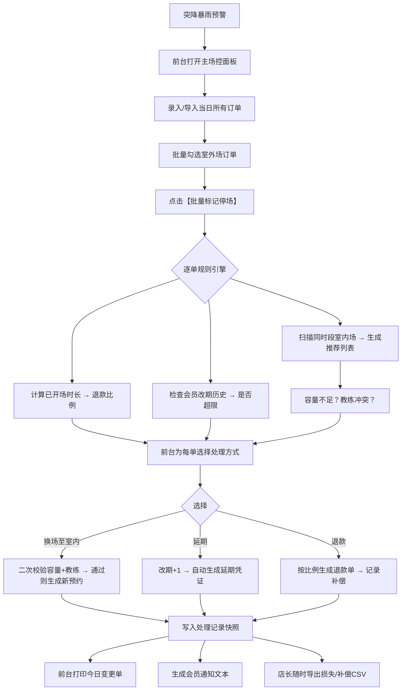

## 1. 产品概述

网球馆雨停场地切换管理系统，解决下午突降暴雨时前台处理会员换场、延期、退款混乱问题。通过录入会员、场地、时段、教练、付款等信息，批量标记室外停场，智能推荐可用室内场，自动检测容量/教练/退款冲突，完整留痕处理结果，支持打印变更单、导出损失补偿记录和生成会员通知。

- 目标用户：前台接待、店长、教练
- 核心价值：雨天场地调度效率提升80%，错漏率为零，补偿透明可追溯

## 2. 核心功能

### 2.1 用户角色
| 角色 | 登录方式 | 核心权限 |
|------|----------|----------|
| 前台 | 本地系统 | 录入订单、标记停场、换场/延期/退款、打印变更单、发送通知 |
| 店长 | 本地系统 | 查看全部记录、导出停场损失/补偿记录、审核特殊处理 |
| 教练 | 本地系统 | 查看个人排课、提交补偿方案、查看历史补偿记录 |

### 2.2 功能模块
1. **主场控面板**：今日订单列表、室外/室内场地总览、批量停场操作、天气备注
2. **订单录入/编辑**：会员信息、场地类型、时段、教练、付款金额、改期次数
3. **智能换场推荐**：基于时段匹配的可用室内场、教练空闲检测、容量告警
4. **冲突与规则引擎**：室内容量不足、教练时间冲突、已开场时长退款比例、会员连续改期超限
5. **补偿留痕**：教练补偿方案录入、处理结果快照、历史追溯
6. **打印与导出**：今日变更单打印（A4）、停场损失CSV、补偿记录导出
7. **会员通知**：按处理结果（换场/延期/退款）生成通知模板内容

### 2.3 页面详情
| 页面名称 | 模块名称 | 功能描述 |
|----------|----------|----------|
| 主场控面板 | 场地概览卡片 | 室外/室内场地数、已用/剩余、停场标记数 |
| 主场控面板 | 今日订单表格 | 订单列表、多选批量操作、状态标签（正常/停场/换场/延期/退款） |
| 主场控面板 | 天气备忘录 | 实时天气标记、降雨起止时间、备注 |
| 订单弹窗 | 基础信息录入 | 会员姓名、电话、会员等级、场地类型选择、时段选择 |
| 订单弹窗 | 教练与付款 | 教练下拉、时薪、付款金额、支付方式、改期历史 |
| 订单弹窗 | 冲突检测面板 | 实时提示教练冲突、容量不足、改期超限、退款比例计算 |
| 订单弹窗 | 换场推荐列表 | 按推荐度排序的可用室内场、一键换场 |
| 订单弹窗 | 补偿方案编辑 | 教练补偿方案、补偿金额、审批人、备注 |
| 侧边栏 | 今日变更单 | 汇总当日变更、打印按钮 |
| 侧边栏 | 导出中心 | 停场损失CSV、补偿记录CSV、通知模板复制 |
| 角色切换栏 | 身份切换 | 前台/店长/教练视图切换 |

## 3. 核心流程

前台接降雨预警 → 录入/导入当日订单 → 批量勾选室外场订单 → 点击"标记停场" → 系统自动对每个订单：检测已开场时长计算退款比例 → 检测会员连续改期次数 → 推荐匹配时段的可用室内场 → 前台选择（换场/延期/退款）→ 若换场：校验容量+教练冲突 → 确认后生成变更记录 → 前台打印当日变更单/生成通知 → 店长导出损失与补偿报表 → 教练查看并确认补偿方案

## 4. 用户界面设计

### 4.1 设计风格
- **主色**：深青绿 #0F766E（球场绿，专业稳重），辅色：琥珀黄 #F59E0B（预警/提醒），警示红 #DC2626，成功绿 #16A34A
- **中性色**：石灰白背景 #F8FAF9，炭灰文字 #1F2937，深灰分区 #E5E7EB
- **按钮风格**：圆角 10px，主要按钮渐变 + 轻微投影，次级按钮描边+悬停上浮
- **字体**：Noto Sans SC（中文正文清爽）+ 数字等宽 JetBrains Mono（金额/时段）
- **布局**：顶部导航栏 + 左侧统计侧栏 + 中部订单表格 + 右侧订单详情抽屉，卡片化分区，信息密度高但层次分明
- **图标/emoji**：网球拍🎾、雨滴💧、室内🏠、室外🌳、教练👨‍🏫、警告⚠️、换场🔄、退款💰、延期📅、打印🖨️、导出📊

### 4.2 页面设计概述
| 页面名称 | 模块名称 | UI 元素 |
|----------|----------|---------|
| 主场控面板 | 顶部天气条 | 渐变背景（晴→雨动画）、实时天气标签、降雨起止输入、备注气泡 |
| 主场控面板 | 场地概览卡 | 3列卡片：室外/室内/停场统计，数字大号带趋势箭头，悬停微弹动 |
| 主场控面板 | 订单表格 | 斑马行、多选框、状态彩色胶囊、操作列浮动按钮、行展开显示冲突详情 |
| 主场控面板 | 批量操作栏 | 吸顶固定、计数徽章、批量停场/换场/延期/退款按钮 |
| 订单弹窗/抽屉 | 分段表单 | 会员/场地/教练/付款四段式，进度条指示，每段独立校验 |
| 订单弹窗/抽屉 | 冲突提示区 | 顶部警告横幅、按严重程度分色、可折叠展开规则详情 |
| 订单弹窗/抽屉 | 换场推荐列表 | 卡片横向滚动、推荐星级、容量进度条、教练头像、一键确认按钮 |
| 订单弹窗/抽屉 | 补偿留痕区 | 时间线样式、处理人签名、不可编辑历史记录、编辑态仅当日 |
| 侧边栏 | 打印预览 | A4 比例缩小预览、打印按钮、导出PDF |
| 侧边栏 | 导出中心 | 大图标按钮、文件大小预估、最近导出时间 |
| 顶栏 | 角色切换 | 胶囊形切换器、当前角色高亮、视图权限即时变化 |

### 4.3 响应式
- **桌面端优先**：1440×900 基准，主区表格+抽屉
- **平板横屏**：抽屉变模态弹窗，表格列数精简
- **移动竖屏**：卡片化列表，操作按钮下移底部固定栏，仅保留紧急操作（标记停场/快速换场）

### 4.4 动效与细节
- 降雨天气条：雨滴 SVG 下落循环动画（10s 循环）
- 表格行进入：stagger 渐入 80ms 延迟
- 冲突提示：警告横幅滑入 + 轻微抖动
- 换场成功：绿色对勾 SVG 勾绘动画
- 数据持久化：操作后右下角 Toast 提示"已自动保存 ✓"
- 打印视图：进入时所有交互元素隐藏，A4 虚线边界显示
