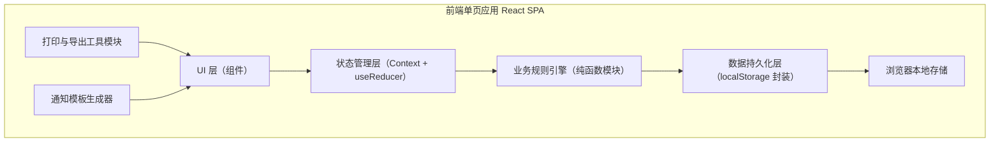
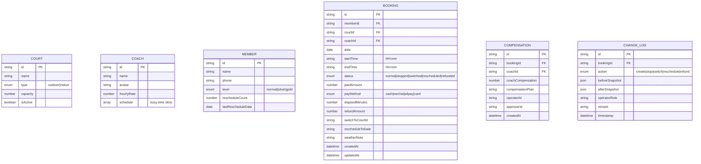

## 1. 架构设计



纯前端单页应用，无后端依赖，所有数据通过 localStorage 持久化，刷新后不丢失。业务规则与 UI 解耦为独立模块，便于单测与维护。

## 2. 技术说明
- **前端**：React@18 + TypeScript + Vite
- **样式**：Tailwind CSS 3（原子类 + 自定义设计令牌）
- **图标**：Lucide React（线条风格）
- **打印**：原生 window.print() + 专用打印样式 @media print
- **导出**：CSV 原生生成（Blob + URL.createObjectURL），无需第三方库
- **状态**：React Context + useReducer（轻量替代 Redux，避免过度工程）
- **持久化**：localStorage 自定义 Hook + 自动 debounce 保存（500ms）
- **初始化工具**：npm create vite@latest
- **Mock 数据**：内置 15 条典型当日订单 + 8 个场地 + 5 位教练的种子数据，首次加载自动注入

## 3. 路由定义
| 路由 | 用途 |
|------|------|
| / | 主场控面板（默认页，单页应用核心视图） |

单页架构，所有功能通过模态弹窗/抽屉/标签切换呈现，不使用多路由跳转，保证雨天操作连续性。

## 4. 数据模型

### 4.1 数据模型定义



### 4.2 业务规则引擎（核心纯函数）
- `calculateRefund(elapsedMinutes, totalMinutes, paidAmount)` → { refundRatio, refundAmount }
  - 0-15min 开场：全额退（100%）
  - 16-45min：退 70%
  - 46-90min：退 50%
  - >90min：不退
- `findAvailableIndoorCourts(bookings, courts, coaches, targetStartTime, targetEndTime, excludeBookingId?)` → 推荐数组（含推荐分）
  - 容量足够 + 时段空闲 + 教练无冲突
- `checkCoachConflict(coachId, startTime, endTime, date, bookings, excludeBookingId?)` → boolean
- `checkRescheduleLimit(memberId, members)` → { exceed: boolean, count, limit: 3 }
  - 7 天内连续改期超过 3 次 → 锁定需店长审批
- `detectCapacityWarning(indoorCourts, bookingsAfterSwitch, date)` → { totalIndoor, usedIndoor, remainingIndoor, ratio, warning: boolean }

## 5. 核心组件结构
```
src/
├── types/
│   └── index.ts              # Booking, Court, Coach, Member, Compensation, ChangeLog 类型
├── data/
│   └── seed.ts               # 种子数据（首次 localStorage 注入）
├── store/
│   ├── AppContext.tsx        # Context Provider
│   ├── reducer.ts            # useReducer actions（ADD_BOOKING, STOP_BOOKING, SWITCH_COURT 等）
│   └── hooks.ts              # useAppState, usePersist
├── engine/
│   ├── refund.ts             # 退款计算
│   ├── scheduler.ts          # 换场推荐、容量、教练冲突
│   └── rules.ts              # 改期限制、其他规则
├── utils/
│   ├── storage.ts            # localStorage 封装 + 版本迁移
│   ├── csv.ts                # CSV 导出
│   ├── print.ts              # 打印内容生成
│   └── notify.ts             # 通知模板生成
├── components/
│   ├── layout/
│   │   ├── TopBar.tsx        # 顶部导航 + 角色切换 + 天气条
│   │   ├── StatsSidebar.tsx  # 场地概览卡
│   │   └── ExportPanel.tsx   # 导出中心
│   ├── bookings/
│   │   ├── BookingTable.tsx  # 订单表格 + 批量操作
│   │   ├── BookingRow.tsx    # 单行 + 展开详情
│   │   └── BatchActionBar.tsx# 吸顶批量操作栏
│   ├── forms/
│   │   ├── BookingForm.tsx   # 订单录入/编辑
│   │   └── CompensationForm.tsx
│   ├── alerts/
│   │   ├── ConflictBanner.tsx
│   │   └── WarningToast.tsx
│   ├── recommend/
│   │   └── IndoorCourtList.tsx # 换场推荐卡片
│   └── modals/
│       ├── BookingDrawer.tsx # 订单详情抽屉
│       ├── StopConfirmModal.tsx # 停场确认弹窗（含批量）
│       └── PrintPreview.tsx  # A4 打印预览
├── App.tsx
├── main.tsx
└── index.css                 # Tailwind + 自定义设计令牌 + 打印样式
```

## 6. 初始化数据（种子）
- **场地（8）**：室外 1-5 号场，室内 1-3 号场
- **教练（5）**：张伟（主攻单打）、李娜（双打）、王强（青少）、刘洋（私教）、陈静（入门）
- **会员（20+）**：各等级混合，含 1-2 位已连续改期 2 次的会员
- **当日订单（15 条）**：
  - 上午室外（已开场/未开场混合）
  - 下午室外（高峰段，批量停场主要对象）
  - 室内订单（用于容量计算参考）
  - 含教练重叠、改期即将超限等测试场景

## 7. 性能与可靠性
- 所有规则引擎为纯函数，计算复杂度 O(n)，n≤100 时无感知
- localStorage 写入采用 debounce（500ms）+ 变更快照 diff，减少 IO
- 数据版本号：`SCHEMA_VERSION=1`，未来字段变更时自动迁移
- 崩溃恢复：初始化时检测损坏 JSON → 回退至上一次完整备份（保留最近 3 份快照）
