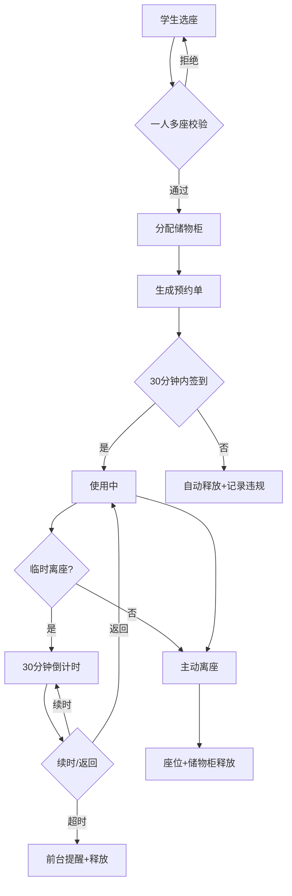

## 1. 产品概述

自习室座位预约台是面向商业自习室的一体化座位管理系统，解决座位紧张、学生占座吃饭、储物柜绑定依赖前台、清场繁琐等痛点。实现前台实时监控、店长时段分析、老板数据导出三大层级的管理闭环。

- 核心用户：自习室学生、前台、店长、老板
- 产品价值：减少占座纠纷、提升座位周转率、降低前台管理成本、为经营决策提供数据支撑

## 2. 核心功能

### 2.1 用户角色

| 角色 | 登录方式 | 核心权限 |
|------|----------|----------|
| 学生用户 | 扫码/手机号登录 | 预约座位、绑定储物柜、签到离座、临时离座续时、超时提醒 |
| 前台 | 账号密码 | 实时座位图、签到/离座确认、释放占座、记录违规、清场遗留物 |
| 店长 | 账号密码 | 时段空座率分析、套餐调整建议、保洁安排、遗留物管理 |
| 老板 | 账号密码 | 利用率报表导出、违规占座统计、柜位问题汇总、全量数据 |

### 2.2 功能模块

1. **学生端预约台**：座位图展示、座位预约、储物柜绑定、签到/离座、临时离座/续时、超时提醒
2. **前台工作台**：实时座位图、签到确认、强制释放、违规记录、清场登记、遗留物录入
3. **店长分析台**：时段空座率热力图、晚间套餐对比、保洁时段建议、违规趋势
4. **老板仪表盘**：利用率统计、违规报表、柜位问题、一键导出CSV

### 2.3 页面详情

| 页面名称 | 模块名称 | 功能描述 |
|----------|----------|----------|
| 学生预约台 | 座位图网格 | 按楼层/区域展示座位状态（空闲/已约/使用中/临时离座），点击预约 |
| 学生预约台 | 储物柜绑定 | 预约时自动分配同区域储物柜，支持手动更换 |
| 学生预约台 | 签到离座面板 | 到店扫码签到、结束离座、临时离座计时、续时按钮、超时预警 |
| 前台工作台 | 实时空位看板 | 顶部统计卡片（空闲/使用/临时离座/违规数）+ 颜色编码座位图 |
| 前台工作台 | 签到确认区 | 待签到列表、扫码确认、未签到自动倒计时释放 |
| 前台工作台 | 违规记录 | 超时离座、一人多座、未签到释放等违规事件流水 |
| 前台工作台 | 清场遗留物 | 逐座检查勾选、遗留物类型/位置/照片登记、认领状态 |
| 店长分析台 | 时段空座率 | 24小时柱状图（按30分钟切片），对比7天/30天趋势 |
| 店长分析台 | 套餐调整建议 | 晚间时段上座率对比、高峰期识别、保洁时段推荐 |
| 老板仪表盘 | 利用率总览 | 日/周/月利用率、座位周转次数、平均使用时长 |
| 老板仪表盘 | 违规与柜位 | 违规类型饼图、储物柜使用率/故障率、导出按钮 |

## 3. 核心流程

### 3.1 学生预约到离座
学生选择空闲座位 → 系统校验无占座 → 自动分配储物柜 → 生成预约单 → 30分钟内扫码签到 → 超时未签到自动释放 → 使用中可临时离座（限2次/次30分钟）→ 离座确认 → 座位和储物柜同步释放

### 3.2 前台清场
进入清场模式 → 逐座检查 → 标记遗留物 → 批量释放未离座 → 生成清场报告

### 3.3 店长决策
查看时段空座率 → 识别低峰/高峰 → 调整晚间套餐时间段 → 配置保洁班次 → 保存策略

## 4. 用户界面设计

### 4.1 设计风格
- 主色：深墨绿 #1F4D3C（静谧专注），辅色：暖琥珀 #E8A838（活力提醒）
- 强调色：警示红 #C25450，成功绿 #4CA771
- 按钮：微立体圆角（8px），hover有轻微上浮+阴影加深
- 字体：思源宋体（标题，营造沉静氛围）+ 思源黑体（正文，确保可读性）
- 布局：卡片式分层，顶部导航+左侧角色切换+右侧主内容区
- 图标：线性SVG图标，座位用方块+人形小图标组合

### 4.2 页面设计概览

| 页面名称 | 模块名称 | UI元素 |
|----------|----------|--------|
| 学生预约台 | 座位图网格 | 深墨绿背景+暖琥珀边框的座位方块，悬浮放大，已选座位用琥珀渐变填充 |
| 学生预约台 | 签到面板 | 卡片式，带圆形进度环显示剩余签到时间，倒计时跳动动效 |
| 前台工作台 | 实时看板 | 顶部四色统计卡片（浅绿/浅蓝/浅黄/浅红），数字放大+下方小字标签 |
| 前台工作台 | 座位图 | 网格布局，颜色编码状态，违规座位有红色脉冲光圈 |
| 店长分析台 | 时段图 | 堆叠柱状图，柱子hover高亮，低峰段用虚线框标注建议保洁时段 |
| 老板仪表盘 | 总览卡片 | 大数字+小趋势箭头，利用渐变进度条 |

### 4.3 响应式
- Desktop-first设计，主界面针对1440×900优化
- 前台工作台支持平板横屏（1024px），座位图自适应缩小
- 学生端预约台支持手机竖屏，导航改为底部Tab，座位图单列滚动
- 触摸优化：按钮最小44×44px，座位方块触控区域扩大

### 4.4 动效细节
- 座位图加载：逐行渐入动画（stagger 30ms）
- 倒计时最后5分钟：数字呼吸闪烁+边框颜色渐变
- 违规记录推送：右侧滑入Toast，停留3秒自动收起
- 座位状态变更：方块颜色过渡动画（400ms ease）
- 清场检查：已检座位添加勾选标记的缩放动效
